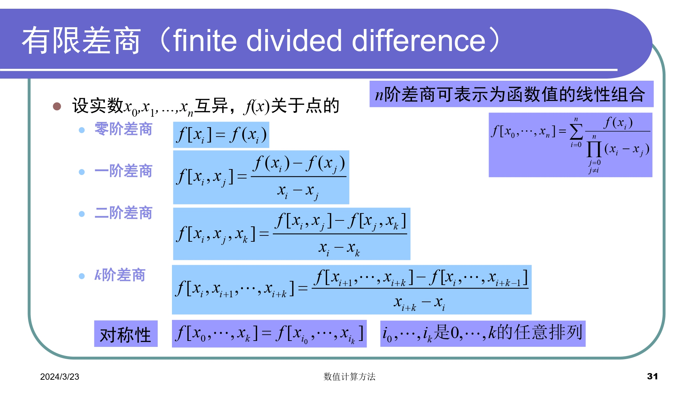
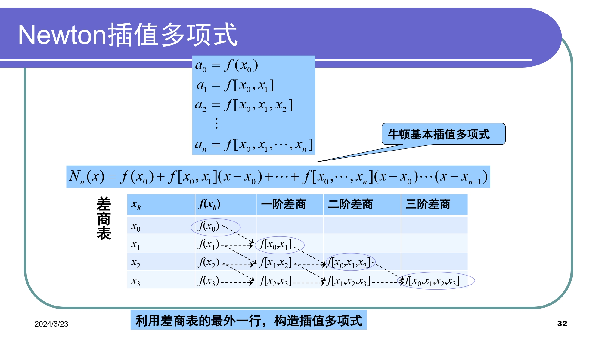
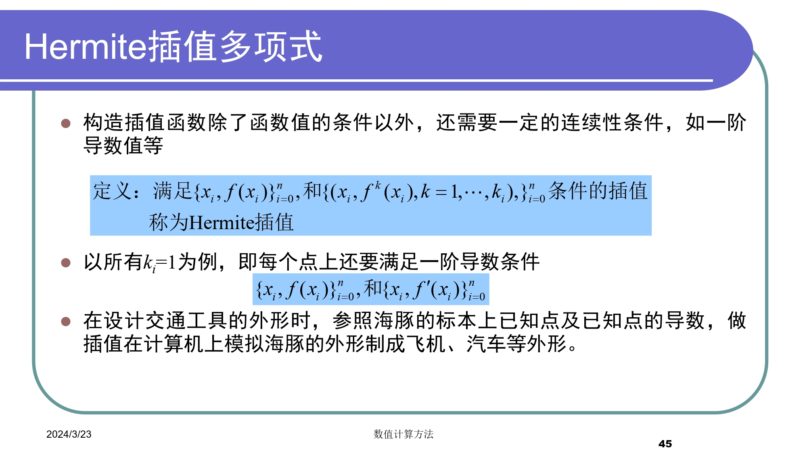
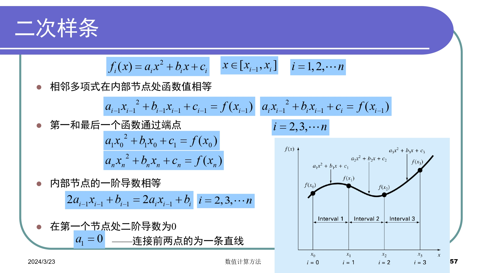
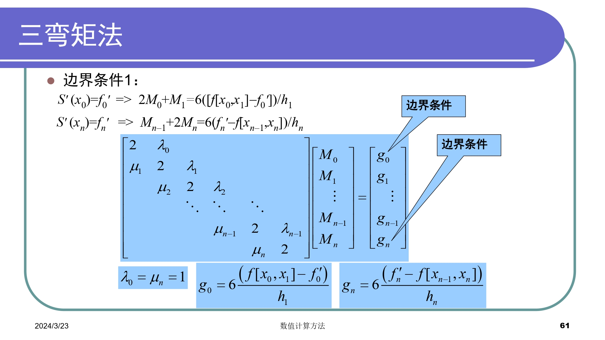
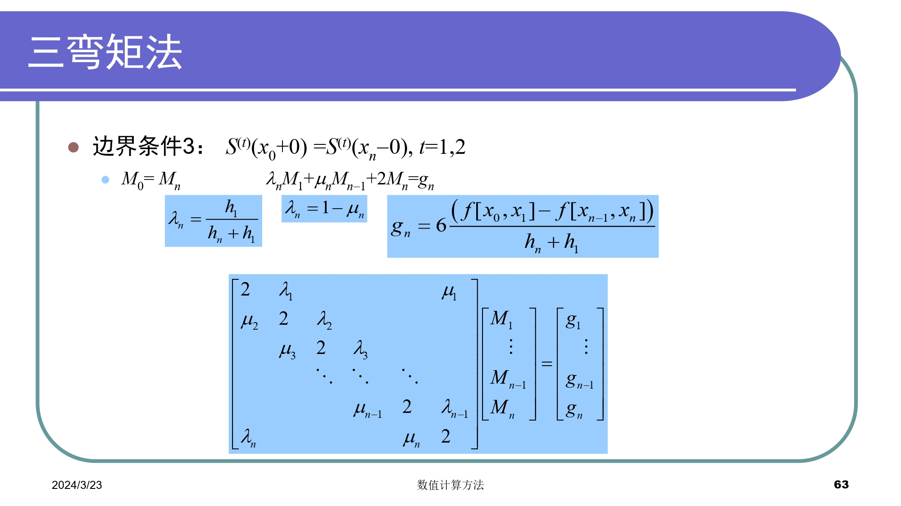
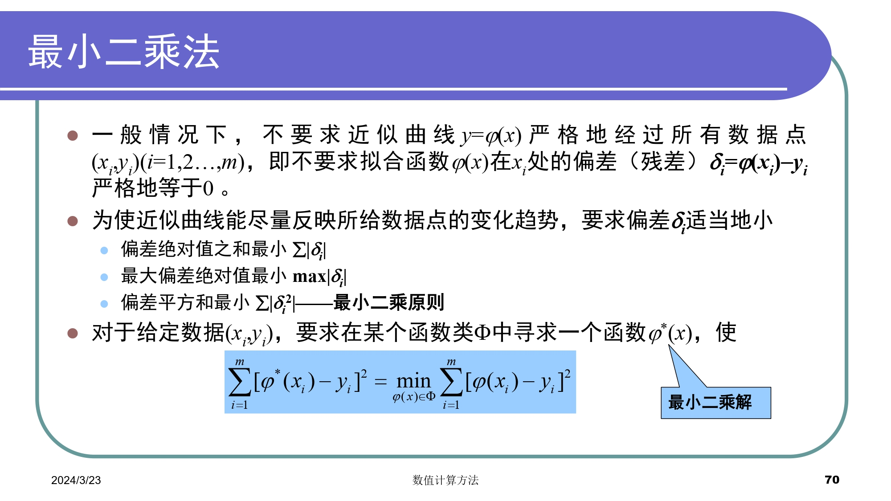
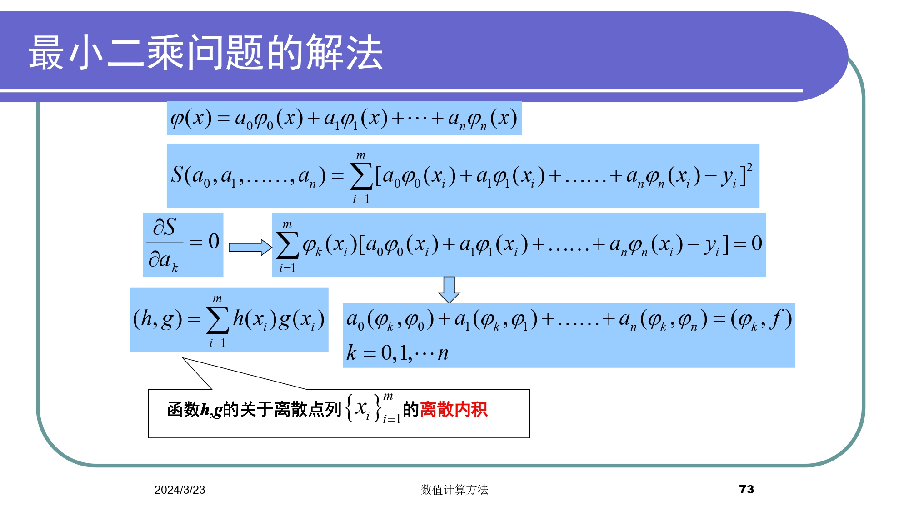
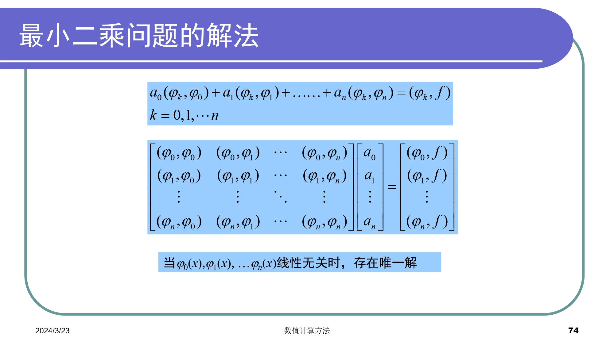
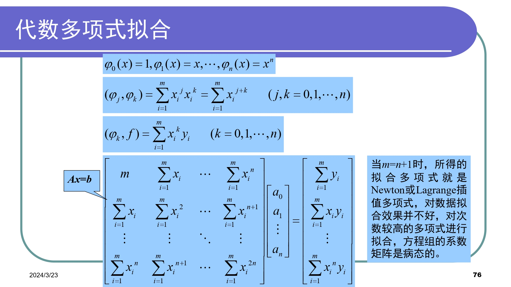

# Chapter4 插值和拟合
### 插值
#### 插值函数
一般有代数多项式、有理函数、三角函数，其中有理插值可使区间内插值误差分布均匀，适用于某些被插函数具有无穷间断点的附近
#### 插值函数存在唯一定理
 
#### 插值多项式存在唯一性
 
#### 插值余项
 
#### 内插与外推
- 内插
插值点位于插值区间内，即$a<x<b$
- 外推
插值点位于插值区间外，即$x<a$或$x>b$，但又较接近于插值区间端点时
#### 插值余项误差
- 插值多项式仅与已知数据有关，与$f(x)$原来形式无关，但余项与$f(x)$密切相关
- 若$f(x)$本身是一个不超过n次多项式，则$P_{n}(x)=f(x)$
- 对于多项式插值，增加阶数不一定能提高精度(一般推荐3j个节点的插值)
- 插值点$x$不能位于插值区间之外的远处
#### Lagrange插值多项式
 
 ```matlab
 %拉格朗日插值多项式
function y_predict=lagrange(x_data,y_data,x_predict,num)
%num为插值节点数目

volumn_data=length(x_data);
volumn_predict=length(x_predict);
y_predict=zeros(1,volumn_predict);

%根据插值节点数目进一步筛选数据
divide=floor((volumn_data-1)/num);
x_train=zeros(1,num);
y_train=zeros(1,num);
for i=1:num
    x_train(i)=x_data(1+i*divide);
    y_train(i)=y_data(1+i*divide);
end

%计算预测值
for i=1:volumn_predict
    for j=1:num
        term=1;
        for k=1:num
            if k~=j
                term=term*(x_predict(i)-x_train(k))/(x_train(j)-x_train(k));
            end
        end
        y_predict(i)=y_predict(i)+term*y_train(j);
    end
end

end
```
##### 缺点
- 无承袭性：增加一个节点，所有的基函数都要重新计算
##### 适用场景
- 均匀分布的数据点
- 低阶插值
- 数据点误差较小
- 用于插值而非外推
#### Newton插值多项式
 
 
 
 
 

##### 等距节点的插值
数据在空间上间距相等

- 步长
$x_0<...<x_n$,其中$x_i-x_{i-1}=h$,$x_i=x_0+ih$,h被称作步长
- 有限差分
    - $\Delta f(x)=f(x+h)-f(x)$        一阶向前差分
    - $\nabla f(x)=f(x)-f(x-h)$        一阶向后差分
    - $\delta f(x)=f(x+h/2)-f(x-h/2)$  一阶中心差分
    - $\Delta$ 前差算子  $\nabla$ 后差算子  $\delta$ 中差算子
##### Newton向前插值公式
 
 

#### Hermite插值多项式
 

#### Runge现象
插值多项式次数越高：
1. 计算量大
2. 在部分区间(两端)激烈振荡，截断误差/计算余项偏大
#### 插值误差
- 截断误差是插值的收敛性问题，Runge现象
- 舍入误差是插值的稳定性稳定
- 为避免Runge和不稳定，一般限定n<7
- n较大时采用分段低次插值、样条插值、次数较低的最小二乘逼近
#### 分段低次插值
为了避免龙格现象，可以对每个小区间进行低次多项式插值，常见的有分段线性插值和分段抛物插值
```matlab
%分段低次插值
function y_predict=piecewise(x_data,y_data,x_predict)

volumn_data=length(x_data);
volumn_predict=length(x_predict);
y_predict=zeros(1,volumn_predict);

%分段线性插值

for i=1:volumn_predict
    %外推
    if x_predict(i)<x_data(1)
        y_predict(i)=y_data(1)+(y_data(2)-y_data(1))/(x_data(2)-x_data(1))*(x_predict(i)-x_data(1));
    end
    if x_predict(i)>x_data(volumn_data-1)
        y_predict(i)=y_data(volumn_data-1)+(y_data(volumn_data)-y_data(volumn_data-1))*(x_data(volumn_data)-x_data(volumn_data-1))*(x_predict(i)-x_data(volumn_data-1));
    end
    %内插
    for j=1:volumn_data-1
        if x_predict(i)>=x_data(j) && x_predict(i)<=x_data(j+1)
            y_predict(i)=y_data(j)+(y_data(j+1)-y_data(j))/(x_data(j+1)-x_data(j))*(x_predict(i)-x_data(j));
        end
    end
end


%{
%分段抛物插值
coefficient=zeros(volumn_data-2,3);%系数矩阵
for i=1:volumn_data-2
    k2=(y_data(i+2)-y_data(i+1))/(x_data(i+2)-x_data(i+1));
    k1=(y_data(i+1)-y_data(i))/(x_data(i+1)-x_data(i));
    coefficient(i,1)=(k2-k1)/(x_data(i+2)-x_data(i));
    coefficient(i,2)=k1-coefficient(i,1)*(x_data(i+1)+x_data(i));
    coefficient(i,3)=y_data(i)-coefficient(i,1)*x_data(i)*x_data(i)-coefficient(i,2)*x_data(i);
end

for i=1:volumn_predict
    %外推
    if x_predict(i)<x_data(1)
            y_predict(i)=coefficient(1,1)*x_predict(i)*x_predict(i)+coefficient(1,2)*x_predict(i)+coefficient(1,3);
    end
    if x_predict(i)>x_data(volumn_data-2)
            y_predict(i)=coefficient(volumn_data-2,1)*x_predict(i)*x_predict(i)+coefficient(volumn_data-2,2)*x_predict(i)+coefficient(volumn_data-2,3);
    end
    %内插
    for j=1:volumn_data-2
        if x_predict(i)>=x_data(j) && x_predict(i)<=x_data(j+2)
            y_predict(i)=coefficient(j,1)*x_predict(i)*x_predict(i)+coefficient(j,2)*x_predict(i)+coefficient(j,3);
            break;
        end
    end
end
%}

end
```
##### 优点
- 公式简单，只要区间充分小，就能保证误差要求
- 局部性质良好，修改某个节点，只影响相邻的两个区间
##### 缺点
- 不能保证节点处插值函数的导数连续，因而不能满足某些工程曲线光滑性的要求
#### 样条插值
##### 概览
- 样条插值的原理和分段低次插值相同，都是使用分段多项式来逼近数据
- 在样条插值中，相邻子区间的插值函数除了满足函数值连续，还对一阶连续性和二阶连续性有要求
 
 
 
##### 三弯矩法
0. 算法分析
简单地说就是将二阶导函数用线性函数表示，然后通过积分推导出三次方程的系数
1. 数据准备
导入已知的数据点，其中自变量$x_{i}$，因变量$y_{i}$
2. 计算差分
计算相邻数据点的差分，得到自变量的差分$h_{i}=x_{i+1}-x_{i}$和因变量的差分$\delta_{i}=(y_{i+1}-y_{i})/h_{i}$
3. 计算弯矩
在每个数据点$x_{i}$处，计算插值函数的弯矩$M_{i}$，通常通过以下公式计算$M_{i}=6(\frac{\delta_{i+1}-\delta_{i}}{h_{i+1}}-\frac{\delta_{i}-\delta_{i-1}}{h_{i}})$
其中$M_{1}$和$M_{n}$通常设定为零
4. 构建系数矩阵
根据已知数据点和弯矩值，构建系数矩阵。系数矩阵的每一行对应一个插值段的系数
5. 求解边界条件
由以上步骤得到4n-2个条件，我们需要在区间端点加上两个约束条件，称为边界条件。一般有：
    + 固定边界 (Clamped Spline)
    已知两端的一阶导数值，即 $S^\prime(x_{0})=y_{0}^\prime,S^\prime(x_{n})=y_{n}^\prime$
    + 自然边界 (Nature Spline)
    已知两端的二阶导数值，即 $S^{\prime\prime}(x_{0})=y_{0}^{\prime\prime},S^{\prime\prime}(x_{n})=y_{n}^{\prime\prime}$
    + 非扭结边界 (Not-A-Knot Spline)
    已知第一个插值节点的三阶导数值与第二个相等，最后一个插值点的三阶导数值与倒数第二个相等，即 $S_{0}^{\prime\prime\prime}(x_{0})=S_{1}^{\prime\prime\prime}(x_{1}),S_{n-2}^{\prime\prime\prime}(x_{n-1})=S_{n-1}^{\prime\prime\prime}(x_{n})$
6. 求解插值函数
解出系数矩阵，得到每个插值段的系数。这些系数就是样条插值函数的参数，用于计算插值函数在任意点的值。
 
 
 
 
```matlab
%三次样条插值
function y_predict=spline(x_data,y_data,x_predict)

volumn_data=length(x_data);
volumn_predict=length(x_predict);
y_predict=zeros(1,volumn_predict);

%计算步长
h_array=zeros(1,volumn_data-1);
for i=1:volumn_data-1
    h_array(i)=x_data(i+1)-x_data(i);
end

%构造线性方程组
%构造左侧系数矩阵
A=zeros(volumn_data,volumn_data);
for i=1:volumn_data
    if i==1 || i==volumn_data
        A(i,i)=1;
    else
        A(i,i-1)=h_array(i-1);
        A(i,i)=2*(h_array(i-1)+h_array(i));
        A(i,i+1)=h_array(i);
    end
end
%构造右侧向量
B=zeros(1,volumn_data);
for i=1:volumn_data
    if i==1 || i==volumn_data
        B(i)=0;
    else
        B(i)=(y_data(i+1)-y_data(i))/h_array(i)-(y_data(i)-y_data(i-1))/h_array(i-1);
    end
end

disp(A)
disp(B)
%求解
X=gauss(A,B);

%计算样条函数的系数
a_array=zeros(1,volumn_data-1);
c_array=zeros(1,volumn_data-1);
b_array=zeros(1,volumn_data-1);
d_array=zeros(1,volumn_data-1);
for i=1:volumn_data-1
    a_array(i)=y_data(i);
    c_array(i)=X(i)/2;
    d_array(i)=(X(i+1)-X(i))/6/h_array(i);
    b_array(i)=(y_data(i+1)-y_data(i))/h_array(i)-h_array(i)/2*X(i)-h_array(i)/6*(X(i+1)-X(i));
end

%计算预测值
for i=1:volumn_predict
    %外推
    if x_predict(i)<x_data(1)
        y_predict(i)=a_array(1)+b_array(1)*(x_predict(i)-x_data(1))+c_array(1)*power(x_predict(i)-x_data(1),2)+d_array(1)*power(x_predict(i)-x_data(1),3);
    end
    if x_predict(i)>x_data(volumn_data)
        y_predict(i)=a_array(volumn_data-1)+b_array(volumn_data-1)*(x_predict(i)-x_data(volumn_data))+c_array(volumn_data-1)*power(x_predict(i)-x_data(volumn_data),2)+d_array(volumn_data-1)*power(x_predict(i)-x_data(volumn_data),3);
    end
    %内插
    for j=1:volumn_data-1
        if x_predict(i)>=x_data(j) && x_predict(i)<=x_data(j+1)
            y_predict(i)=a_array(j)+b_array(j)*(x_predict(i)-x_data(j))+c_array(j)*power(x_predict(i)-x_data(j),2)+d_array(j)*power(x_predict(i)-x_data(j),3);
            break;
        end
    end
end

end
```
#### 逆插值
- 交换变量
    - 横坐标在空间分布的不均匀性会导致插值多项式产生振荡(即使是低阶多项式)
- 利用初始数据进行插值，得到插值多项式后，寻找对应的$x$值，相当于方程求根
### 拟合
求出一个经验公式，使各数据点从总体上最贴近，而不一定要求构造的函数曲线通过所给数据点
#### 最小二乘方法
 
##### 基本环节
- 确定$\varphi(x)$的形式
- 求最小二乘解
##### 解法
 
 
 
##### 代数多项式拟合
 
 
### 总结
- 相同点
    - 从函数角度看，插值法与最小二乘法都是根据函数表求函数的近似表达式的问题，属于函数逼近问题
    - 从几何上看，二者都是根据一列数据点求曲线的近似曲线问题，是曲线拟合问题
- 不同点
    - 插值法根据插值条件选择近似函数
    - 最小二乘法根据“偏差平方和最小”原则选择近似函数