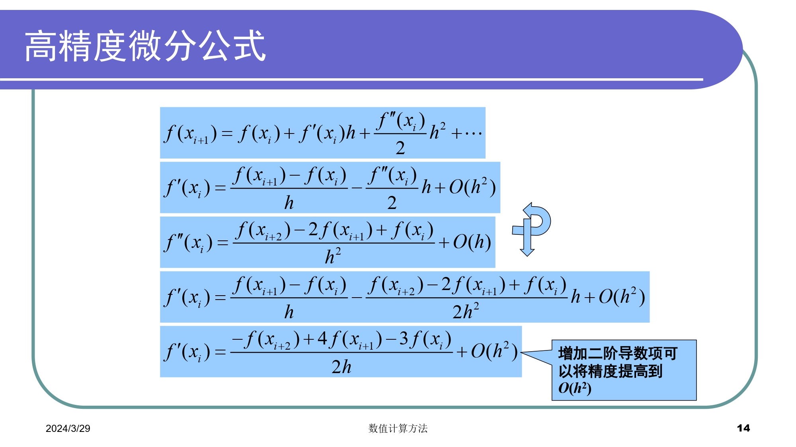
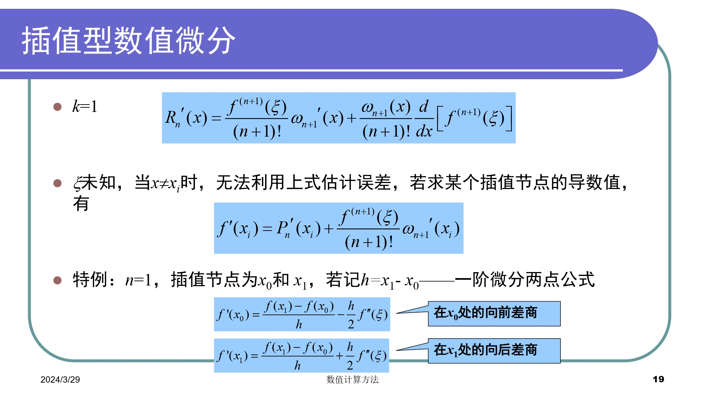
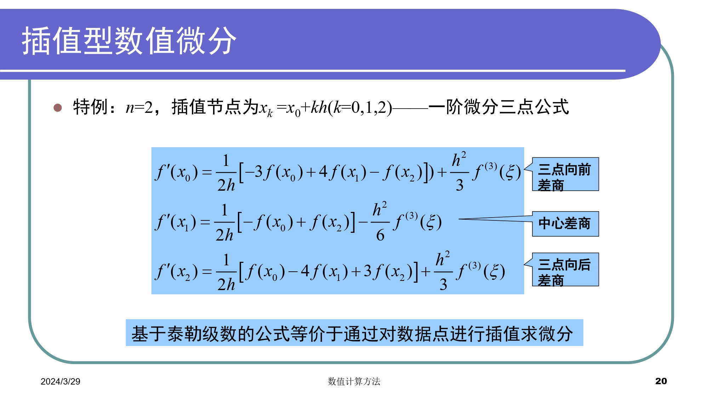
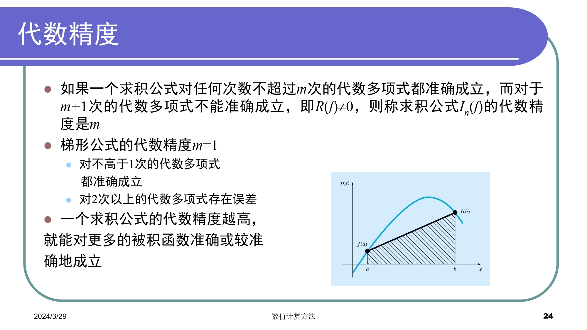
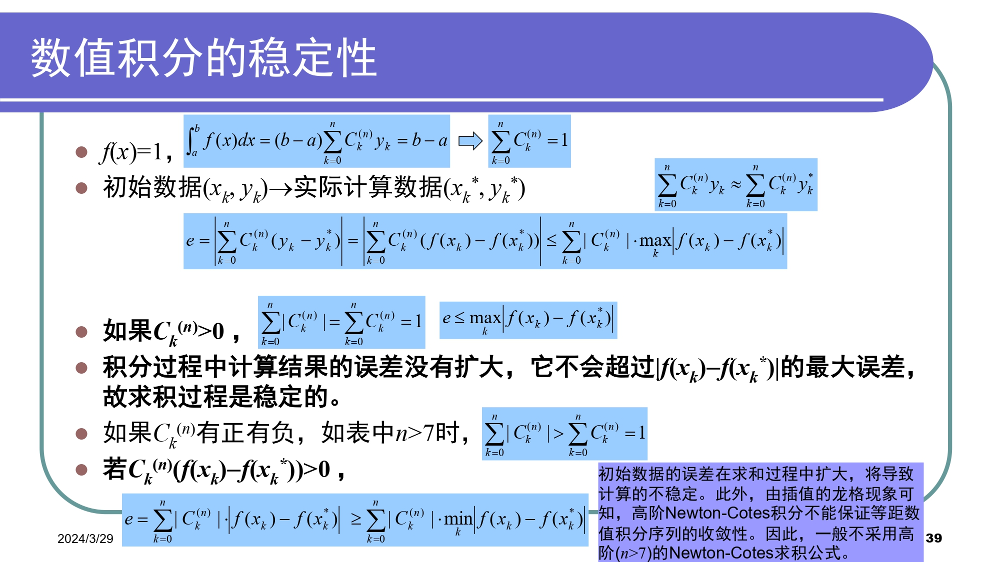
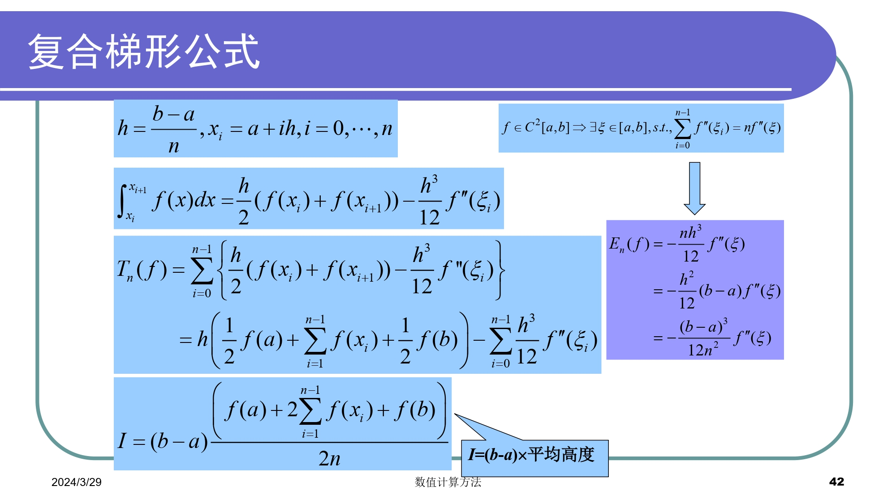
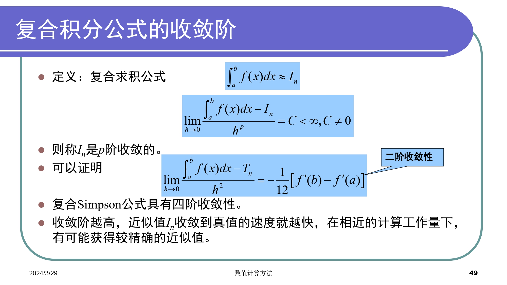
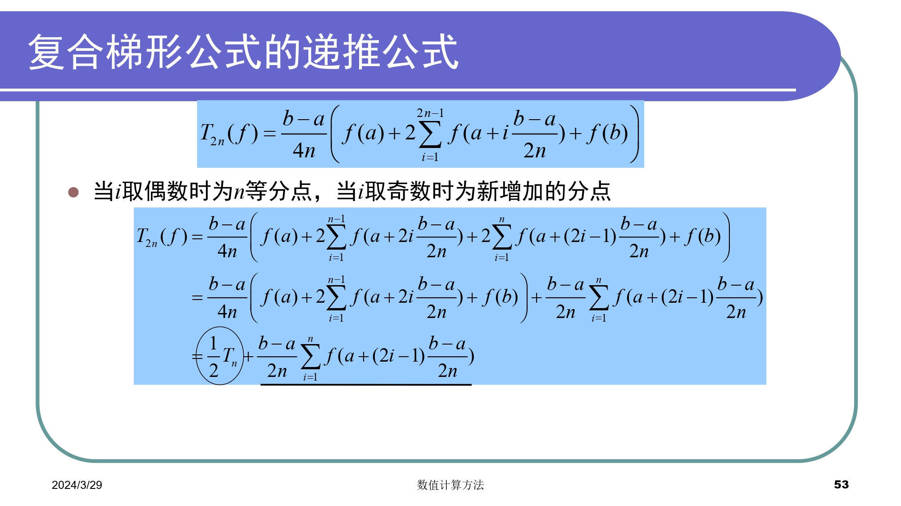
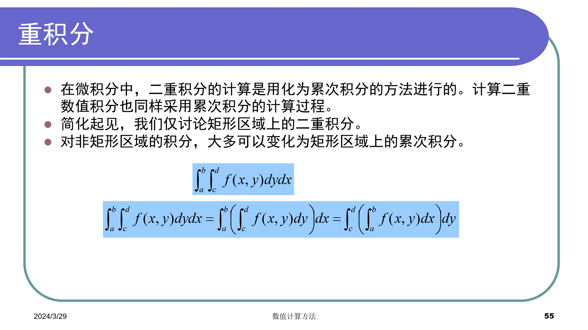
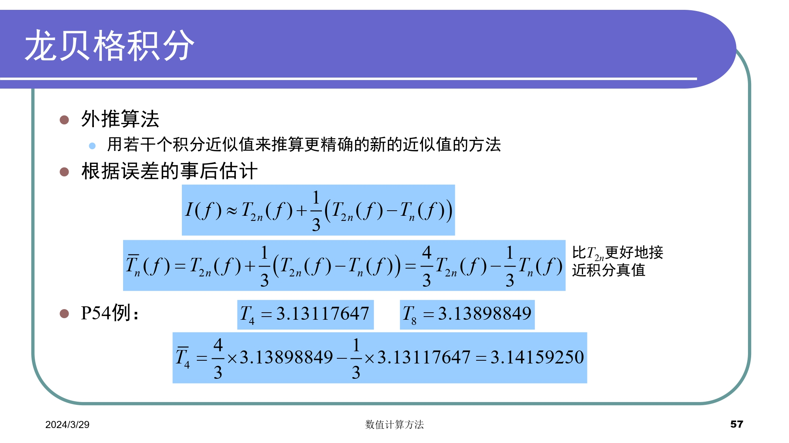

# Chapter5 数值微分和数值积分
### 概览
#### 数值微分
- 有限差商逼近导数
- 数据存在误差，使用曲线拟合技术构造光滑拟合曲线，对拟合曲线微分
#### 数值积分
$$
\int_{a}^{b}f(x)dx=f(\xi)(b-a)
$$
用区间$[a,b]$上一些点$x_{k}$出的函数值$f(x_{k})$的加权平均值，作为平均高度$f(\xi)$的近似值
$$
I=\int_{a}^{b}f(x)dx=\sum_{k=0}^{n}A_{k}f(x_{k})
$$
求积系数$A_{k}=\omega_{k}(b-a)$,$\omega_{k}$是求积节点权系数
#### 复杂函数
- 由函数表达式生成离散的数据列表
- 在离散点的基础上，利用数值方法计算数值微分和积分
#### 稳定性
- 一般数值积分过程稳定，解精确度较高(正负随机误差倾向于相互抵消)
- 数值微分解不稳定，精度较差(正负随机误差倾向于累积)
### 数值微分
#### 差商近似





#### 插值型数值微分
用插值函数的导数近似为原函数的导数



- 用三次样条插值的导数近似被插值函数的导数，效果相当好
- 实际问题中公式选择视具体问题而定
给定一个列表函数，对函数中间各点都可使用精度较高的中心差商公式，但起始点只能使用前插公式，终点则使用后插公式
- 一般情况下，三点公式比两点公式准确，步长越小结果越准确。但当余项中的高阶导数无界或计算过程中的舍入误差超过截断误差是，结论不成立
### 数值积分




#### Newton-Cotes积分

- 一组基于等距节点的数值积分方法
- 形式有梯形规则(Trapezoidal Rule)、辛普森规则(Simpson's Rule)、复合梯形规则(Composite Trapezoidal Rule)
- 在给定区间的等距离点上估计函数值，然后使用多项式插值来近似积分值

```matlab
%使用Newton-Cotes积分
function int_newton=Newton(f,a,b,n)
%f=求积函数，a=左端点，b=右端点，n=节点数
array=linspace(a,b,n);
y_array=zeros(1,n);
h=(b-a)/(n-1);
for i=0:n-1
    y_array(i+1)=f(a+i*h);
end
int_newton=h*sum(y_array);
```













#### Romberg积分

- 一组自适应数值积分方法
- 通过递归地细分区间并应用Newton-Cotes积分来逼近积分值
- 通过不断增加节点的数量和细分区间的大小来提高积分的准确度，并最终收敛于所需的精度




##### 数值微分的外推法


#### Gauss求积公式
##### 概览
- 一种基于节点和权重的数值积分方法
- 通过选择合适的节点和权重来最小化积分误差
- 节点通常是选择为Chebyshev节点或Legendre节点，权重则通过多项式插值和正交性质来确定。
##### 比较
代数精度和待定数量的数量相关，待定系数数量为n，代数精度至少为n-1，我们讨论只有两个节点的情况：
$$
\int_{-1}^{1}f(x)dx \approx A_{0}f(x_{0})+A_{1}f(x_{1}) 
$$
对于Newton-Cotes积分，由于区间等分，故$x_{0}$和$x_{1}$确定，待定系数只有$A_{0}$和$A_{1}$，代数精度至少为1

而Gauss积分由于不等分区间，则$x_{0}$和$x_{1}$也是待定系数，代数精度至少为3
```matlab
%使用高斯求积公式
function int_gauss=Gauss(f,a,b)
a0=(b+a)/2;
a1=(b-a)/2;

%三点Gauss-Legendre公式
x1=-sqrt(3/5);
x2=0;
x3=sqrt(3/5);
int_1=f(a0 + a1 * x1) * 5/9;
int_2=f(a0 + a1 * x2) * 8/9;
int_3=f(a0 + a1 * x3) * 5/9;
int_gauss=(int_1+int_2+int_3)*a1;
end

%{
%两点Gauss-Legendre公式
x1=sqrt(3)/3;
x2=-sqrt(3)/3;
int_1=fun2(f,a0,a1,x1);
int_2=fun2(f,a0,a1,x2);
int_gauss=int_1+int_2;
%}
```


- 优点
    - 计算量小，精度高
- 缺点
    - n改变大小时，节点和系数几乎都改变
    - 利用余项控制精度困难
    - 需要计算节点处的函数值，不适用于函数表达式未知的情况
- 较多采用复合求积的方法，将积分区间分成m个等长的小区间，在每个小区间上使用同一低阶Gauss求积公式算出积分的近似值，再相加
### 总结
