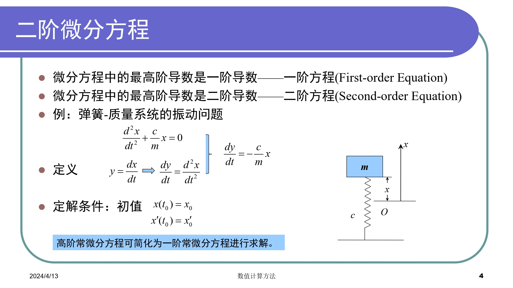
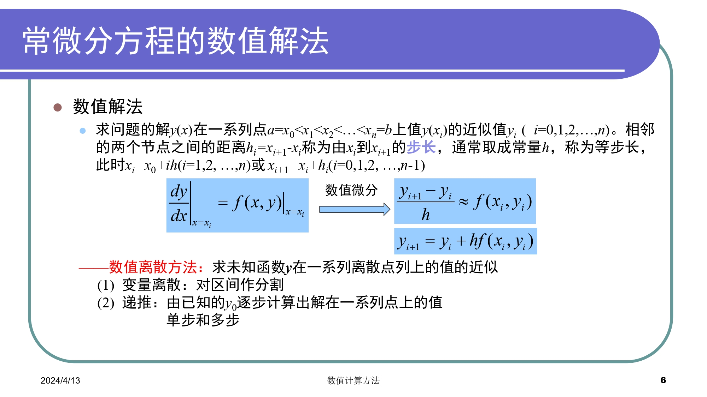
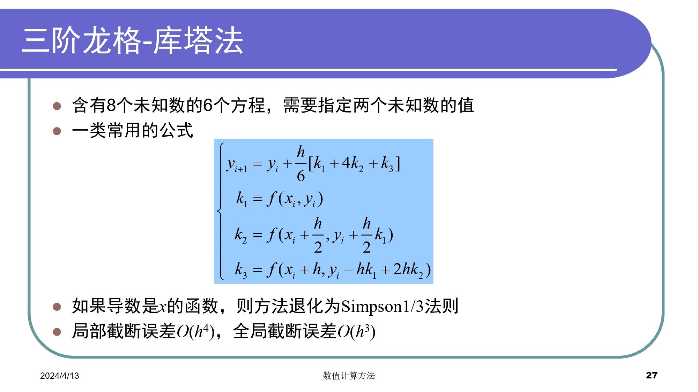
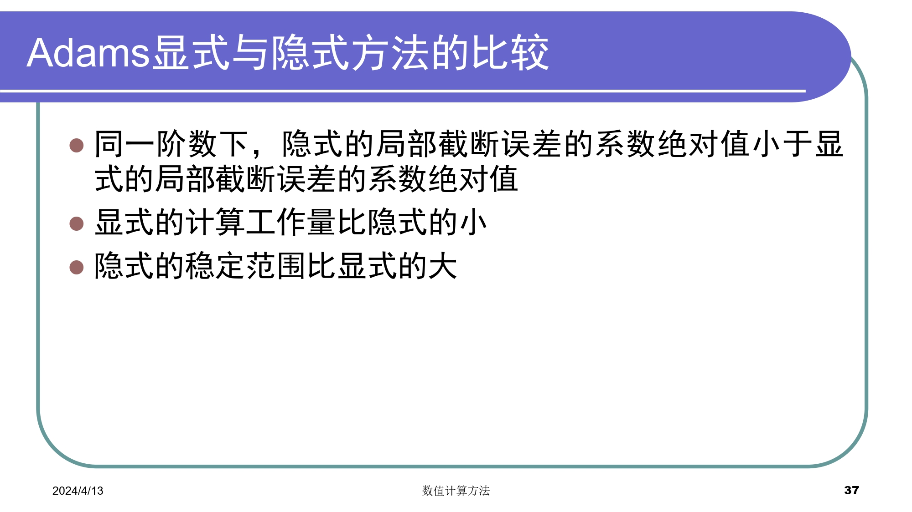
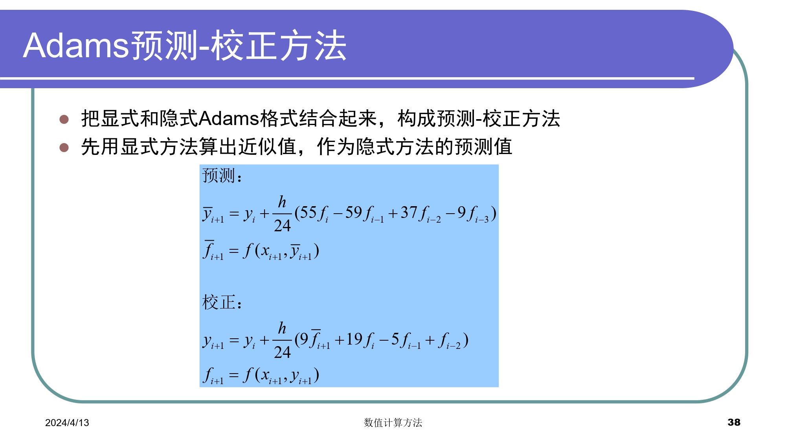
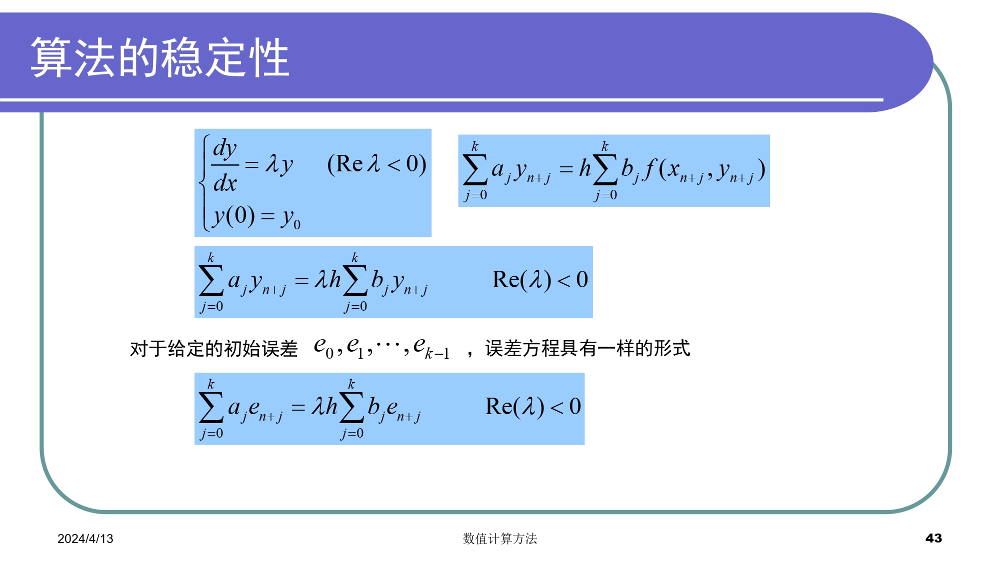
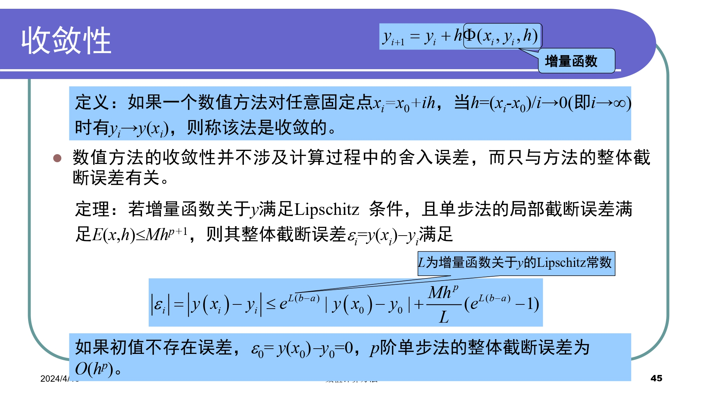
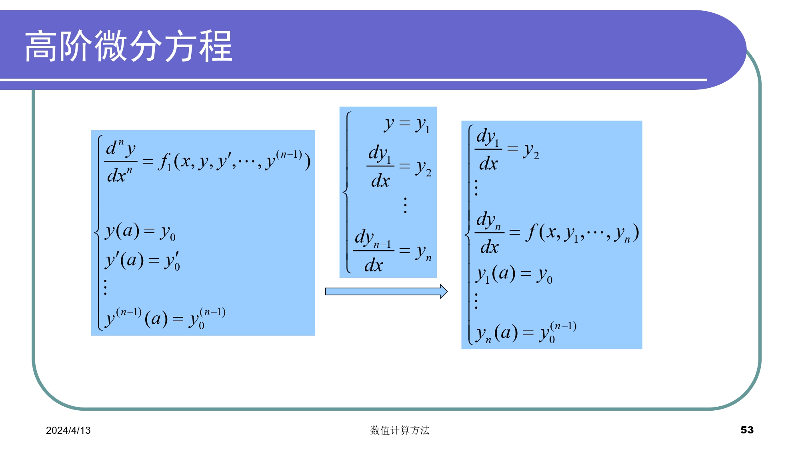
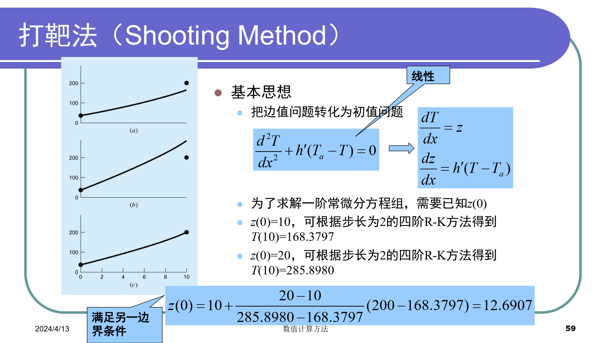

# Chapter6 常微分方程的数值解
### 概览
定解条件

- 初值问题
给出积分曲线在初始点的状态(初始条件)
- 边值问题
给出积分曲线首尾两端的状态(边界条件)

### 初值问题
#### 欧拉(Eular)法

#### 龙格-库塔(Runge-Kutta)法

#### 多步法

#### 稳定性、收敛性和刚性问题

##### 稳定性

##### 收敛性

#### 微分方程组和高阶微分方程

### 边值问题

#### 打靶法

#### 差分法

### 总结

