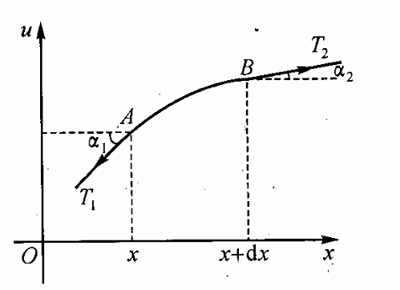

# Chap1 方程的导出和定解问题

## 方程的导出

### 偏微分方程的导出

!!! question "弦的微小横振动"
    有一个完全柔软的弦，沿水平直线绷紧，而后以某种方法激发，使弦在同一个平面上作小振动，列出弦的横振动方程。

!!! proof "推导过程"
    对于柔软的弦，张力沿着切线方向作用

    

    在弦上隔离出一小段弦元，其重力与所受张力相比可忽略不计

    AB段无纵向（$x$轴方向）运动，故有

    $$T_2\cos \alpha_2-T_1\cos \alpha_1=0$$

    不妨认为$\mathrm{d}s\approx \mathrm{d}x,\alpha_1 \approx 0,\alpha \approx 0,\cos \alpha_1 \approx 1,\sin \alpha_1 \approx \tan \alpha_1=u_x|_x,\sin \alpha_2 \approx \tan \alpha_2 =u_x|_{x+\Delta x}$

    根据牛顿第二定律，得横向的运动方程

    $$T_s \sin \alpha_2 -T_1 \sin \alpha_1 =(\rho \Delta x)u_{tt}$$

    其中$\rho$为线密度。不难得到$T_1=T_2$。由胡克定律知张力$T$与时间$t$无关，故张力$T$为常数，记为$T_0$，即有

    $$T_0 (u_x|_{x+\Delta x}-u_x|_x)=(\rho \Delta x)u_{tt}$$

    利用微分中值定理，令$\Delta x \rightarrow 0$，得

    $$T_0u_{xx}=a^2u_{ttt}$$

    记$a^2=T_0/\rho$，即有

    $$\frac{\partial^2 u}{\partial t^2}=a^2 \frac{\partial^2 u}{\partial x^2}$$

### 数学物理方程

含有未知函数及其偏导数的关系式，即<b>偏微分方程</b>，又称<b>数学物理方程</b>。

我们给出以下示例：

!!! example "示例：弦的微小横振动"

    弦的微小横振动方程，又称<b>一维波动方程</b>

    $$\frac{\partial^2 u}{\partial t^2}=a^2 \frac{\partial^2 u}{\partial x^2}$$

    若弦在振动过程中受到外力作用，则有<b>弦的强迫振动方程</b>

    $$
    u_{tt} = a^2 u_{xx} +f(x,t)
    $$

!!! example "示例：膜的微小横振动"
    <b>二维波动方程</b>

    $$u_{tt}=a^2(u_{xx}+u_{yy})$$

    膜的受迫振动方程

    $$u_{tt}=a^2 (u_{xx}+u_{yy})+f(x,y,t)$$

考察波在空间的传播，得到三维的波动方程

$$u_{tt}=a^2 \nabla^2 u+f(P,t)$$

若记$u_{xx}+u_{yy}+u_{zz}=\nabla^2 u=\Delta u=\frac{\partial^2 u}{\partial x^2}+\frac{\partial^2 u}{\partial y^2}+\frac{\partial^2 u}{\partial z^2}$，其中$\nabla^2$或$\Delta$称为Laplace算子，则一般的波动方程为

$$u_{tt}=a^2 \nabla^2 u+f(P,t)$$

!!! example "热传导方程"
    根据热传导的Fourier定律和热量守恒定律，可以推导出<b>热传导方程</b>

    $$
    u_t=a^2\Delta u
    $$

    $$
    u_t=a^2 \Delta u + f(x,y,z,t)
    $$

    在无热源的热传导问题中，经过相当长时间后，各点的温度随时间的推移趋于稳定，称为温度分布趋于稳恒状态，此时$u_t=0$，方程为

    $$
    \Delta u=0
    $$

    上式称为<b>Laplace方程</b>，又称为调和方程

    类似地若热源与时间无关，且温度分布达到稳恒状态时有

    $$\Delta u =f(x,y,z)$$

    上式称为<b>Poission方程</b>

偏微分方程的一般形式为

$$F(x_1,x_2,...x_n,u,u_{x_1},...,u_{x_1x_2})=0$$

方程中出现的未知函数$u=u(x_1,...x_n)$的最高导数的阶数称为<b>方程的阶</b>。若$F$对$u$及其各阶偏导数来说是线性函数，则称该方程是<b>线性方程</b>。

$n$个自变量二阶线性方程的一般形式为

$$\sum_{i,j=1}^n a_{ij}\frac{\partial^2 u}{\partial x_i \partial x_j}+\sum_{i=1}^n b_i \frac{\partial u}{\partial x_i}+cu=f$$

不含$u$及其偏导数的项称为<b>自由项</b>。若$f\equiv 0$，称为<b>线性齐次方程</b>，反之称为<b>线性非齐次方程</b>。

若$u$及其各阶偏导数的系数均是常数，称为<b>常系数的线性方程</b>。

## 定解条件和定解问题

### 边界条件

未知函数在边界上的值已知，称为<b>第Ⅰ类边界条件</b>

$$
u|_{x=0} \equiv u(0,t)=f_1(t)
$$

$$
u|_{x=l} \equiv u(l,t)=f_2(t)
$$

未知函数沿界面的外法向的方向导数已知，称为<b>第Ⅱ类边界条件</b>

$$
\frac{\partial u}{\partial n}|_{x=l} = g(t)
$$

未知函数及其外法向方向导数的线性组合在界面上已知，称为<b>第Ⅲ类边界条件</b>

$$
(\frac{\partial u}{\partial n}+ \mu u)|_{x=t}=f(t)
$$

对于二维或三维空间的物理模型，可类似写出各类边界条件，如第Ⅲ类边界条件是

$$(h\frac{\partial u}{\partial n}+ku)|_{s}=f(P,t)$$

若$f(P,t)\equiv 0$，称边界条件是<b>齐次</b>的，否则称为<b>非齐次边界条件</b>。

### 初始条件

初始条件是整个被研究系统的某些必要的初始状态。

初始条件，边界条件统称为<b>定解条件</b>。方程和定解条件构成<b>定解问题</b>。

边界条件和方程组成的边值问题称为<b>边值问题</b>。三类边界条件加上方程构成的定解问题分别称为：<b>第一边值问题</b>（Dirichlet问题），<b>第二边值问题</b>（Neumann问题），<b>第三边值问题</b>（Robin问题）。当边值问题考虑的区域是无限时，通常要求$\lim_{p\rightarrow \infty}u(P)=0$，称为<b>自然的边界条件</b>。

初始条件和方程组成的定解问题称为<b>初值问题</b>，又称Cauchy问题。

既有初始条件又有边界条件的定解问题称为<b>混合问题</b>。

解的存在性、唯一性和连续依赖性，总称为<b>定解问题的适定性</b>。

## 二阶线性方程的分类和叠加原理

### 二阶线性方程的分类

对于平面上的二次曲线方程，有一般形式

$$ax^2+2bxy+cy^2+dx+ey=f$$

经过适当的坐标变化可将上式化简为椭圆、双曲线和抛物线的标准方程。我们希望对于二阶线性偏微分方程，也有适当的自变量变换，将其化简，从而得到标准型。

对于二阶线性偏微分方程

$$
au_{xx}+2bu_{xy}+cu_{yy}+du_{x}+eu_{y}+fu=g
$$

设有自变量变换

$$\left\{\begin{aligned}\xi=\xi(x,y) \\ \eta=\eta(x,y) \end{aligned}\right.$$

代入得到

$$a_1u_{\xi\xi}+2b_1u_{\xi\eta}+c_1u_{\eta\eta}+d_1u_\xi+e_1u_{\eta}+f_1u=g_1$$

其中

$$\left\{\begin{aligned}a_1 =a\xi_x^2+2b\xi_x \xi_y+c\xi_y^2 \\ c_1=a\eta_x^2 +2b \eta_x \eta_y +c\eta_y^2\end{aligned}\right.$$

我们可以取适当的$\xi(x,y)$和$\eta(x,y)$，使$a_1=c_1=0$，以实现方程的化简

注意到$a_1$和$c_1$的形式统一，即$\xi(x,y)$和$\eta(x,y)$可以取下列一阶偏微分的两个线性无关的解

$$a\xi_x^2+2b\xi_x\xi_y+c=0$$

令

$$\frac{\mathrm{d}y}{\mathrm{d}x}=\frac{-\xi_x}{\xi_y}$$

则有

$$a(\frac{\mathrm{d}y}{\mathrm{d}x})^2-2b\frac{\mathrm{d}y}{\mathrm{d}x}+c=0$$

!!! formula "特征方程"
    我们称其为<b>特征方程</b>

    $$
    a(\frac{dy}{dx})^2 -2b\frac{dy}{dx}+c=0
    $$

    相应的积分曲线称为<b>特征线</b>

根据判别式的符号，我们可以对二阶线性偏微分方程进行分类讨论

$$\Delta=b^2-ac$$

#### 双曲型方程

$\Delta>0$，方程有两个不等的实根，可以得到两个通积分

$$\xi(x,y)=C_1,\eta(x,y)=C_2$$

引进替换

$$\xi=s+t$$

$$\eta=s-t$$

可以得到<b>双曲型方程的标准型</b>

$$
u_{ss}-u_{tt}=H_2(s,t,u,u_s,u_t)
$$

#### 抛物型方程

$\Delta=0$，方程只有一个实根，通积分为$\xi(x,y)=C_1$，取与$\xi(x,y)$无关的任一函数$\eta=\eta(x,y)$

方程可以化简为

$$
u_{\eta\eta}=H_3(\xi,\eta,u,u_\xi,u_\eta)
$$

称为<b>抛物型方程的标准型</b>

#### 椭圆型方程

$\Delta<0$，方程有一对共轭复根，解得通积分$\xi(x,y)=C_1$和$\eta(x,y)=C_2$，其中$\eta=\bar{\xi}$

引进替换

$$\xi=s+\mathrm{i}r$$

$$\eta=s-\mathrm{i}r$$

方程化简为

$$
u_{ss}+u_{tt}=H_4(s,r,u,u_s,u_r)
$$

称为<b>椭圆型方程的标准型</b>

热传导方程、波动方程和拉普拉斯方程分别是抛物型、双曲型和椭圆型三类方程的典型代表。

!!! info "二阶线性偏微分方程的化简"
    1. 求特征方程
    2. 求特征线
    3. 作替换化简

### 线性方程的叠加原理

设有二阶线性偏微分方程

$$\sum_{i,j=1}^n a_{ij}\frac{\partial^2 u}{\partial x_i \partial x_j}+\sum_{i=1}^n b_i \frac{\partial u}{\partial x_i}+cu=f$$

引入算子

$$L=\sum_{i,j=1}^n a_{ij}\frac{\partial^2}{\partial x_i \partial x_j}+\sum_{i=1}^n b_i \frac{\partial }{\partial x_i}+c$$

则方程可改写为

$$Lu=f$$

!!! definition "线性算子"
    我们给出线性算子的概念，若算子M满足

    $$M(c_1u_1+c_2u_2)=c_1M(u_1)+c_2M(u_2)$$

    则称M为线性算子

故L为线性（微分）算子

我们给出<b>线性方程的叠加原理</b>

!!! theorem "线性方程的叠加原理"
    - 若$u_i$是$Lu=0$的解，$c_i$为任意常数，则$\sum_{i=1}^n c_iu_i=u$也是$Lu=0$的解

    - 若$u_i$是$Lu=0$的解，$\bar{u}$是非齐次方程$Lu=f$的一个解，则$u=\sum_{i=1}^n c_iu_i+\bar{u}$满足$Lu=f$

    - 设$L(u_1)=f_1,L(u_2)=f_2$，则$L(c_1u_1+c_2u_2)=c_1f_1+c_2f_2$
    
    - 设$L(u_i)=0$且$\sum_{i=1}^\infty c_iu_i$在G中一致收敛，对自变量$(x_1...x_n)$逐项微分两次后的级数在G中仍一致收敛，则$u=\sum_{i=1}^\infty c_iu_i$是$Lu=0$的解

对于非线性方程或非线性边界条件，叠加原理不再成立

### 二维Laplace方程的通解

二阶常微分方程的通解中含有两个任意常数，与之类似，二阶偏微分方程的通解中含有两个任意函数

例如，偏微分方程$\frac{\partial^2 u(x,y)}{\partial x^2}=0$的通解为

$$u(x,y)=c_1(y)+xc_2(y)$$

其中$c_1(y)$和$c_2(y)$是任意函数

又如，偏微分方程$\frac{\partial^2 u(x,y)}{\partial x\partial y}=0$的通解为

$$u(x,y)=c_1(x)+c_2(y)$$

其中$c_1(x)$和$c_2(y)$是任意函数

对于二维Laplace方程$\nabla^2 u=0$，我们作变换

$$\xi=x+\mathrm{i}y,\eta=x-\mathrm{i}y$$

原方程变为$\frac{\partial^2 u}{\partial \xi \partial \eta}=0$

可得通解为

$$u(x,y)=f(x+\mathrm{i}y)+g(x-\mathrm{i}y)$$
