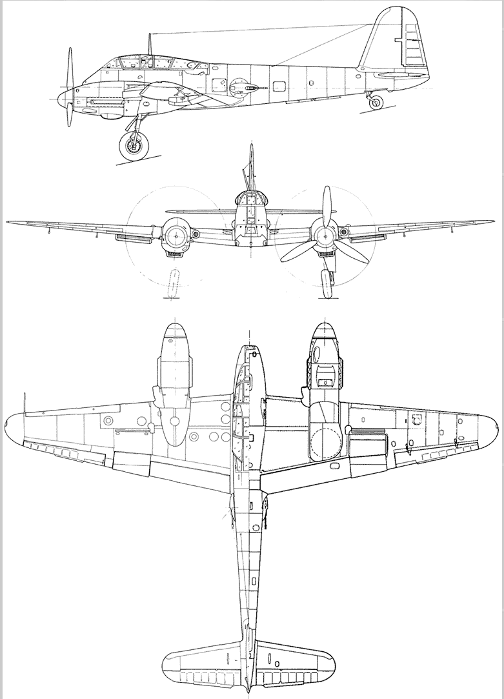
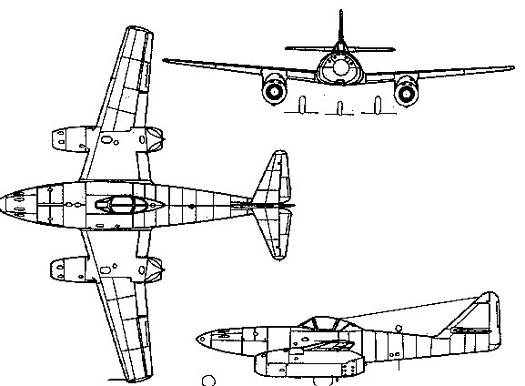
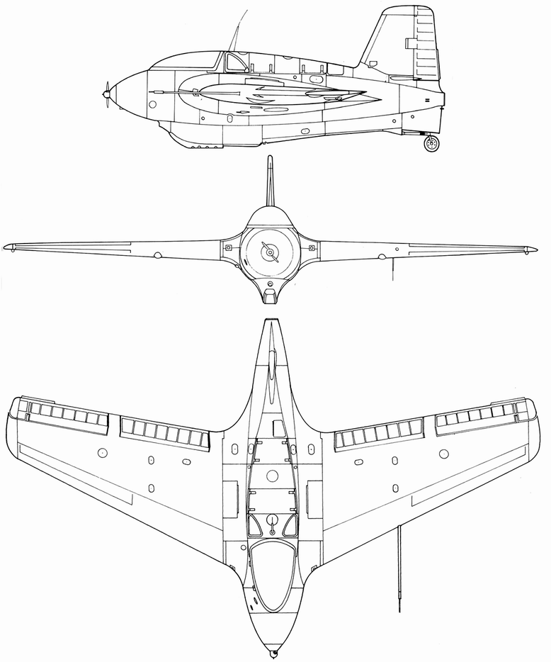
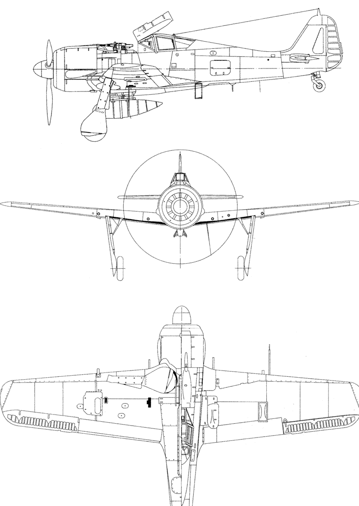
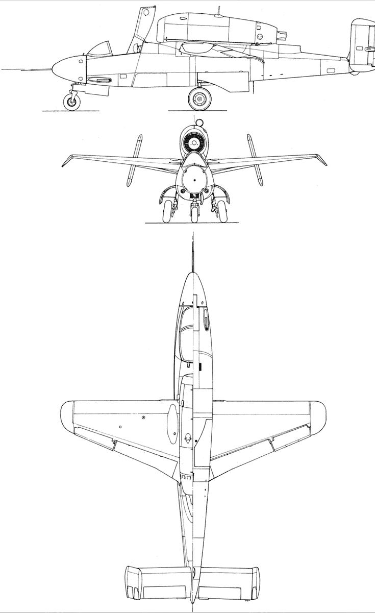

# 翼载荣光！

鉴于本科专业知识学得毫无章法可言，因此笔者准备自主撰写一份学习的总纲，并定名为《翼载荣光！》

拟包含四大篇章：总体（航概+总体设计）、飞动（空动+飞动+推进）、结构（结构设计基础+结构动力学+有限元）、控制（自控+信号）。尽量援引教材原文，突出重点。

让我们以杨华老师总结归纳的问题为引，开始正式探索吧！

!!! question "问题"
    - 如何确定一架飞机的总体质量——飞行器总体设计
    - 如何绘制一架飞机的三维数模——机械制图
    - 如何计算一架飞机的气动性能——空气动力学
    - 如何评估一架飞机的飞行性能——飞行动力学
    - 如何设计一架飞机的机体结构——飞行器结构设计基础
    - 如何加工和制作一架飞机——微型飞行器装配
    - 如何调试和试飞一架飞机——航空航天创新实践

vsp 低速不可压 涡格法

静稳定 重心在焦点前面

大黄蜂 Me410

金飞燕 Me262

彗星 Me163

金Fw Fw-190

蝾螈 He-162

