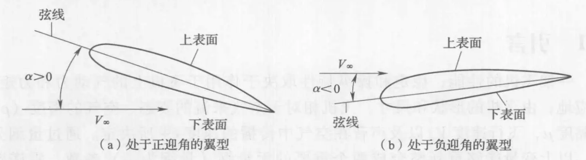
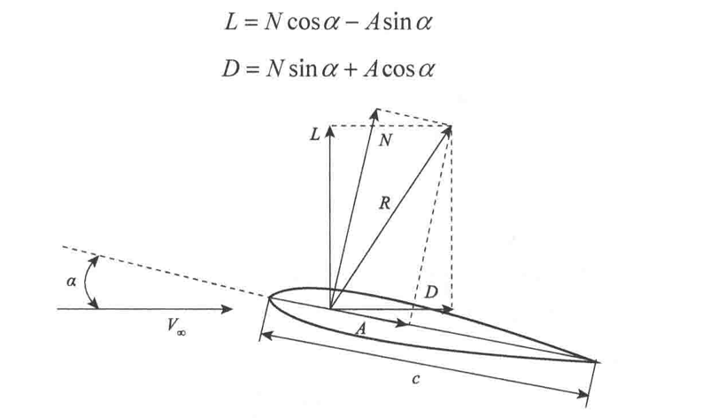

# 飞动篇

## 空气动力学原理

这部分内容详见空气动力学

## 飞行的力

### 阻力

阻力：摩擦阻力、压差阻力、诱导阻力

### 受力分析

飞机相对于气流的姿态即迎角$\alpha$，定义为气流方向与固定于飞机上的一条参考线之间的夹角

## 飞行性能、稳定性与操纵性

这部分内容详见飞行动力学

<b>飞行性能：</b>研究在外力作用下飞机质心运动的规律及飞机在飞行中所能达到的一些指标

<b>稳定性：</b>研究在外界扰动作用下飞机的运动特性即飞机<b>保持</b>飞行状态的能力

<b>操纵性：</b>研究在飞行员操纵作用下飞机的运动特性即飞机<b>改变</b>飞行状态的能力

### 飞行性能

### 稳定性

### 操纵性

