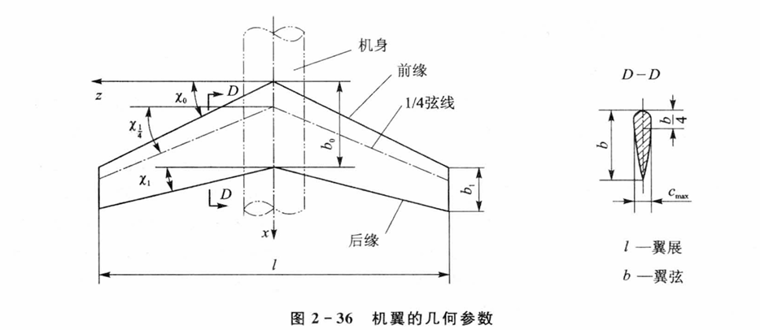
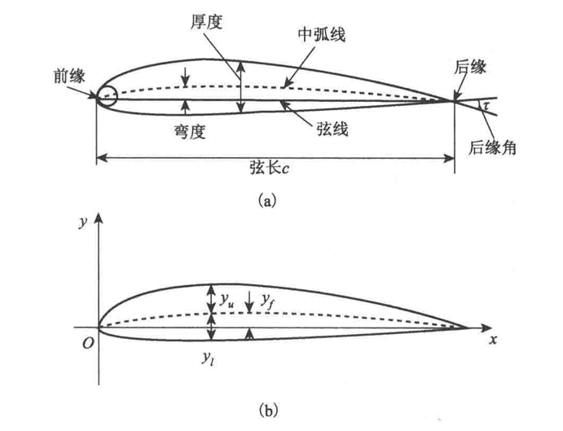

# 总体篇

## 飞机

这部分内容详见航空航天概论和飞行器总体设计

飞行器的定义与历史不必赘述（详见于航概第一章），我们直接来认识飞机本身。

飞机机体可分为机翼、机身、尾翼。

### 机身参数

### 机翼参数

机翼是产生升力和阻力的主要部件，其几何外形可以从<b>机翼平面形状</b>和<b>翼剖面形状</b>两个方面描述。

机翼平面形状包括：

- 翼展$l$：机翼左右翼梢之间的最大横向距离

- 翼弦$b$：翼型前缘点和后缘点之间的连线

- 前缘后掠角$\chi_0$：机翼前缘线与垂直于翼根对称平面的直线之间的夹角

影响飞机气动特性的主要参数有：<b>前缘后掠角</b>$\chi_0$、<b>展弦比</b>$\lambda$、<b>梢根比</b>$\eta$和<b>翼型的相对厚度</b>$\bar{c}$。

<b>展弦比</b>是指机翼展长与平均几何弦长之比，即

$$\lambda=\frac{l}{b_{av}}=\frac{l^2}{lb_{av}}=\frac{l^2}{S}$$

对于图示直边机翼，平均几何弦长$b_{av}=(b_0+b_1)/2$；S为整个机翼平面形状的面积。

<b>梢根比</b>是指翼梢弦长与翼根弦长之比，即

$$\eta=\frac{b_1}{b_0}$$

PS：总体设计会考察展弦比和梢根比的计算

<b>翼型的相对厚度</b>是指翼型最大厚度与弦长之比，即

$$\bar{c}=\frac{c_{\max}}{b}$$

!!! note "NACA翼型"
    NACA翼型可以归为：4位数字、5位数字和6系列翼型
    - NACA系列的四位数字翼型
        + 第一位表示最大弯度相对弦长的百分数
        + 第二位数字表示最大弯度位置距前缘点距离相对弦长的十分数
        + 最后两位表示最大厚度相对弦长的百分数

$$C_l=\frac{L}{\frac{1}{2}\rho_{\infty}V_{\infty}^2S}$$

$$C_d=\frac{D}{\frac{1}{2}\rho_{\infty}V_{\infty}^2S}$$

$$C_m=\frac{M}{\frac{1}{2}\rho_{\infty}V_{\infty}^2S\bar{c}}$$

分别为升力系数、阻力系数和俯仰力矩系数