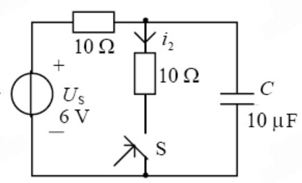
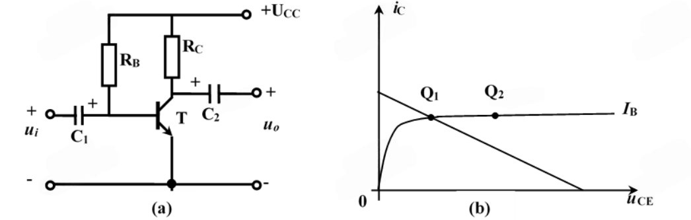
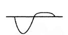
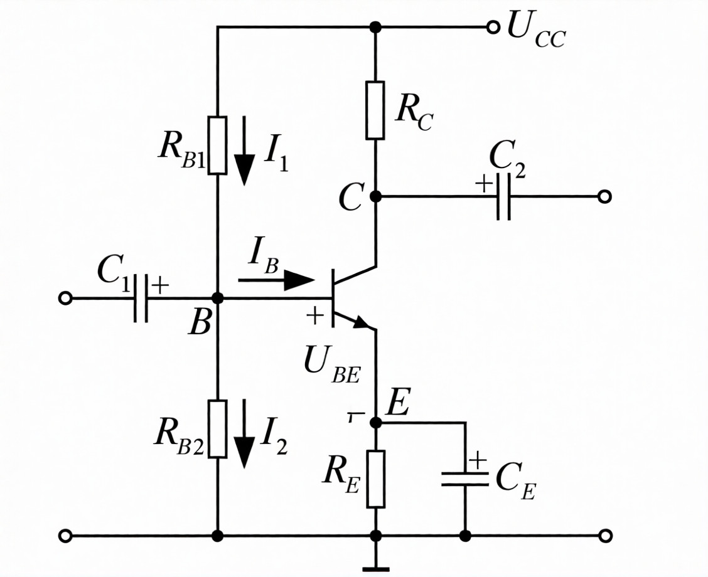
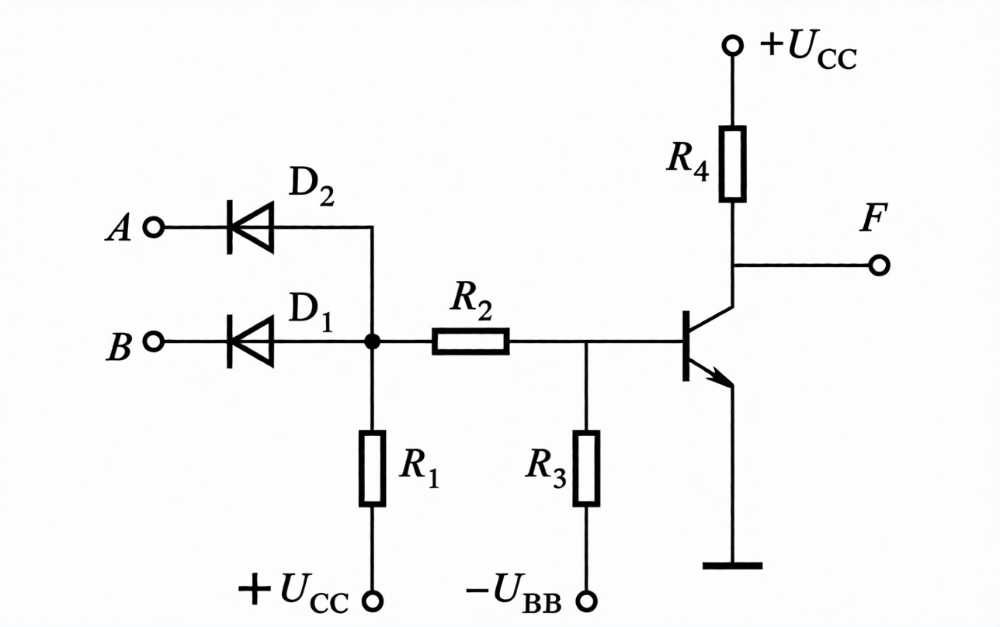
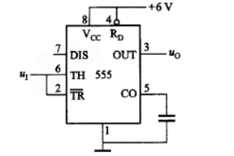
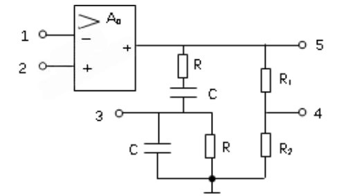

# 电工电子学 小测

## 第一章课堂小测

## 第二章课堂小测

1.戴维宁定理可将复杂的有源二端电路等效为一个电压源和一个电阻并联的电路模型

A.正确

B.错误

答案：B

---

2.处于谐振状态的RLC串联电路，当电源频率升高时，电路将呈电容性

A.正确

B.错误

答案：B

---

3.三相对称电路分析计算可以归结为一相电路计算，其他两相可依此滞后120度直接写出

A.正确

B.错误

答案：A

---

4.电容器在充电时，其端电压逐渐由低变高，充电电流也逐渐由小变大

A.正确

B.错误

答案：B

---

5.功率因数提高实质是提高了电路中负载的有功功率

A.正确

B.错误

答案：A

---

6.关于叠加定理的应用，下列叙述中正确的是（）

A.不仅适用于线性电路，而且适用于非线性电路

B.仅适用于非线性电路的电压、电流计算

C.仅适用于线性电路，并能利用其计算各分电路的功率进行叠加得到原电路的功率

D.仅适用于线性电路的电压、电流计算

答案：D

---

7.关于正弦交流电相量的中（）的说法是正确的

A.模是正弦量的平均值

B.模是有效值

C.辐角是相位

D.辐角是相位差

答案：B

---

8.已知RLC并联电路的端电流I=10A，电感电流IL=1A，电容电流IC=9A，则电阻电流IR为（）

A.8A

B.6A

C.2A

D.0A

---

9.当电源容量一定时，功率因数值越大，说明电路中用电设备的（）

A.无功功率大

B.有功功率大

C.有功功率小

D.视在功率大

答案：B

---

10.图示电路在换路前处于稳定状态，在t=0瞬间将开关S闭合，则$i_2(0^+)$为（）

A.0.6A

B.1.2A

C.0.3A

D.0.8A

答案：A

## 第三章课堂小测

1.通常要求电压放大电路的输入电阻要小，输出电阻要大

A.正确

B.错误

答案：B

---

2.只要放大电路的静态工作点设置合适，输出波形就不会失真

A.正确

B.错误

答案：B

---

3.共发射极放大电路放大倍数大，输入电阻大，输出电阻小

A.正确

B.错误

答案：B

---

4.共集电极放大电路输入电阻大，输出电阻小，但没有电压放大能力

A.正确

B.错误

答案：A

---

5.晶体管构成非门电路时工作在开关状态

A.正确

B.错误

答案：A

---

6.下图（a）所示为放大电路，（b）为三极管的输出特性曲线及放大电路的负载线，欲将静态工作点从Q1移到Q2位置时，应调节电阻（）

A.RC减少

B.RC增加

C.RB减少

D.RB增加

---

7.由NPN型晶体管组成的基本共射放大电路，当输入信号ui为正弦波时，输出uo波形为下图，则可判定uo波形为（）

A.截止失真

B.饱和失真

C.交越失真

D.不能确定

答案：A

---

8.如右图所示的分压式偏置电路，以下针对该电路特点的说法中错误的是（）

A.UB由电源电压UCC和偏流电阻RB1、RB2所决定，不随温度而变，与双极晶体管的参数也无关

B.发射极电阻RE引入了直流电流串联负反馈

C.CE称交流旁路电容，主要作用是旁路RE，以免降低放大电路的放大倍数

D.由于RE越大，工作点稳定效果越好，因此，RE的取值越大越好

---

9.射极跟随器的主要特点是（）

A.电压放大倍数小于1，输入阻抗低、输出阻抗高

B.电压放大倍数小于1，输入阻抗高、输出阻抗低

C.电压放大倍数大于1，输入阻抗低、输出阻抗高

D.电压放大倍数大于1，输入阻抗高、输出阻抗低

答案：B

---

10.设图晶体管工作在开关状态，其输出F与输入A、B的逻辑关系为（）

A.$F=AB$

B.$F=A+B$

C.$F=\overline{AB}$

D.$F=\overline{A+B}$

答案：D

## 第四章课堂小测

1.寄存器属于组合逻辑电路

A.正确

B.错误

答案：错误

---

2.三态门输出为高阻时，其输出线上电压为高电平

A.正确

B.错误

答案：错误

---

3.RS触发器、JK触发器的输出均有不定状态

A.正确

B.错误

答案：错误

---

4.两个二进制数相加，并加上来自低位的进位，称为全加，所用的电路为全加器

A.正确

B.错误

答案：A

---

5.同步清零与CP脉冲无关，异步清零与CP脉冲无关

A.正确

B.错误

答案：B

---

6.组合逻辑电路通常由（）组合而成

A.门电路

B.触发器

C.计数器

D.寄存器

答案：A

---

7.有一个左移移位寄存器，当预先置入1011后，其串行输入固定接0，在4个移位脉冲CP作用下，四位数据的移位过程是（）

A.1011--0110--1100--1000--0000

B.1011--0101--0010--0001--0000

C.1011--0000--1100--0110--1000

D.0001--0101--0010--0000--1011

---

8.在函数F=AB+CD的真值表中，F=1的状态有多少个（）

A.2

B.4

C.6

D.7

答案：D

---

9.在下列逻辑电路中，不是组合逻辑电路的有（）

A.译码器

B.编码器

C.全加器

D.寄存器

答案：D

---

10.N个触发器可以构成最大计数长度（进制数）为（）的计数器

A.N

B.2N

C.N^2

D.2^N

## 第五章课堂小测

## 第六章课堂小测

1.对一个正弦波振荡电路只要满足AF=1就能输出正弦波

A.正确

B.错误

答案：B

---

2.只要引入正反馈，电路就会产生正弦波振荡

A.正确

B.错误

答案：B

---

3.应用单稳态触发器时，触发脉冲持续时间应小于暂稳时间tw

A.正确

B.错误

答案：A

---

4.施密特触发器是属于电平触发器

A.正确

B.错误

答案：A

---

5.产生低频正弦波一般可用RC正弦波振荡电路

A.正确

B.错误

答案：A

---

6.在RC正弦波振荡电路中，RC串并联网络的功能是（）

A.正反馈和选频

B.选频和稳幅

C.放大和稳幅

D.正反馈和放大

答案：A

---

7.下图电路是由一个555集成定时器构成的（）

A.多弦振荡器

B.单稳态触发器

C.施密特触发器

D.正弦波振荡电路 

---

8.一个正弦波振荡器的反馈系数$F=1/5\angle 180^\circ$，若该振荡器能够维持稳定振荡，则开环电压放大倍数Au必须等于（）

A.$1/5\angle 360^\circ$

B.$1/5\angle 0^\circ$

C.$5\angle -180^\circ$

D.$5\angle 0^\circ$

答案：C

---

9.未产生周期性矩形波，应当选用（）

A.施密特触发器

B.单稳态触发器

C.多谐振荡器

D.译码器

答案：C

---

10.要将下图所示运放电路接成正弦波振荡电路，正确的连接方法是（）

A.1与3相接，2与5相接

B.1与5相接，2与3相接

C.1与4相接，2与3相接

D.1与3相接，2与4相接

## 第七章课堂小测

## 第八章课堂小测

1.在三种功率放大电路中，效率最高的是甲类功放

A.正确

B.错误

答案：B

---

2.在电路参数相同的情况下，半波整流电路流过二极管的平均电流为桥式整流电路流过二极管平均电流的一半

A.正确

B.错误

答案：B

---

3.功率放大电路的主要作用是向负载提供足够大的功率信号

A.正确

B.错误

答案：A

---

4.在功率放大电路中，输出功率越大，功放管的功耗越大

A.正确

B.错误

答案：B

---

5.由于功率放大电路中的功放管工作于大信号状态，因此通常用图解法分析电路

A.正确

B.错误

答案：A

---

6.功率放大电路的效率是指（）

A.输出功率与电源提供的平均功率之比

B.输出功率与三极管所消耗的功率之比

C.三极管所消耗的功率与电源提供的平均功率之比

D.三极管所消耗的功率与输出功率之比

答案：A

---

7.与甲类功率放大方式相比，乙类功率放大方式的主要优点是（）

A.不用输出变压器

B.不用输出端大电容

C.效率高

D.无交越失真

答案：C

---

8.互补对称功率放大电路从放大作用来看，（）

A.既有电压放大作用，又有电流放大作用

B.只有电流放大作用，没有电压放大作用

C.只有电压放大作用，没有电流放大作用

D.没有电压放大作用，也没有电流放大作用

答案：B

---

9.整流电路输出端加上电容滤波后，使负载的电压（）

A.交流分量不变，平均值增大

B.交流分量增大，平均值增大

C.交流分量减小，平均值增大

D.交流分量减小，平均值不变

答案：C

---

10.一般晶闸管导通后，要使其阻断，则必须（）

A.去掉控制极正向电压

B.使阳极与阴极间的正向电压降到零或加反向电压

C.控制极加反向电压

D.使阳极电流大于维持电流

答案：B

## 第九章课堂小测

1.变压器在运行时的损耗包括铁损耗和铜损耗

A.正确

B.错误

答案：A

---

2.变压器可改变直流电压和交流电压的大小

A.正确

B.错误

答案：B

---

3.三相异步电动机中旋转磁场的转速与外接电源电压的大小成正比

A.正确

B.错误

答案：B

---

4.三相交流异步电动机电磁转矩的大小与外加交流电压的大小相关

A.正确

B.错误

答案：A

---

5.三相异步电动机在正常运行时，其转差率都在0至1之间

A.正确

B.错误

答案：A

---

6.两个完全相同的交流铁心线圈，分别工作在电压相同而频率不同（$f_1$>$f_2$）的两电源下，此时线圈的电流I1和I2的关系是（）

A.I1>I2

B.I1<I2

C.I1=I2

D.不确定

答案：B

---

7.三相异步电动机旋转磁场的转速与（）

A.转子电流频率成正比

B.定子电流频率成正比

C.定子磁极对数成正比

D.电源电压大小成正比

答案：B

---

8.一台三相异步电动机，额定功率10kW，额定转速1440r/min，额定电压为380V，额定频率50Hz，额定效率0.90，额定功率因数0.85。电动机的磁极对数P和额定电流IN为（）

A.P=1、IN=19.86A

B.P=2、IN=34.4A

C.P=2、IN=17.8A

D.P=2、IN=19.86A

答案：D

---

9.三相异步电动机星形-三角形换接起动适用于（）

A.电动机正常运行时为星形接法，轻载或空载

B.电动机正常运行时为三角形接法，轻载或空载

C.电动机正常运行时为星形接法，额定负载

D.电动机正常运行时为三角形接法，与负载无关

答案：B

---

10.正常运行的三相异步电动机转子的转速nN与旋转磁场的转速n1之间的关系是（）

A.nN>n1

B.nN<n1

C.nN=n1

D.不定

答案：B

## 第十章课堂小测