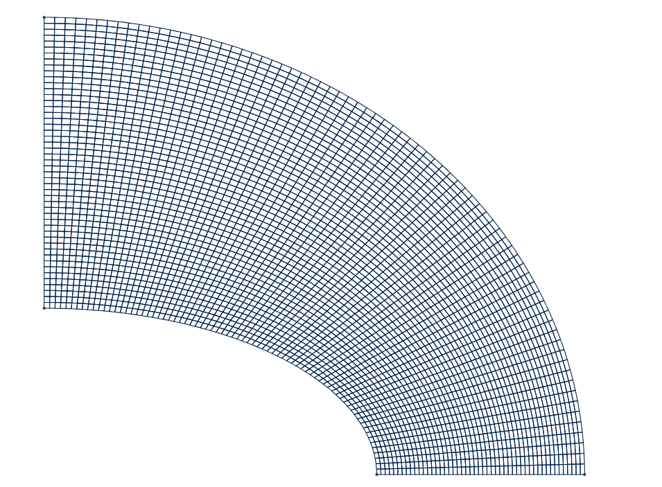
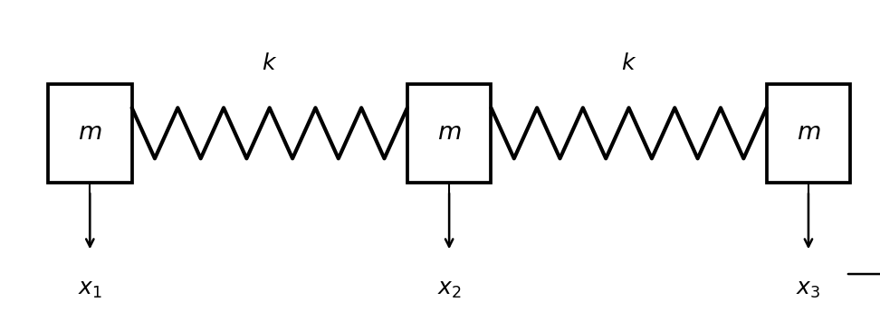
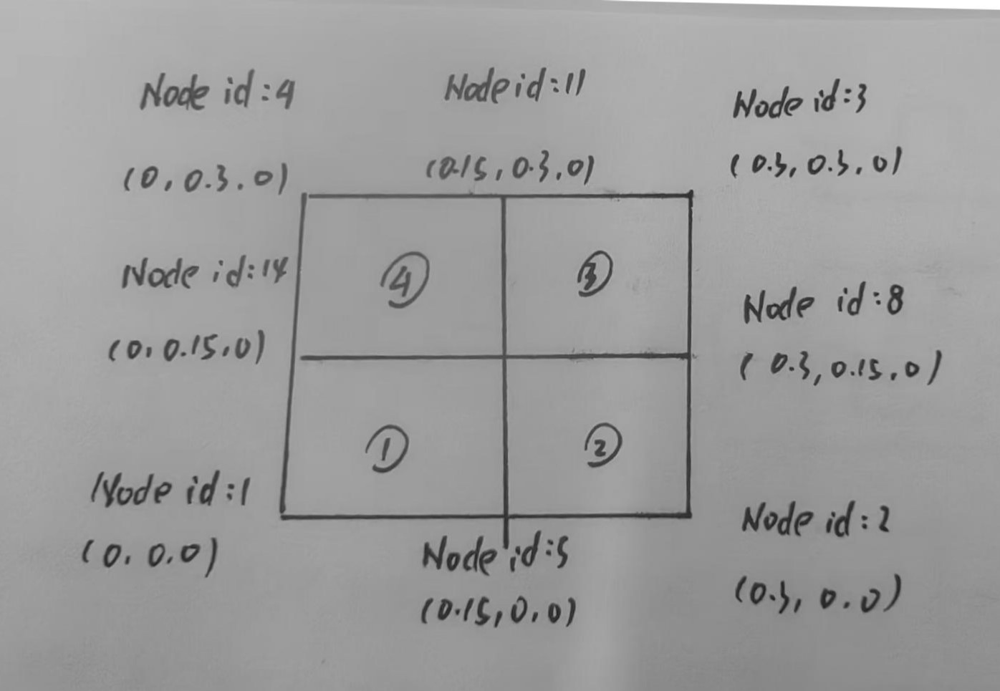

# 2025-2026 春夏学期 飞行器结构动力学

一、填空题（每题5分）

1.自激振动是由于输入输出间有反馈现象并且____的振动

2.长度为1的正方形薄板，其第一阶固有频率表达式为____

3.一弹簧振子，周期是1.5s，振幅为6cm，当振子通过平衡位置向右运动时开始计时，那么9秒内振子完成____次振动，通过路径____cm

4.结构动力学问题的基本特点是____

二、判断以下说法是否正确，对错误的说法加以改正（每题5分）

1.对于非线性系统，其固有特性也可以采用叠加原理

2.为了避免共振，要错开激励频率和结构固有频率，一般通过改变激励频率来实现

3.参数振动是系统自身参数变化激发的振动

4.结构的固有频率，会随着所选择坐标系的变化而变化

三、简答与叙述题（每题10分）

1.下图是NAFEMS发布的第一个单元精度测试标准考题LEI，用三节点一阶平面单元离散后计算，误差很大，请问如何提高其计算精度（注：图片仅供参考）

2.飞行器结构动态响应分析的时间域方法主要有哪些？选用它们时主要考虑的因素是什么

3.飞行器结构动态固有特性分析的作用与特点

四、解析与数值计算题（每题15分）

1.在简化模型中，估算导弹轴向频率的模型如下图所示，求图示系统的频率和振型（提示：半正定系统）

2.有一长0.3m厚2mm的正方形钢板（弹性模量210000MPa，Poison比0.32，密度7800kg/m3），正方形右边为固支边界，有限元离散为四个四边形单元，如下图所示，先要用Prepromax开源软件分析其前4阶固有频率特性，请写出其输入文件

