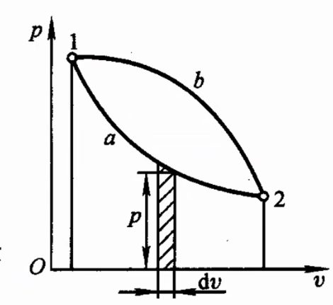
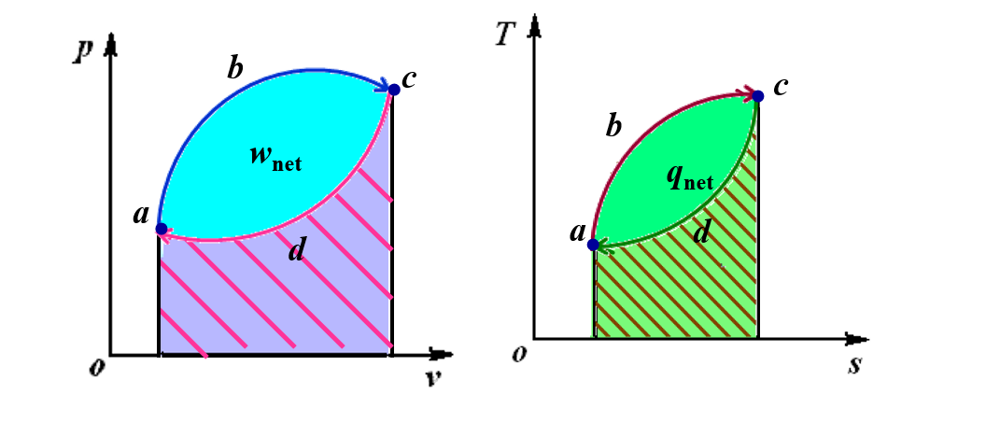

# Chap1 基本概念和定义

## 热能和机械能相互转换过程

### 热能动力装置

!!! note 分类
    分为气体动力装置（combustion gas power plant）、蒸汽动力装置（steam power plant）
    气体动力装置分为内燃机、燃气轮机装置、喷气发动机（jet power plant）等

本质：由媒介物通过吸热-膨胀做功-排热

### 工质

对工质的要求：膨胀性、流动性、热容量、稳定性、安全性、对环境友好性、价廉、容易大量获取

物质三态中气态最适宜

### 热源

高温热源-热源（heat source）：如反应堆堆芯

低温热源-冷源（heat sink）：如冷却水

恒温热源（constant heat reservoir）：如稳定工况的堆芯

变温热源：如启动、停堆时的堆芯

## 热力系统

热力系分类

1. 按组元和相

按组元数：单元系（one component system;pure substance system）/多元系（multicomponent system）

按相数：单相系（homogeneous system）/复相系（heterogeneous system）

2. 按系统与外界质量交换

闭口系（closed system）：无物质交换，又称为控制质量

开口系（open system）：有物质交换，又称为控制容积

3. 按能量交换

绝热系（adiabatic system）：与外界热量交换

孤立系（isolated system）：既无能量交换又无质量交换

4. 简单可压缩系（simple compressible system）

由可压缩流体组成，无化学反应、与外界交换体积变化功（膨胀功或压缩功）的有限物质系统

## 工质的热力学状态及其基本状态参数

### 状态参数的特性和分类

状态参数是宏观量，只有平衡态才有

状态参数是状态的单值函数，物理上与过程无关，数学上其微量是全微分

常用的状态参数有：压力P、温度T、体积V、热力学能U、焓H、熵S

压力、温度、比体积可以直接测量，称为基本状态参数

状态参数分类：广延量（extensive property）、强度量（intensive property）

PS：广延量与系统的质量有关，如质量、体积等；强度量与物质的数量无关，如温度、密度等；广延量的比性质具有强度量特性

PS：工程热力学约定用小写字母表示单位质量参数

### 系统状态相同的充分必要条件

系统两个状态相同的充要条件：所有状态参数一一对应相等

简单可压缩系两状态相同的充要条件：两个独立的（强度量）状态参数对应相等

The state of a simple compressible system is completely specified by two independent, intensive properties.

### 压力

$$p=p_b+p_e, (p>p_b)$$

$$p=p_b-p_v, (p<p_b)$$

只有绝对压力才是状态参数

## 平衡状态

### 平衡状态

平衡状态（themodynamic equilibirum state）：无外界影响系统保持状态参数不随时间改变的状态

热平衡（thermal equilibrium）：无外界作用，系统内部、系统与外界处处温度相等

力平衡（mechanical equilibrium）：无外界作用，系统内部、系统与外界处处压力相等

系统平衡的充要条件：系统同时达到热平衡和力平衡

本质：不存在任何不平衡势差

PS：平衡状态是相对时间而言的，均匀状态是相对空间而言的；平衡不一定均匀，单相平衡态则一定均匀

PS：稳定状态是参数不随时间改变，可以由外界作用；稳定不一定平衡，但平衡一定稳定

### 纯物质的状态方程

状态方程

$$f(p,v,T)=0$$

理想气体状态方程（ideal-gas equation;Clapeyron's equation）

$$pv=R_g T, pV=mR_g T, pV=nRT $$

$$R=MR_g$$

$R_g$——气体常数（gas constant）

$R$——通用气体常数（molargas constant）：R=8.3145J/(mol·K)

M——摩尔质量

### 状态参数坐标图（parametic coordinates）

简单可压缩系只有两个独立参数

常用坐标图有压容图（p-v）和温熵图（T-s）

## 工质的状态变化过程

准静态过程（quasi-static process;quasi-equilibrium process）：偏离平衡态无穷小，随时恢复平衡的状态变换过程

条件：破坏平衡的势无穷小，过程进行无线缓慢，工质有恢复平衡的能力

可逆过程（reversible process）：系统可经原途径返回原来状态而在外界不留下任何变化的过程

可逆=准静态+没有耗散效应

PS：耗散效应是通过摩擦使功变热的效应；可逆过程一定是准静态过程，准静态不一定可逆

## 功和热量

### 功的定义和可逆过程的功

功的热力学定义：通过边界传递的能量其全部效果可表现为举起重物

可逆过程的膨胀（压缩）功

$$\delta w=\frac{1}{m}pdV=pdv; w_{1-2}=\int_1^2 pdv$$

可逆功可用p-v图上过程线下的面积表示，故p-v图又称为示功图

符号约定：系统对外作功为正，外界对系统作功为负

### 热量

定义：仅仅由于温差通过边界传递的能量

符号约定：系统吸热为正，放热为负

$$\delta q=Tds; q=\int_1^2 T ds$$

热量可用T-s图上过程线与s轴包围面积表示，故T-s图又称为示热图

可逆绝热过程即为定熵过程

### 热量与功的异同

!!! note 相同点
    1. 热量与功均为通过边界传递的能量
    2. 均为过程量
    3. 功传递由压力差推动，比体积变化是做功标志；热量由温差推动，比熵变化是传热标志
    4. 功是物系间通过宏观运动发生相互作用传递的能量；热是物系间通过紊乱的微粒运动相互作用传递的能量

功->热是无条件的；热->功是有条件、限度的

## 热力循环

### 热力循环

定义：封闭的热力过程

特性：一切状态参数恢复原值

### 动力循环

动力循环（正向循环）（power cycle;direct cycle）：把热能转化为机械能的循环，使外界得到功

输出净功；在p-v图及T-s图上顺时针运行；膨胀线在压缩线上方；吸热线在放热线上方

热效率：$\eta_t=\frac{w_{net}}{q_1}<1$

### 逆向循环

逆向循环（reverse cycle）：把热量从低温热源传向高温热源的循环，消耗外界的功，又称制冷循环（refrigeration cycle）、热泵循环（heat-pump cycle）

输入净功；在状态参数图逆时针运行；吸热小于放热

制冷系数：$\varepsilon=\frac{q_2}{w_{net}}\ge 1 or < 1$

供暖系数：$\varepsilon'=\frac{q_1}{w_{net}}>1$

## 本章中英名词对照

热能动力装置（Thermal power plant）：从燃料燃烧中获得热能并利用热能得到动力的整套设备

工质（working shubstance;working medium）：实现热能和机械能相互转换的媒介物质

热源（heat source;heat reservoir）：工质从中吸取或向之排出热能的物质系统

系统（thermodynamic system;system;control mass）：人为分割出来，作为热力学研究对象的有限物质系统

外界（surrounding）：与体系发生质、能交换的物系

边界（boundary）：系统与外界的分界线

热力学状态（state of thermodynamic system）：系统宏观物理状况的综合

状态参数（state properties）：描述物系所处状态的宏观物理量

绝对压力（absolute pressure）

表压力$p_e/p_g$（gauge pressure;manometer pressure）

真空度$p_v$（vacuum;vacuum pressure）

当地大气压$p_b$（local atmospheric pressure）

比体积（specific volume）：单位质量工质的体积

密度（density）：单位体积工质的质量

热量（heat）：仅仅由于温差通过边界传递的热量

纯物质的状态方程（pure substance state equation）

可逆循环（reversible cycle）：

热效率（thermal efficiency）

制冷系数（coefficient of performance for the refrigeration cycle）

供暖系数（coefficeint of performance for the heat-pump cycle）

