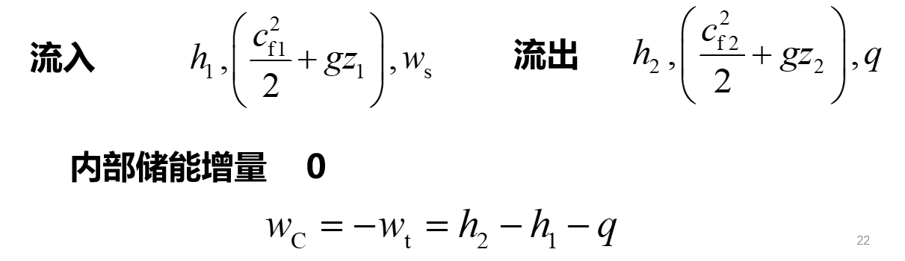
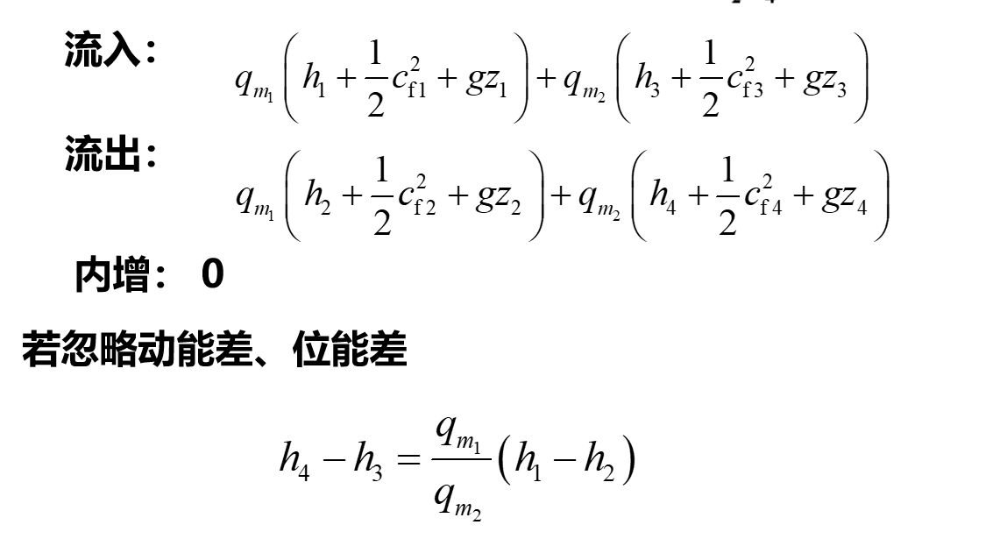

# 热力学第一定律

!!! note 解题规律
    1. 取好热力系
    2. 计算初、终态
    3. 两种解题思路：从已知条件逐步推向目标；从目标反过来缺什么补什么
    4. 不可逆过程的功可尝试从外部参数入手

## 热力学能（内能）和总能

E(总能)= U(热力学能)+Ek(宏观动能)+Ep(宏观位能)

热力学能即内部储存能，宏观动能和宏观位能为外部储存能

## 热力学第一定律

### 表述

热是能的一种，机械能变成热能，或热能变机械能的时候，它们之间的比值是一定的

或

热可以变为功，功也可以变为热；一定量的热消失时必定产生相应量的功；消耗一定量的功时，必出现与之相应量的热

### 实质

能量转换与守恒定律在热现象中的应用

### 基本表达式

加入系统的能量总和-热力系统输出的能量总和=热力系总储存能的增量

加入：$\delta Q+\sum \delta m_ie_i$

输出：$\delta W_{tot}+\sum \delta m_je_j$

内部储能增量：$d E=\delta Q+\sum \delta m_i e_i-(\delta W_{tot}+\sum \delta m_je_j)$

## 闭口系基本能量方程式

$$Q=\Delta E +\int_{\tau_1}^{\tau_2}[\sum(e_j \delta m_j)-\sum(e_i \delta m_i)]+W_{tot}$$

对于闭口系，$\delta m_i=0,\delta m_j=0$

忽略宏观动能和位能， $\Delta E=\Delta U$

$$Q=\Delta U +W , \delta Q=dU +\delta W$$

$$q=\delta u+w, \delta q=du + \delta w$$

对于可逆过程，$\delta Q=dU+pdV$

对于循环，$\oint \delta Q=\oint dU +\oint \delta W \rightarrow Q_{net}=W_{net}$

## 开口系能量方程

### 推动功和流动功

推动功：$pA\Delta H=pv$

流动功：$p_2v_2-p_1v_1$

### 焓（enthalpy）

定义：$H=U+pV , h=u+  pv$

焓是状态参数

$$dH=c_p dT+ [V-T(\frac{\partial V}{\partial T}_p)]dp$$

### 稳定流动方程（steady-flow energy equation）

稳定流动特征

1. 各截面参数不随时间变化
2. $\Delta E_{CV}=0, \Delta S_{CV}=0, \Delta m_{CV}=0...$

$$q_Q=(\dot{H_2}-\dot{H_1}+q_m{(\frac{c_{f2}^2}{2}-\frac{c_{f_1}^2}{2}})+\dot{q_m}g(z_2-z_1)+P_s$$

$$q=h_2-h_1+\frac{1}{2}(c_{f2}^2-c_{f1}^2)+g(z_2-z_1)+w_s$$

技术功

$$w_t=w_s+\frac{1}{2}\Delta c_f^2+g\Delta z$$

可逆过程技术功可用过程线与p轴包围的面积表示

第一定律第二解析式

!!! note 适用条件
    $q=\Delta u+w$ CM，任何过程
    $q=\Delta u+\int pdv$ CM，可逆过程
    $q=\Delta h+w_t$ 任何稳流过程
    $q=\Delta h+w_i$ 忽略动、位能变化
    $q=\Delta h-\int vdp$ 稳流可逆过程

!!! note 可逆过程两个热力学微分关系式
    $$\delta q=du+pdv$$
    $$\delta q=dh=vdp$$
    适用于闭口系统和稳流开口系统

!!! note 几种功及其关系
    膨胀功$w=w_t+\Delta(pv)$
    技术功$w_t=\frac{1}{2}\Delta c_f^2+ g\Delta z+w_i$
    流动功$w_f=\Delta(pv)$
    内部功$w_i$
    轴功$w_s$

!!! note 总结
    1. 通过膨胀，由热能->功，$2=q-\Delta U$
    2. 第一定律两解析式可相互导出，但只有在开系中能量方程才能用焓

### 稳定流动能量方程的应用

1. 蒸汽轮机、气轮机

2. 压气机（compressor）、水泵类（pump）

3. 换热器（锅炉、加热器等）（heat exchanger;boiler、heater etc.）

4. 管内流动

5. 合（分）流

## 本章中英名词对照

热力学能（internal energy）

总（储存）能（total stored energy of system）

推动功（flow work;flow energy）：系统引进或排除工质传递的热量

流动功（flow work;flow energy）：系统维持流动所花费的代价

焓（enthalpy）：引进或排除工质而输入或排出系统的总能量

技术功（technical work）：技术上可资利用的功