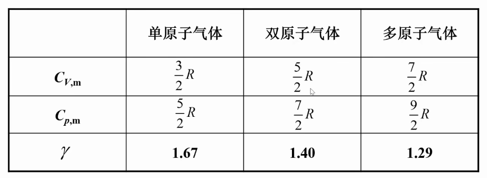
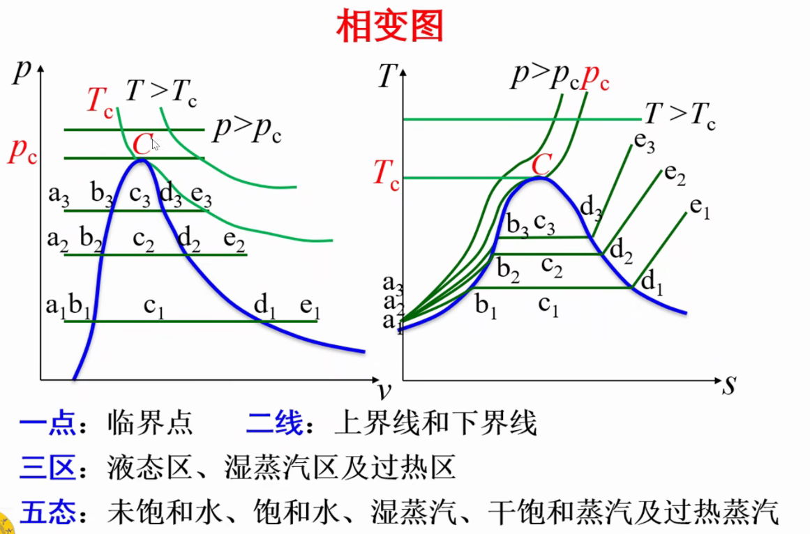

# Chap3 气体和蒸汽的性质

## 理想气体

理想气体基本假设：分子为不占体积的弹性质点；除碰撞外分子间无作用力

理想气体是实际气体在低压高温的抽象

状态方程

$$pV=mR_gT$$

$R=MR_g=8.3145J/(mol \dot K)$

## 理想气体的比热容

### 比热容定义和分类

比热容

$$c=\lim_{\Delta \rightarrow 0}\frac{q}{\Delta T}=\frac{\delta q}{dT}$$

c与过程有关，是温度的函数

!!! note 比热容分类
    按物量分为：质量热容（specific heat capacity per unit of mass）、体积热容（volumetric specific heat capacity）、摩尔热容（mole specific heat capacity）
    按过程分为：质量定压热容（比定压热容）（constant pressure specific heat capacity per unit of mass）、质量定容热容（比定容热容）（constant volume specific heat capacity per unit of mass）

### 比定压热容、比定容热容和迈耶公式

#### 一般表达式

一般表达式

$$c=(\frac{\partial u}{\partial T})_v + [(\frac{\partial u}{\partial v})_T+p] \frac{dv}{dT}$$

#### 比定容热容

$$c_V=\frac{du}{dT}$$

#### 比定压热容

$$c_p=\frac{dh}{dT}$$

#### 迈耶公式

迈耶公式（Mayer's formula）

$$c_p-c_V =R_g$$

$R_g$是1kg某种理想气体定压升高1K对外所做功

### 理想气体的比热容比$\gamma$

$$\gamma=\frac{c_p}{c_V}$$

理想气体可逆绝热过程的绝热指数（adiabatic exponent;isentropic exponent）：$\mathscr{k}=\gamma$

### 利用比热容计算热量

#### 真实比热容积分

#### 利用平均比热表

#### 利用平均比热直线

#### 定值比热容

## 理想气体的热力学能、焓和熵

理想气体热力学能和焓仅是温度的函数

### 理想气体的熵（entropy）

定义

$$ds=\frac{\delta q}{T}|_{rev}$$

熵是状态参数

$$ds=C_V \frac{dT}{T}+R_g\frac{dv}{v}$$

## 饱和状态、饱和温度和饱和压力

### 饱和状态（Saturated state）

饱和状态：汽化速度等于液化速度，系统处于动态平衡，宏观上气液两相保持一定的相对数量

干度（dryness）：湿蒸汽中干饱和蒸汽的质量分数，用w或x表示

$$x=\frac{m_v}{m_v+m_x}$$

湿度y=1-x

## 水的定压加热汽化过程

## 水和水蒸气状态参数

## 水蒸气图表和图

## 水和水蒸气热力性质程序简介

## 本章中英名词对照

理想气体（perfect gas/ideal gas）

理想气体状态方程（ideal-gas equation）

比热容比（specific heat ratio;ratio of specific heat capacity）

汽化（vaporization）：由液态到气态的过程

液化（liquefaction）：由气相到液相的过程

饱和温度$t_s$（Saturated temperature）

饱和压力$p_s$（Saturated pressure）

饱和液（saturated liquid）：处于饱和状态的液体

干饱和蒸汽（dry-saturated vapor）：处于饱和状态的蒸汽

未饱和液（unsaturated liquid ）：温度低于所处压力下饱和温度的液体

过热蒸汽（superheated vapor）：温度高于饱和温度的蒸汽

湿饱和蒸汽（wet-saturated vapor;wet vapor）：饱和液和干饱和蒸汽的混合物

三相点（triple pint）：气液固三相平衡共存的状态