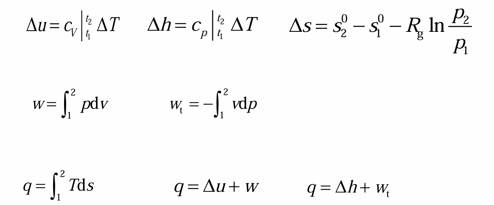

# Chap4 气体和蒸汽的基本的热力过程

## 研究热力过程的目的及一般方法

### 基本热力过程

在$lnp-lnV$图中有$lnp=-nlnV+c$，即$pV^n=const.$

n称为多变指数

定压过程（isobaric process;constant pressure process）：n=0，p=const.

定温过程（isothermal process;constant temperature process）：n=1，pv=const.

定熵过程（isemetric process;constant volume process）：$n=\mathscr{k}, pv^{\mathscr{k}}=const.$

定容过程（isometric process;constant  volume process）：$n=\pm \infty$，v=const.

可逆多变过程（polytropic process）：$pv^b=const.$

### 研究热力过程的方法

!!! note 方法和手段
    1. 求出过程方程及计算各过程初终态参数
    2. 根据热力学第一定律及理想气体性质计算过程中功和热
    3. 画出过程的p-v图和T-s图，直观分析过程中参数间关系及能量关系

## 理想气体的定压、定容和定温过程

### 过程方程

定容过程

$$\frac{p_1}{T_1}=\frac{p_2}{T_2}$$

定压过程

$$\frac{v_1}{T_1}=\frac{v_2}{T_2}$$

定温过程

$$p_1v_1=p_2v_2$$

### 过程的p-v图和T-s图

斜率推导

$$pv^n=const. => (\frac{\partial p}{\partial v})_n=-n\frac{p}{v}$$

$$Tds=\delta q =c_n dT=>(\frac{\partial T}{\partial s})_n = \frac{T}{c_n}$$

### 比热容

|定容过程|定压过程|定温过程|
|:-:|:-:|:-:|
|$c_V=\frac{R_g}{\gamma-1}$|$c_p=\frac{\gamma}{\gamma-1}R_g$|$c_T->\infty$|

### $\Delta u$、$\Delta h$和$\Delta s$

### w、$w_t$和q

## 理想气体等比熵（可逆绝热过程）

## 理想气体多变过程

## 水蒸气的基本过程

## 本章中英名词对照

