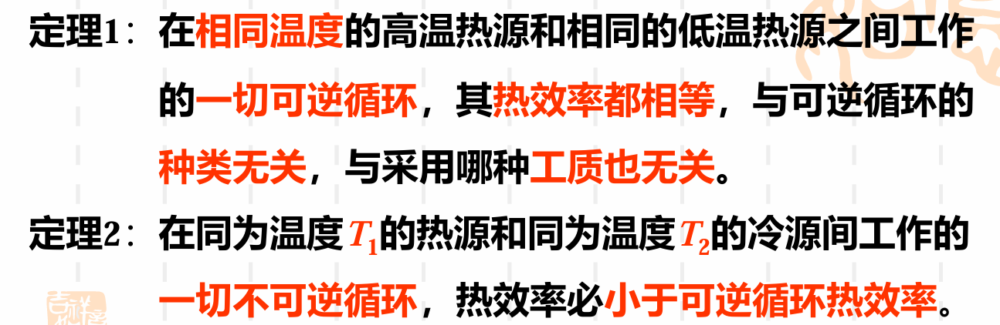

# Chap6 热力学第二定律

## 热力学第二定律

### 自发过程的方向性

!!! note 归纳
    1. 自发过程有方向性
    2. 自发过程的反方向过程并非不可进行，而是要有附加条件
    3. 并非所有不违反热力学第一定律的过程均可进行

能量转换方向性的实质是能质有差异

能质降低的过程可自发进行，反之则需要一定条件——补偿过程，其总效果是总体能质降低

### 热力学第二定律的两种典型表述

克劳修斯表述：热量不可能自发地不花代价地从低温物体传向高温物体

开尔文-普朗克表述：不可能制造循环热机，只从单一热源吸热，将之全部转换为功，而不在外界留下任何影响

## 卡诺循环和卡诺定理

### 卡诺循环及其热效率

1-2：绝热压缩

2-3：等温吸热

3-4：绝热膨胀

4-5：等温放热

是两个热源的可逆循环

$$\eta_t=\frac{W_{net}}{q_1}$$

$$\eta_c=\frac{(T_H-T_L)\Delta s_{23}}{T_H \Delta s_{23}}=1-\frac{T_L}{T_H}$$

4. 实际循环不可能实现卡诺循环的原因
    - 一切过程不可逆
    - 气体实施等温吸热，等温放热困难
    - 气体卡诺循环$w_{net}$太小，若考虑摩擦，输出净功极微

5. 卡诺循环指明了一切热机提高热效率的方向——加大循环温差
### 逆向卡诺循环

制冷系数

$$\varepsilon=\frac{T_2}{T_1-T_2}$$

供暖系数

$$\varepsilon=\frac{T_1}{T_1-T_2}$$

### 概括性卡诺循环

回热：利用工质原本排出的热量来加热工质本身的方法
### 卡诺定理

## 熵和热力学第二定律的数学表达式

### 熵是状态参数

### 克劳修斯积分不等式

### 热力学第二定律的数学表达式

$$s_2-s_1 \ge \int_1^2 \frac{\delta q}{T_r}$$

$$ds \ge \frac{\delta q}{T_r}$$

$$\oint \frac{\delta q}{T_r} \le 0$$

!!! note 注意
    1. 可逆时为等号，不可逆时为不等号
    2. $T_r$是热源温度
    3. Q的符号都以工质考虑
    4. 对任何循环：$\oint dS=0$

### 熵的微观意义

玻尔兹曼熵

$$S=kln W$$

k为玻尔兹曼常数，微观状态数W为宏观系统的无序度

## 熵方程与孤立系统熵增原理

### 熵方程

#### 闭口系

对于闭口系

$$ds=\delta s_f + \delta s_g => \Delta s=s_f+s_g$$

闭口系的熵变等于热熵流和熵产之和

（热）熵流：$s_f=\int_1^2 \frac{\delta q}{T_r}$，吸热为正，放热为负，系统与外界换热造成系统熵的变化

熵产：$s_g$，不可逆为正，可逆为零，系统进行不可逆过程造成系统熵的增加

#### 开口系

对于开口系

$$dS=\sum(s_i\delta m_i-s_j \delta m_j)+\delta S_{f,Q}+\delta S_g$$

稳流开口系

$$dS=0$$

绝热稳流开口系

$$s_2-s_1=s_g \ge 0$$

### 孤立系统熵增原理

$$\Delta S_{iso}=S_g\ge 0$$

可逆取等号，不可逆取不等号

孤立系统熵增原理：孤立系内一切过程均使孤立系统熵增加，其极限——一切过程均可逆时系统熵保持不变

!!! note 注意
    1. 可作为第二定律的又一数学表达式，且为更基本的一种表达式
    2. 可推广到闭口绝热系
    3. 一切实际过程均不可逆，所以可根据熵增原理判别过程进行的方向
    4. 孤立系统一切过程均不改变其总内部储能，即任意过程能量守恒

## 系统的作功能力（㶲）及熵产与作功能力损失

### 热源热量的可用能

1. $q_a$是环境条件下热源传出热量中可转化为功的最高份额，称为热量㶲
2. $q_{un}$是理想状况下热量仍不能转变为功的部分，是热能的一种属性，环境条件和热源确定后不能消除减少，称为热量㷻

### 冷量的作功能力

1. 温度低于环境温度的物体交换的热量称为冷量
2. 吸入热量时作出的最大有用功称为冷量㶲

### 定质量物系的作功能力（㶲）

### 稳流工质的作功能力

### 熵产与系统作功能力（㶲）损失

## 㶲平衡过程及㶲损失

### 㶲平衡方程

## 本章中英名词对照

卡诺循环（Carnot cycle）

㶲（exergy）：在环境条件下，能量中可转化为有用功的最高份额称为㶲

㷻（anergy）：在环境条件下，不可能转化为有用功的那部分能量称为㷻