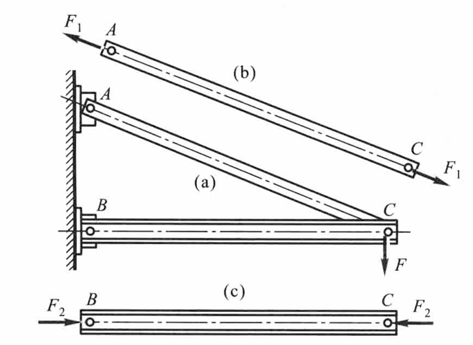
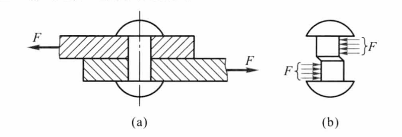
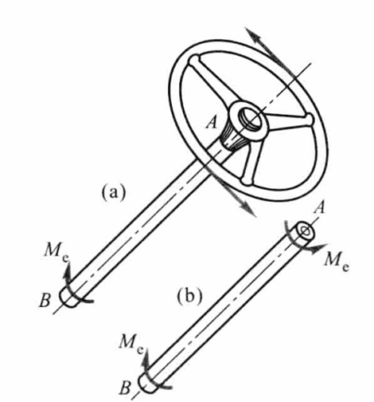
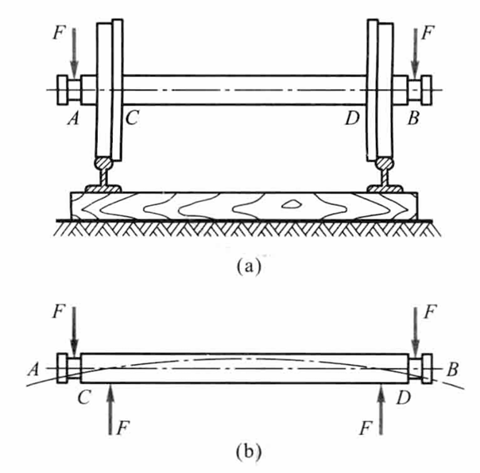

# Chap1 绪论

## 材料力学的任务

材料力学主要研究变形体受力后发生的变形；研究由于变形而产生的附加内力；研究由此而产生的失效以及控制失效的准则。在此基础上导出工程构件静力学设计的基本方法

!!! note "材料力学研究内容"
    材料力学（Strength of materials 或 Mechanics of meterials）的研究内容分属于两个学科

    第一个学科是固体力学（solid mechanics），即研究物体在外力作用下的应力、变形和能量，统称为应力分析（stress analysis）。但是，材料力学所研究的仅限于杆、轴、梁等物体，其几何特征是纵向尺寸（长度）远大于横向（横截面）尺寸，这类物体统称为杆或杆件（bars 或 rods）

    第二个学科是材料科学（materials science）中的材料的力学行为（behaviors of materials），即研究材料在外力和温度作用下所表现出的力学性能（mechanical properties）和失效（failure）行为。但是，材料力学所研究的仅限于材料的宏观力学行为，不涉及材料的微观原理

!!! note "构件要求"
    为保证工程结构或机械的正常工作，构件应有足够的能力负担起应当承受的载荷，为此应当满足以下要求：

    - <b>强度要求：</b>抵抗破坏的能力，或者说在确定的外力作用下，不发生破裂或过量塑性变形的能力
    - <b>刚度要求：</b>抵抗变形的能力，或者说构件受力后，不能发生工程所允许的弹性变形的能力
    - <b>稳定性要求：</b>保持原有平衡状态的能力，或者说构件在压缩载荷的作用下，保持平衡形式不发生突然转变的能力

!!! info "工程构件静力学设计"
    1. 分析并确定构件所受各种外力的大小和方向
    2. 研究在外力作用下构件的内部受力、变形和失效的规律
    3. 提出保证构件具有足够强度、刚度和稳定性的设计准则与设计方法

## 变形固体的基本假设

!!! theorem "变形固体假设"
    固体因外力作用而变形，故称为变形固体或可变形固体。研究构件的强度、刚度和稳定性时，对变形固体作以下假设：

    - <b>连续性假设：</b>认为组成固体的物质不留空隙地充满固体的体积
    - <b>均匀性假设：</b>认为在固体内到处有相同的力学性能
    - <b>各向同性假设：</b>认为无论沿哪个方向固体的力学性能都是相同的

    PS：均匀性针对所有点，各向同性针对同一点的各个方向

## 外力及其分类

根据作用方式，外力可分为表面力和体积力。表面力又可分为分布力和集中力

根据随时间变化的情况，载荷可分为静载荷和动载荷。随时间作周期性变化的动载荷称为交变载荷

## 内力、截面法和应力的概念

### 内力

杆件横截面上的分布内力简化的结果得到一个合力和一个合力偶：$F_R$——内力主矢，$M$——内力主矩

考察内力分量时，我们以轴向为$x$方向建立笛卡尔坐标系，得到沿$x$方向的轴力$F_N$，沿$y$和$z$方向的剪力$F_{Qy}$、$F_{Qz}$。同理有沿$x$方向的扭矩$M_x$，沿$y$和$z$方向的弯矩$M_y$、$M_z$

轴力引起拉伸或压缩变形，剪力引起剪切变形。扭矩引起扭转变形，弯矩引起弯曲变形

### 截面法

!!! info "截面法"
     简记为截、取、代、平

     1. 沿关心的截面假想地把构件分成两部分
     2. 任意地取出一部分作为研究对象，并弃去另一部分
     3. 用作用于截面上的内力代替弃去部分对取出部分的作用
     4. 建立取出部分的平衡方程，确定未知的内力

### 应力

单位面积上内力的平均集度称为平均应力，即

$$p_m=\frac{\Delta F}{\Delta A}$$

当$\Delta A$趋于零时，可以得出点的应力

$$p=\lim_{\Delta A\rightarrow 0} p_m=\lim_{\Delta A \rightarrow 0}\frac{\Delta F}{\Delta A}$$

应力$p$可分解为垂直于截面的分量$\sigma$（正应力）和切于截面的分量$\tau$（切应力），即有

$$\sigma=\lim_{\Delta A \rightarrow 0}\frac{\Delta F_N}{\Delta A},\tau=\lim_{\Delta A \rightarrow 0}\frac{\Delta F_Q}{\Delta A}$$

应力与相应内力分量关系为

$$\int_A \sigma_x \mathrm{d}A=F_N$$

$$\int_A (\sigma_x\mathrm{d}A)z=M_y$$

$$\int_A (\sigma_x\mathrm{d}A)y=-M_z$$

切应力$\tau$第一个字母表示作用面的法线方向，第二个字母表示应力指向

$$\int_A \tau_{xy}\mathrm{d}A=F_{Qy}$$

$$\int_A \tau_{xz}\mathrm{d}A=F_{Qz}$$

$$-\int_A (\tau_{xy}\mathrm{d}A)z+\int_A (\tau_{xz}\mathrm{d}A)y=M$$

应力分布具有超静定性质

## 变形与应变

两个重要条件：小变形条件、线弹性条件

### 应变

平均应变定义为单位长度的平均伸长或缩短，即

$$\varepsilon_m=\frac{\overline{M'N'}-\overline{MN}}{\overline{MN}}=\frac{\Delta s}{\Delta x}$$

使$\overline{MN}$趋近于零，得到点的线应变或<b>正应变</b>（normal strains），或简称应变（strains），即<b>正应力引起的线变形的程度</b>

$$\varepsilon=\lim_{\overline{MN}\rightarrow 0}\frac{\overline{M'N'}}{\overline{MN}} = \lim_{\Delta x\rightarrow 0}\frac{\Delta s}{\Delta x}$$

固体的变形同时表现在正交线段的夹角的变化，称为切应变或角应变或<b>剪应变</b>（shearing strains），即<b>剪应力引起的角变形的程度</b>

$$\gamma = \lim_{\frac{\overline{MN} \rightarrow 0}{\overline{ML} \rightarrow 0}} (\frac{\pi}{2}-\angle L'M'N')$$

应变$\varepsilon$和切应变$\gamma$是度量一点处变形程度的两个基本量

### 应力与应变的物性关系

$$\sigma=E\varepsilon,\varepsilon=\frac{\sigma}{E}$$

其中$E$为杨氏弹性模量

$$\tau=G\gamma,\gamma=\frac{\tau}{G}$$

其中$G$为剪切弹性模量

弹性模量量纲与应力相同，材料的弹性模量一般在GPa级

## 杆件变形的基本形式

变形的四种基本形式：拉压（轴力$F_N$）、剪切（剪力$F_S$）、扭转（扭矩$T$）、弯曲（剪力$F_S$或弯矩$M$）

### 拉伸或压缩

拉伸或压缩（tension or compression）：当杆件两端承受沿轴线方向的拉力或压力载荷时，杆件将产生轴向伸长或压缩变形

### 剪切

剪切（shearing）：在平行于杆横截面的两个相距很近的平面内，方向相对地作用着两个横向力，当这两个力相互错动并保持二者之间的距离不变时，杆件将产生剪切变形

### 扭转

扭转（torsion）：当作用在杆件上的力组成作用在垂直于杆轴平面内的力偶$M_e$时，杆件将产生扭转变形，即杆件的横截面绕其轴相互转动

### 弯曲

弯曲（bend）：当外加力偶$M$或外力作用于与杆件垂直的纵向平面内时，杆件将发生弯曲变形，其轴线将变成曲线

### 组合受力

组合受力（complex loads and deformation）：由基本受力形式中的两种或两种以上共同形成的受力与变形形式即为组合受力与变形

