# Chap2 拉伸、压缩与剪切

!!! summary "小结"
    正应力公式与伸长量公式

    $$\sigma=\frac{F_N}{A},\Delta l=\frac{F_N l}{EA}$$

    其中，只有杆件横截面上正应力均匀分布时，正应力公式才成立；只有轴向方向均匀变形时，伸长量公式才成立

    对于不均匀问题，应当化为一系列均匀问题的叠加

!!! caution "注意"
    我们对截面上的微元进行考察时，由于微元取得很小，实际上就是过一点处不同方向面的应力。因此，当论及应力时，必须指明是哪一点处、哪一个方向面上的应力

## 轴向拉伸或压缩时横截面上的内力和应力

当所有外力均沿杆的轴线方向作用时，杆的横截面上只有沿轴线方向的一个内力分量，这个内力分量称为轴力（normal force），用$F_N$表示。表示轴力沿杆轴线方向变化的图形，称为轴力图（diagram of normal forces）

习惯上，把拉伸时的轴力规定为正，压缩时的轴力规定为负

!!! example "例2.1"
    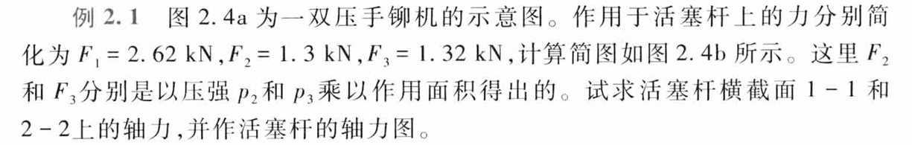
    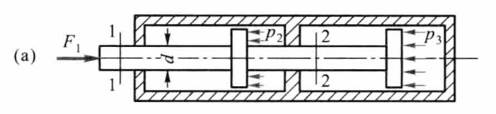
    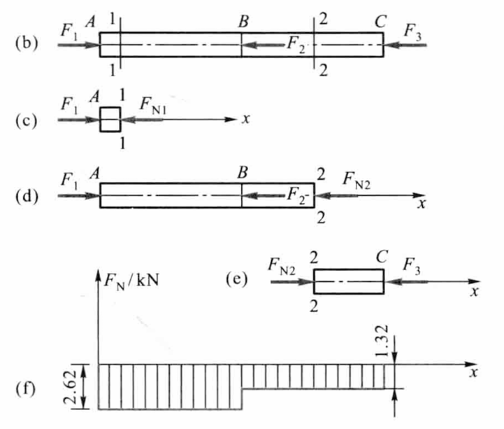

    不难分析出轴力的突变与平衡外力的关系

当外力沿着杆件的轴线作用时，与轴力相对应，杆件横截面上将只有正应力

$$\int_A\sigma \mathrm{d}A=F_N$$

杆件在轴力作用下产生均匀的伸长或缩短变形。因此，根据材料均匀性的假定，杆件横截面上的应力均匀分布，正应力满足

$$\sigma=\frac{F_N}{A}$$

关于正应力的符号，一般规定拉应力为正，压应力为负

导出此公式时，要求外力合力与杆件轴线重合，如此才能保证各纵向纤维变形相等，横截面上正应力均匀分布。若轴力沿轴线变化，可先作出轴力图，再由公式求出不同横截面上的应力。当截面的尺寸也沿轴线变化时，只要<b>变化缓慢，外力合力与轴线重合</b>，公式仍可使用，写成

$$\sigma(x)=\frac{F_N(x)}{A(x)}$$

## 直杆轴向拉伸或压缩时斜截面上的应力

考虑斜截面上的应力，设与横截面成$\alpha$角的斜截面$k-k$的面积为$A_\alpha$，有

$$A_\alpha=\frac{A}{\cos \alpha}$$

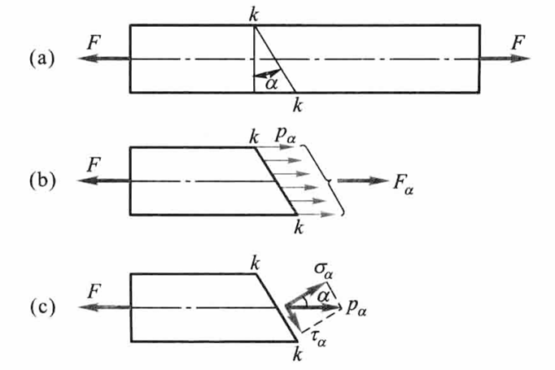

沿斜截面$k-k$假想地把杆件分成两部分，以$F_\alpha$表示斜截面上的内力，可知

$$F_\alpha=F$$

不难得出斜截面上的应力分布也是均匀分布的，有

$$p_\alpha=\frac{F_\alpha}{A_\alpha}=\frac{F}{A_\alpha}$$

记外力与轴线重合时的正应力为$\sigma=\frac{F}{A}$，即有

$$p_\alpha=\frac{F}{A}\cos \alpha=\sigma\cos\alpha$$

将应力$p_\alpha$分解成垂直于斜截面的正应力$\sigma_\alpha$和相切于斜截面的切应力$\tau_\alpha$

$$\sigma_\alpha=p_\alpha\cos \alpha=\sigma\cos^2\alpha$$

$$\tau_\alpha=p_\alpha\sin\alpha=\sigma\cos \alpha\sin\alpha=\frac{\sigma}{2}\sin 2\alpha$$

当$\alpha=0$时，$\sigma_\alpha$达到最大值，且

$$\sigma_{\alpha \max}=\sigma$$

当$\alpha=45^\circ$时，$\tau_\alpha$达到最大值，且

$$\tau_{\alpha \max}=\frac{\sigma}{2}$$

可见，轴向拉伸（压缩）时，在杆件的横截面上，正应力为最大值；在与杆件轴线成$45^\circ$的斜截面上，切应力为最大值。最大切应力在数值上等于最大正应力的二分之一

## 材料拉伸时的力学性能

材料的力学性能也称为机械性质，是指材料在外力作用下表现出的变形、破坏等方面的特性

低碳钢的屈服与最大切应力有关，铸铁的拉断与最大正应力有关

进行拉伸实验，首先根据国家标准将被试验材料制成标准试样（standard specimen）；然后将试样安装在试验机上，使试样承受轴向拉伸载荷，进行拉伸实验（tensile test）。通过缓慢的加载过程，得到应力与应变的关系曲线，称为应力-应变曲线（stress-strain curve）

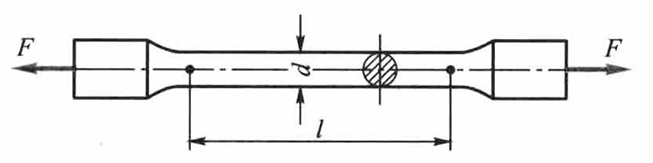

### 低碳钢拉伸时的力学性能

低碳钢是指含碳量在0.3%以下的碳素钢

!!! note "低碳钢拉伸时的力学性能"
    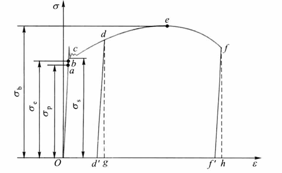

    - 弹性阶段（弹性变形）
        + 比例极限（proportional limit）：$\sigma_p$ ，只有应力低于比例极限，应力才与应变成正比，材料才满足胡克定律$\sigma = E \varepsilon$，这时称材料是<b>线弹性</b>的，$E$称为材料的<b>弹性模量</b>（<b>杨氏模量</b>）（modulus of elasticity or Young modulus）
        + <b>弹性极限</b>（elasticity limit）：$\sigma_e$，出现弹性变形的极限值
        + 应力超过弹性极限后，如再解除拉力，则变形的一部分随之消失，称为弹性变形（elastic deformation）$\varepsilon_e$，遗留下的不能消失的变形称为<b>塑性变形</b>（plastic deformation）$\varepsilon_p$或残余变形

    - 屈服阶段（塑性变形）
        + 屈服（yield）/流动：应力基本保持不变，应变显著增加
        + 下屈服极限/屈服极限/屈服强度：$\sigma_s$
        + 滑移线：表面与轴线出现大致成45°倾角的条纹，是材料内部相对滑移形成，可见屈服现象的出现与最大切应力有关
        + 具有明显屈服阶段或破断时有明显的塑性变形的材料称为<b>韧性材料</b>（ductile materials），断裂前没有明显塑性变形的材料称为<b>脆性材料</b>（brittle materials）

    - 强化阶段（弹性变形+塑性变形）
        + 强化：过屈服阶段后，材料又恢复抵抗变形的能力
        + 强度极限（stress limit）/抗拉强度：$\sigma_b$

    - 局部变形阶段
        + <b>缩颈</b>（necking）：在某局部范围内，横向尺寸急剧缩小
    
试样拉断后，由于保留塑性变形，试样标距由原来的$l$变为$l_1$，有伸长率（percentage elongation）

$$\delta=\frac{l_1-l}{l}\times 100\%$$

根据伸长率，材料可分为：$\delta > 5\%$的塑性材料，如低碳钢；$\delta < 5\%$的脆性材料，如铸铁

原始横截面面积为$A$的试样，拉断后缩颈处的最小截面面积变为$A_1$，有断面收缩率（pencentage reduction n area of cross-section）

$$\psi=\frac{A-A_1}{A} \times 100\%$$

<b>伸长率和断面收缩率都是衡量材料塑性的指标</b>

??? theorem "卸载定律"
    如将试样拉到超过屈服极限的$d$点，然后逐渐卸载拉力，应力和应变关系将沿着斜直线$dd'$回到$d'$点。斜直线近似地平行于$Oa$。这说明：在卸载过程中，应力和应变按直线规律变化，即卸载定律

    拉力完全卸除后，应力-应变图中，$d'g$表示消失了的弹性变形，而$Od'$表示不再消失的塑性变形

??? note "冷作硬化"
    第二次加载时，其比例极限（亦即弹性阶段）得到提高，但塑性变形和伸长率却有所降低，这种现象称为冷作硬化。冷作硬化现象经退火后又可消除

    工程上常利用冷作硬化提高材料的弹性阶段

### 其他塑性材料拉伸时的力学性能

对没有明显屈服极限的塑性材料如铝合金，可以将产生$0.2\%$塑性应变时的应力作为屈服指标，称为规定塑性延伸强度或条件屈服应力（offset yield stress），并用$\sigma_{p,0.2}$来表示

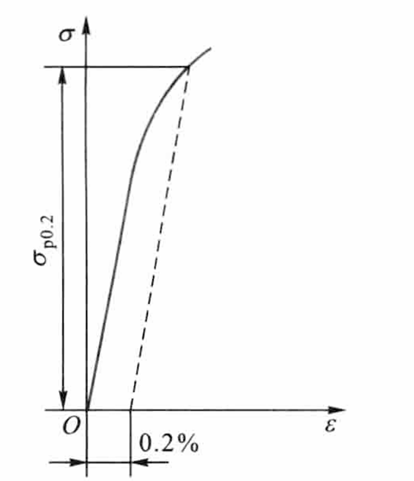

各类碳素钢中，随含碳量的增加，屈服极限和强度极限相应提高，但伸长率降低

### 铸铁拉伸时的力学性能

灰口铸铁拉伸时的应力-应变关系是一段微弯曲线，是典型的脆性材料

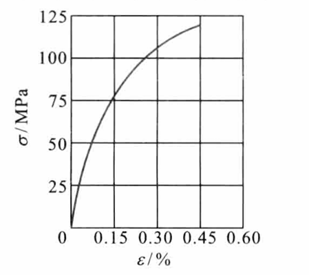

在较低的拉应力下，可近似地认为服从胡克定律。通常取$\sigma-\varepsilon$曲线的割线代替曲线的开始部分，并以割线的斜率作为弹性模量，称为割线弹性模量

铸铁拉断时的最大应力即为其强度极限。因为没有屈服现象，强度极限$\sigma_b$是衡量强度的唯一指标

## 材料压缩时的力学性能

低碳钢压缩时的弹性模量$E$和屈服极限$\sigma_s$都与拉伸时大致相同。屈服阶段以后，试样抗压能力继续增强，因此得不到压缩时的强度极限

铸铁压缩时，试样仍然在较小的变形下突然破坏。破坏断线的法线与轴向大致成$45^\circ\sim 55^\circ$的倾角，表明试样沿斜截面因相对错动而破坏。铸铁的抗压强度比其抗拉强度高$4\sim5$倍

脆性材料抗拉强度低，塑性性能差，但抗压能力强，宜于作为抗压构件的材料

衡量材料力学性能的指标主要有：比例极限（或弹性极限）$\sigma_p$、屈服极限$\sigma_s$、强度极限$\sigma_b$、弹性模量$E$、伸长率$\delta$、断面收缩率$\psi$

## 失效、安全因数和强度计算

<b>断裂和出现塑性变形统称为失效</b>

脆性材料断裂时的应力是<b>强度极限</b>$\sigma_b$，塑性材料到达屈服时的应力是<b>屈服极限</b>$\sigma_s$，这两者都是构件失效时的<b>极限应力</b>或称<b>危险应力</b>（critical stress）

在载荷作用下构件的实际应力$\sigma$（称为<b>工作应力</b>），显然应低于极限应力。强度计算中，以大于1的因数除极限应力，将所得结果称为<b>许用应力</b>（allowable stress），记为$[\sigma]$

对塑性材料

$$[\sigma] = \frac{\sigma_s}{n_s}$$

对脆性材料

$$[\sigma]= \frac{\sigma_b}{n_b}$$

其中，$n_s$和$n_b$称为安全因数

许用应力$[\sigma]$与杆件的材料力学性能以及工程对杆件安全裕度的要求有关，为构件工作应力的最高限度，即有构件轴向拉伸或压缩的强度条件为

$$\sigma=\frac{F_N}{A}\le [\sigma]$$

上式称为拉伸或压缩杆件的<b>强度设计准则</b>（criterion for strength design），又称为<b>强度条件</b>

根据以上强度条件，即可进行强度校核、截面设计和确定许可载荷（allowable load）

!!! example "以圆截面杆为例"
    强度校核
    
    $$\sigma=\frac{4F_N}{\pi d^2}\le [\sigma]$$

    设计圆截面直径
    
    $$d\ge \sqrt{\frac{4 F_N}{\pi [\sigma]}}$$

    许可载荷
    
    $$F_N\le \frac{[\sigma ]\pi d^2}{4}$$

??? example "例2.3"
    图为一悬臂吊车的简图，斜杆AB为直径$d=20\text{mm}$的钢杆，载荷$W=15\text{kN}$。当$W$移到$A$点时，求斜杆$AB$横截面上的应力。若钢材的许用应力$[\sigma]=150\text{MPa}$，试对斜杆AB进行强度校核

    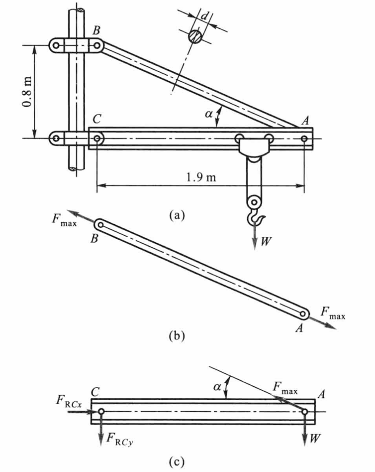

    根据横梁的平衡方程$\sum M_C=0$，得

    $$F_{\max}\sin \alpha\cdot \overline{AC}-W\cdot \overline{AC}=0$$

    $$F_{\max}=\frac{W}{\sin \alpha}$$

    由直角三角形ABC求出

    $$\sin\alpha=\frac{\overline{BC}}{\overline{AB}}$$

    故有

    $$F_{\max}=\frac{W}{\sin \alpha}$$

    斜杆AB的轴力为

    $$F_N=F_{\max}$$

    AB杆横截面上的应力为

    $$\sigma=\frac{F_N}{A}=123\text{MPa}$$

    $$\sigma<[\sigma]$$

    斜杆满足强度条件

## 轴向拉伸或压缩时的变形

### 轴向变形

当应力不超过材料的比例极限时，应力与应变成正比，即胡克定律

$$\sigma=E\varepsilon$$

$$\Delta l=\frac{F_N l}{EA}=\frac{Fl}{EA}$$

EA称为杆件的<b>抗拉（抗压）刚度</b>

我们之前给出的公式适用于杆件横截面面积和轴力皆为常量的情况。若杆件横截面沿轴线变化，但变化缓慢；轴力也沿轴线变化，但作用线仍与轴线重合，此时，可用相邻的横截面从杆中取出长为$\mathrm{d}x$的微段，其伸长为

$$\mathrm{d}(\Delta l)=\frac{F_N(x)\mathrm{d}x}{EA(x)}$$

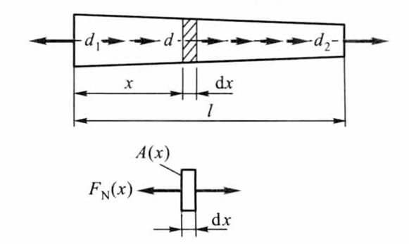

积分得杆件的伸长为

$$\Delta l=\int_l \frac{F_N(x)\mathrm{d}x}{EA(x)}$$

更一般的情形

$$\Delta l=\int_l \frac{F_N(x)\mathrm{d}x}{E(x)A(x)}$$

如功能梯度材料，其成分和结构呈连续梯度变化

### 横向变形

若杆件变形前的尺寸为$b$，变形后为$b_1$，则横向应变为

$$\varepsilon'=\frac{\Delta b}{b}=\frac{b_1-b}{b}$$

试验结果表明：当应力不超过比例极限时，横向应变与轴向应变之比是一个常数

$$\mu=\frac{-\varepsilon^{'}}{\varepsilon}$$

$\mu$称为横向变形因数或<b>泊松比</b>（Poisson ratio），为无量纲量；和弹性模量一样，泊松比也是材料固有的弹性常数

由热力学原理可以给出各向同性材料$\mu$的取值范围是

$$-1\le \mu \le\frac{1}{2}$$

对于常规、传统的材料，有$0<\mu<1/2$；当$\mu=1/2$时，材料在变形过程中体积将保持不变，称为不可压缩材料；当$\mu=0$时，材料在变形过程中横向尺寸将保持不变；当$-1<\mu<0$时，出现杆件伸长时横向增大的现象，这种材料称为负泊松比材料或拉胀材料

## 轴向拉伸或压缩的应变能

固体在外力作用下，因变形而储存的能量称为<b>应变能</b>

现在讨论轴向拉伸或压缩时的应变能。作用于杆件上的力$F$因位移$\mathrm{d}(\Delta l)$而作功，且所作的功为

$$\mathrm{d}W=F\mathrm{d}(\Delta l)$$

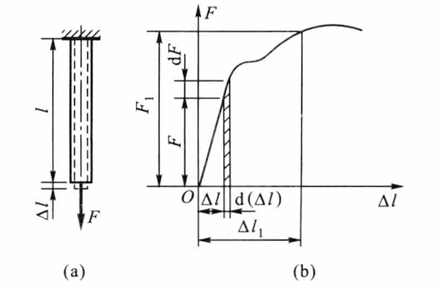

$$W=\int_0^{\Delta l_1}F\mathrm{d}(\Delta l)$$

在应力小于比例极限的范围内，$F$与$\Delta l$的关系是一斜直线，故有

$$W=\frac{1}{2}F\Delta l$$

根据功能原理，拉力所完成的功应等于杆件获得的能量。忽略动能、热能等能量的变化，即有在线弹性范围内

$$V_{\varepsilon}=W=\frac{1}{2}F\Delta l=\frac{F^2l}{2EA}$$

为了求出单位体积内的应变能，设想从构件中取出边长为$\mathrm{d}x,\mathrm{d}y,\mathrm{d}z$的单元体

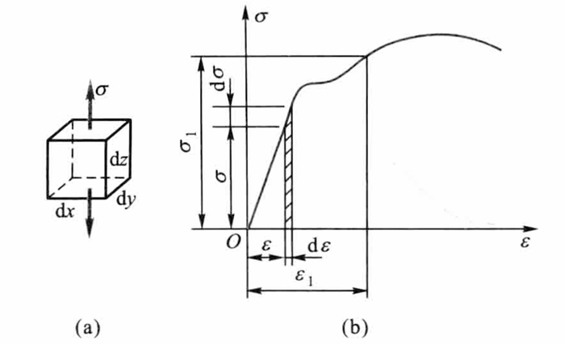

$$\mathrm{d}V_{\varepsilon}=\int_0^{\varepsilon_1}\sigma \mathrm{d}y\mathrm{d}z\mathrm{d}x\mathrm{d}\varepsilon=(\int_0^{\varepsilon_1} \sigma \mathrm{d}\varepsilon)\mathrm{d}V$$

<b>应变能密度</b>即单位体积内的应变能为

$$\upsilon_{\varepsilon}=\frac{\mathrm{d}V_{\varepsilon}}{\mathrm{d}V}=\int_0^{\varepsilon_1}\sigma \mathrm{d}\varepsilon$$

在应力小于比例极限的情况下，$\sigma$与$\varepsilon$的关系为斜直线，有

$$\upsilon_{\varepsilon}=\frac{1}{2}\sigma \varepsilon=\frac{E\varepsilon^2}{2}=\frac{\sigma^2}{2E}$$

杆件的应变能为

$$V_{\varepsilon}=\int_V \upsilon_{\varepsilon}\mathrm{d}V$$

## 拉伸、压缩超静定问题

杆件的轴力可由静力平衡方程求出，称为<b>静定问题</b>；若不能全由静力平衡方程求出，称为<b>超静定问题</b>或<b>静不定问题</b>

未知力的个数减去静力平衡方程的个数就是超静定的次数

一方面，多余约束使结构由静定变为静不定，问题由静力平衡可解变为静力平衡不可解；另一方面，多余约束对结构或构件的变形起一定限制作用，而结构或构件的变形又与受力密切相关，这就为求解静不定问题提供补充条件

各构件变形之间的关系，或者构件各部分变形之间的关系，称为<b>变形协调关系</b>或<b>变形协调条件</b>（compatibility relations of deformation）；进而根据弹性范围内的力和变形之间的关系（胡克定律），即<b>物理条件</b>，建立补充方程

超静定问题综合<b>静力方程</b>、<b>变形协调方程</b>（几何方程）、<b>物理方程</b>求解

## 温度应力和装配应力

### 温度应力

静定结构由于可以自由变形，当温度均匀变化时，不会引起构件的内力；但在超静定结构中，因变形受到部分或全部约束，温度变化时，往往会引起内力，称为热应力或<b>温度应力</b>

### 装配压力

对静定结构，加工误差仅造成结构几何形状的轻微变化，不会引起内力；但对超静定结构，加工误差往往会引起内力，称为<b>装配应力</b>

## 应力集中的概念

在零件尺寸突然改变处的横截面上，应力并不是均匀分布的。这种因杆件外形突然变化，而引起局部应力急剧增大的现象，称为应力集中（stress concentration）

!!! theorem "圣维南原理"
    如果杆端两种外加力静力学等效，则距离加力点稍远处，静力学等效对应力分布的影响很小，可以忽略不计

设发生应力集中的截面上的最大应力为$\sigma_{\max}$，同一截面上的平均应力为$\sigma$，则称其比值

$$K=\frac{\sigma_{\max}}{\sigma}$$

为理论应力集中系数（factor of stress concentration），是反映应力集中的程度的因数

实验结果表明：截面尺寸变化越急剧、角越尖、孔越小，应力集中的程度就越严重

## 剪切和挤压的实用计算

!!! attention "注意"
    剪切和挤压的实用计算，与轴向拉伸或压缩并无实质上的联系

    剪切面平行于剪力，而挤压面垂直于剪力

螺栓、销钉和铆钉等工程上常用的连接件以及被连接的构件在连接处的应力，都属于所谓“加力点附近局部应力”，应力分布比较复杂，因此在工程设计中采用假定计算方法

铆接件的强度失效形式主要有：剪切破坏、挤压破坏、连接板拉断、铆钉后面连接板的剪切破坏

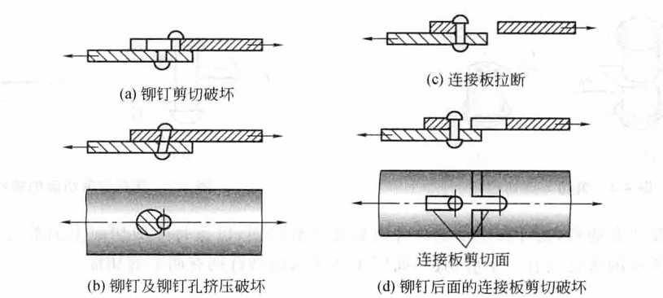

### 剪切的实用计算

剪切的特点是：作用于构件某一截面两侧的力，大小相等，方向相反，且相互平行，使构件的两部分沿这一截面（剪切面）发生相对错动的变形

工程中的连接件，如螺栓、铆钉、销钉、键等都是承受剪切的构件

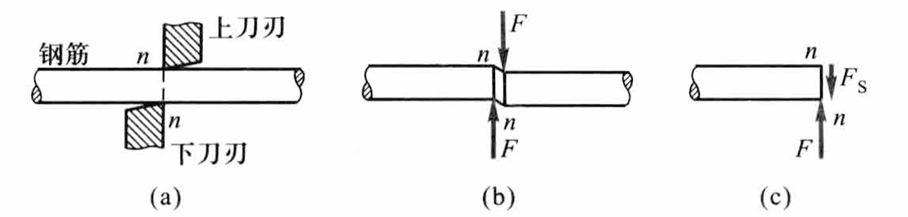

以剪切面$n-n$将受剪构件分成两部分；$n-n$截面上的内力$F_S$与截面相切，称为剪力，由平衡方程

$$F_S=F$$

假设在剪切面上剪切应力是均匀分布的，则有

$$\tau=\frac{F_S}{A}$$

$\tau$与剪切面相切，故为切应力

切应力及相应强度条件为

$$\tau=\frac{F_s}{A}\le [\tau]$$

### 挤压的实用计算

在外力作用下，连接件和被连接的构件之间，必将在接触面上相互压紧，这种现象称为<b>挤压</b>

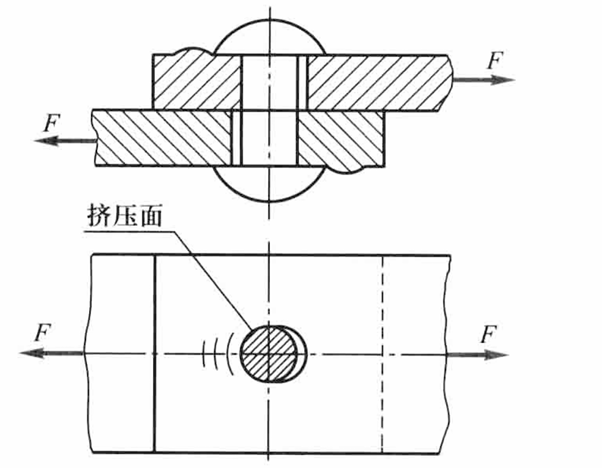

挤压应力（bearing stress）及相应强度条件为

$$\sigma_{bs}=\frac{F}{A_{bs}}\le [\sigma_{bs}]$$

实用计算中，<b>以圆孔或圆钉的直径平面面积</b>$\delta d$<b>除挤压应力</b>$F$<b>，则所得应力大致与实际最大应力接近</b>