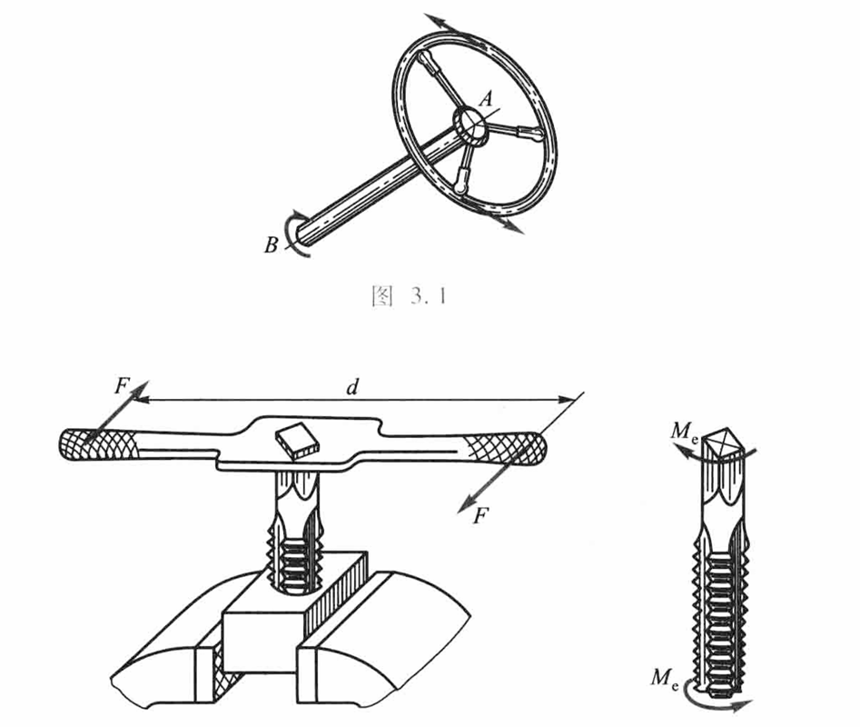
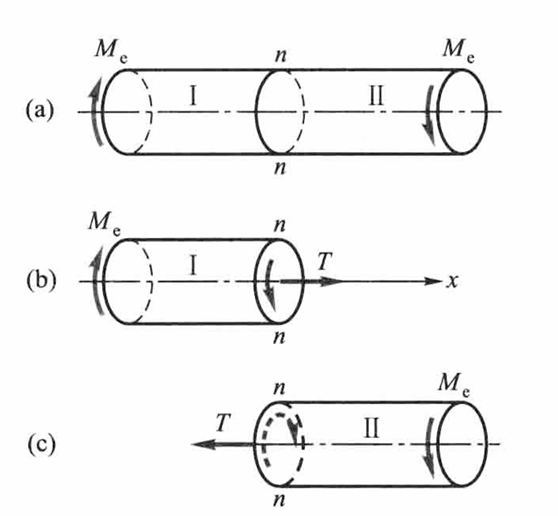
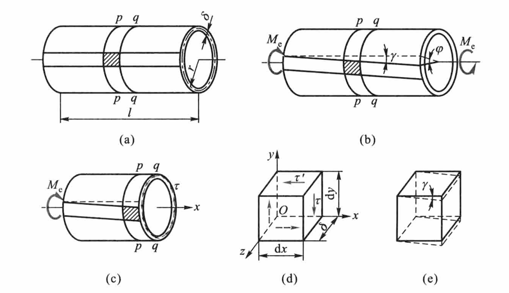
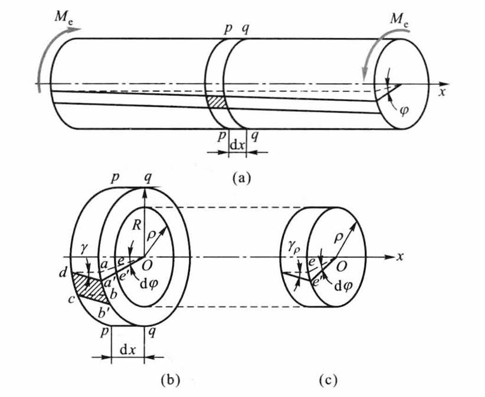

# Chap3 扭转

## 扭转的概念和实例

杆件的两端作用两个大小相等、方向相反且作用平面垂直于杆件轴向的力偶，致使杆件的任意两个横截面都发生绕轴线的相对转动，这就是扭转变形

## 外力偶矩的计算 扭矩和扭矩图

传动轴所受的外力偶矩可用下式计算

$$M_e\omega=P$$

其中$P$为传动功率，$n$为转速，则有

$$\{M_e\}_{\text{N}\cdot\text{m}}=9549\frac{\{P\}_{\text{kW}}}{\{n\}_{\text{r/min}}}$$

考察图示圆轴，圆轴两端受外加力矩$M_e$作用时，横截面上将产生分布剪应力，这些剪应力将组成对横截面中心的合力矩，称为扭矩（twist moment）

应用截面法，将圆轴沿$n-n$截面分成两部分。由平衡方程$\sum M_x=0$，可求出

$$T=M_e$$

对扭矩$T$的符号规定：若按<b>右手螺旋法则</b>将$T$表示为矢量，当矢量方向与截面的外法线的方向一致时，$T$为正；也即当力偶矩矢的指向离开截面时为正

扭矩沿杆轴线方向变化的图形，称为扭矩图（diagram of torsion moment）

## 纯剪切

考察等厚薄壁圆筒，可得

$$\tau=\frac{M_e}{2\pi r^2\delta }$$

用相邻的两个横截面和两个纵向面，从圆筒中取出边长为$\mathrm{d}x$、$\mathrm{d}y$和$\delta $的单元体

!!! theorem "切应力互等定理"
    由平衡方程可知，单元体左、右两侧面切应力的合力偶与上、下两侧面切应力的合力偶相平衡

    $$(\tau\delta \mathrm{d}y)\mathrm{d}x=(\tau^\prime\delta\mathrm{d}x)\mathrm{d}y$$
    
    即有切应力互等定理（pairing principle of shear stress）：

    在相互垂直的两个平面上，切应力必然成对存在，且数值相等；两者都垂直于两个平面的交线，方向则共同指向或共同背离这一交线

在上述单元体的上、下、左、右四个侧面上，只有切应力并无正应力，这种情况称为纯剪切

纯剪切单元体的左右两侧面将发生微小的相对错动，使原来相互垂直的两个棱边的夹角改变一个微量$\gamma$

$$\gamma=\frac{r\varphi}{l}$$

其中，$\gamma$为表面纵向线变形后倾角，$\varphi$为圆筒两端的相对扭转角，$l$为圆筒的长度

当切应力不超过材料的剪切比例极限时，切应变$\gamma$与切应力$\tau$成正比，即剪切胡克定律

$$\tau=G\gamma$$

$G$为比例常数，称为材料的切变模量

对各向同性材料，弹性模量$E$、泊松比$\mu$和切变模量$G$满足

$$G=\frac{E}{2(1+\mu)}$$

剪切应变能

$$v_\varepsilon=\frac{1}{2}\tau \gamma=\frac{\tau^2}{2G}$$

## 圆轴扭转时的应力

应用平衡方法无法确定圆轴扭转时横截面上各点剪应力的大小，这是圆截面扭转剪应力分布的超静定性质，我们需要综合平衡方程、变形协调、物性关系三方面的关系

### 变形几何关系

!!! theorem "圆轴扭转的平面假设"
    圆轴扭转变形前原为平面的横截面变形后仍保持为平面，形状和大小不变，半径仍保持为直线，且相邻两截面间的距离不变，即，截面像刚性平面绕轴线旋转一角度

    

距圆心为$\rho$处的切应变为

$$\gamma_\rho=\rho \frac{\mathrm{d}\varphi}{\mathrm{d}x}$$

### 物理关系

由剪切胡克定律

$$\tau_\rho=G\gamma_\rho$$

代入即有

$$\tau_\rho=G\rho \frac{\mathrm{d}\varphi}{\mathrm{d}x}$$

### 静力关系

由定义，内力系对圆心的力矩即截面上的扭矩，得

$$T=\int_A \rho \tau_\rho\mathrm{d}A=G\frac{\mathrm{d}\varphi}{\mathrm{d}x}\int_A \rho^2 \mathrm{d}A$$

以$I_p$表示上式的积分，即

$$I_p=\int_A \rho^2 \mathrm{d}A$$

$I_p$称为横截面对圆心$O$点的极惯性矩（截面二次极矩），即有

$$T=GI_p\frac{\mathrm{d}\varphi}{\mathrm{d}x}$$

得

$$\tau_\rho=\frac{T\rho}{I_p}$$

在圆截面边缘上，$\rho$为最大值$R$，得最大扭转切应力为

$$r_{\max}=\frac{T R}{I_p}$$

引用记号

$$W_t=\frac{I_p}{R}$$

$W_t$称为抗扭截面系数，则有

$$\tau_{\max}=\frac{T}{W_t}$$

|形状|$I_p$|$W_p$|
|:-:|:-:|:-:|
|实心圆轴|$\frac{\pi D^4}{32}$|$\frac{\pi D^3}{16}$|
|空心圆轴|$\frac{\pi D^4(1-\alpha^4)}{32}$|$\frac{\pi D^3(1-\alpha^4)}{16}$|
|薄壁圆轴|$2\pi R^3 t$|$2\pi R^2 t$|

圆轴扭转的强度条件

$$\tau_{\max}=\frac{T_{\max}}{W_t}\le [\tau]$$

## 圆轴扭转时的变形

扭转角公式

$$\varphi = \frac{Tl}{GI_p}$$

单位长度的扭转角

$$\varphi^`=\frac{  T}{GI_P}$$

$$G=\frac{E}{2(1+\mu)}$$

$GI_p$称为抗扭刚度

## 非圆截面杆扭转的概念

对于矩形截面杆的扭转，最大切应力发生在矩形长边的中点

$$\tau_{\max}=\frac{T}{\alpha hb^2}$$

