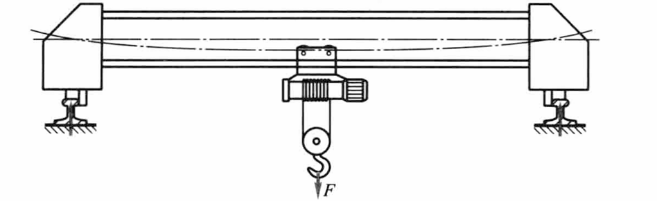
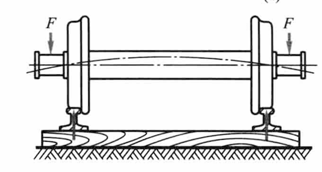
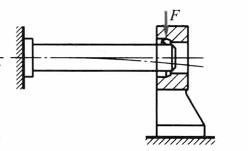
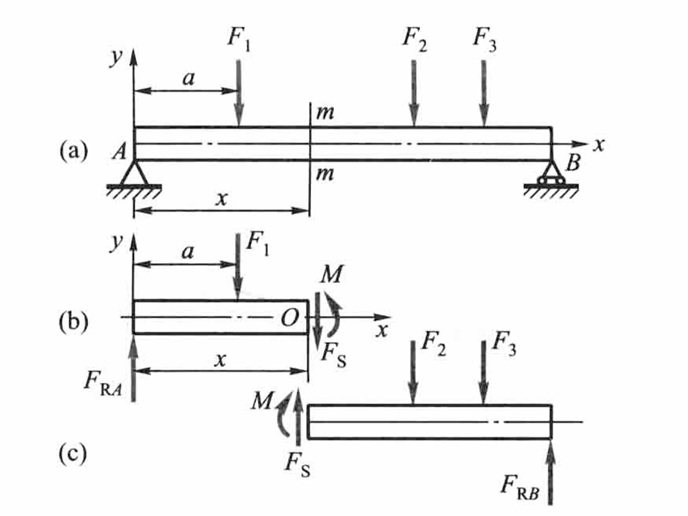
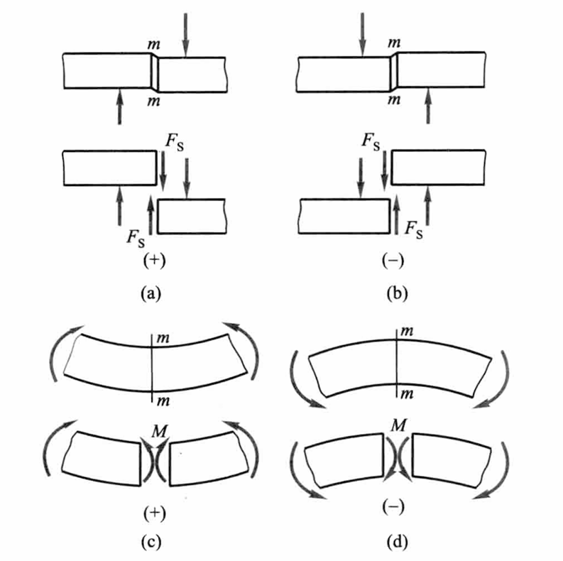
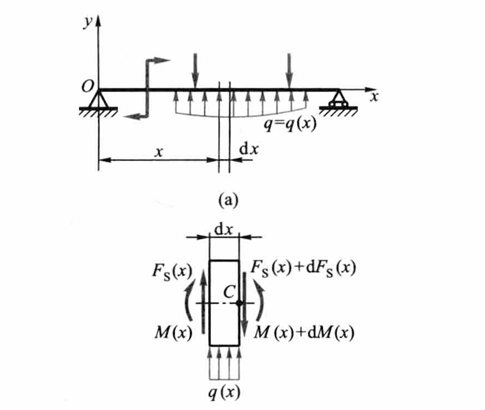

# Chap4 弯曲内力

## 弯曲的概念和实例

杆件承受垂直于其轴线的外力或位于其轴线所在平面内的力偶作用时，其轴线将弯曲成曲线，这种受力与变形形式称为弯曲（bending）

以弯曲变形为主的杆件习惯上称为梁（beam）

## 受弯杆件的简化

!!! note "静定梁的基本形式"
    一端为固定铰支座，另一端为可动铰支座，这种梁称为<b>简支梁</b>（simple supported beam）。传动轴、桥式起重机的大梁可简化为简支梁

    

    一端伸出支座之外，这种梁称为<b>外伸梁</b>（overhanging beam）。车床主轴、火车轮轴可简化为外伸梁

    

    一端为固定端，另一端为自由端，这种梁称为<b>悬臂梁</b>。割刀、镗刀杆可简化为悬臂梁

    

    简支梁或外伸梁的两个铰支座之间的距离称为跨度，用$l$来表示。悬臂梁的跨度是固定端刀自由端的距离

!!! note "控制面"
    在一段杆上，内力按某一种函数变化，这一段杆的两个端截面称为控制面（control cross-section）。据此，下列截面均可为控制面：

    - 集中力作用点的两侧截面
    - 集中力偶作用点的两侧截面
    - 均布载荷（集度相同）起点和终点处的截面

## 剪力和弯矩

以上图所示的简支梁为例，$F_1、F_2、F_3$为作用在梁上的载荷，$F_{RA}$和$F_{RB}$为两端的支座约束力，沿截面m-m假想地把梁分成两部分，并以左段为研究对象

由$\sum F_y=0$，得

$$F_S=F_{RA}-F_1$$

$F_S$称为横截面m-m上的剪力，它是与横截面相切得分布内力系的合力

由$\sum M_O=0$，得

$$M=F_{RA}x-F_1(x-a)$$

$M$称为横截面m-m上的弯矩，它是与横截面垂直的分布力系合成的力偶矩

剪力和弯矩同为梁横截面上的内力，都可由梁端的平衡方程来确定

在上图（a）所示变形情况下，即截面m-m的左段对右段向上相对错动时，截面m-m上的剪力规定为正，反之为负如图（b）；在上图（c）所示变形情况下，即在截面m-m处弯曲变形凸向下时，截面m-m上的弯矩规定为正，反之为负如图（d）

## 剪力方程和弯矩方程 剪力图和弯矩图

描述梁的剪力和弯矩沿长度方向变化的代数方程，分别称为<b>剪力方程</b>（equation of shearing force）和<b>弯矩方程</b>（equation of bending moment）

在绘制刚架的弯矩图时，约定把弯矩图画在杆件弯曲变形凹入的一侧，亦即画在受压的一侧

## 载荷集度、剪力和弯矩间的关系

??? proof "推导过程"

    

    考察上图所示的轴线为直线的梁，以轴线为 $x$ 轴，$y$ 轴向上为正。梁上分布载荷的集度 $q(x)$ 是 $x$ 的连续函数，且规定 $q(x)$ 向上（与 $y$ 轴方向一致）为正。从梁中取出长为 $\mathrm{d}x$ 的微段

    微段左边截面上的剪力和弯矩分别是 $F_{\mathrm{s}}(x)$ 和 $M(x)$。当坐标 $x$ 有一增量 $\mathrm{d}x$ 时，$F_{\mathrm{s}}(x)$ 和 $M(x)$ 的相应增量是 $\mathrm{d}F_{\mathrm{s}}(x)$ 和 $\mathrm{d}M(x)$。所以，微段右边截面上的剪力和弯矩应分别为 $F_{\mathrm{s}}(x) + \mathrm{d}F_{\mathrm{s}}(x)$ 和 $M(x) + \mathrm{d}M(x)$。微段上的这些内力都取正值，且设微段内无集中力和集中力偶。由微段的平衡方程 $\sum F_y = 0$ 和 $\sum M_C = 0$，得

    $$
    F_{\mathrm{s}}(x) - \left[ F_{\mathrm{s}}(x) + \mathrm{d}F_{\mathrm{s}}(x) \right] + q(x) \, \mathrm{d}x = 0
    $$

    $$
    -M(x) + \left[ M(x) + \mathrm{d}M(x) \right] - F_{\mathrm{s}}(x) \, \mathrm{d}x - q(x) \, \mathrm{d}x \cdot \frac{\mathrm{d}x}{2} = 0
    $$

    略去第二式中的高阶微量 $q(x) \, \mathrm{d}x \cdot \dfrac{\mathrm{d}x}{2}$，整理后得出

    $$
    \frac{\mathrm{d}F_{\mathrm{s}}(x)}{\mathrm{d}x} = q(x) 
    $$

    $$
    \frac{\mathrm{d}M(x)}{\mathrm{d}x} = F_{\mathrm{s}}(x) 
    $$

    这就是直梁微段的平衡方程

    又可得出

    $$\frac{\mathrm{d}^2 M(x)}{\mathrm{d} x^2}=\frac{\mathrm{d} F_s(x)}{\mathrm{d}x}=q(x)$$

    以上三式又称为平衡微分方程

$$\frac{\mathrm{d}^2 M(x)}{\mathrm{d} x^2}=\frac{\mathrm{d} F_s(x)}{\mathrm{d}x}=q(x)$$

## 平面曲杆的弯曲内力

某些构件，如活塞环、链环、拱等，一般都有一纵向对称面，其轴线是一平面曲线，称为平面曲杆或平面曲梁。当载荷作用于纵向对称面内时，曲杆将发生弯曲变形

关于内力的符号，规定为：引起拉伸变形时的轴力$F_N$为正；使轴线曲率增加的弯矩$M$为正；以剪力$F_S$对所考虑的一段曲杆内任一点取矩，若力矩为顺时针方向，则剪力$F_S$为正