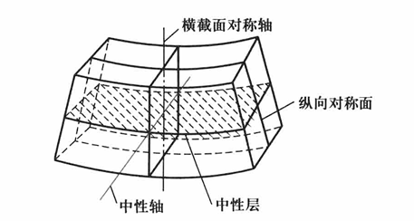
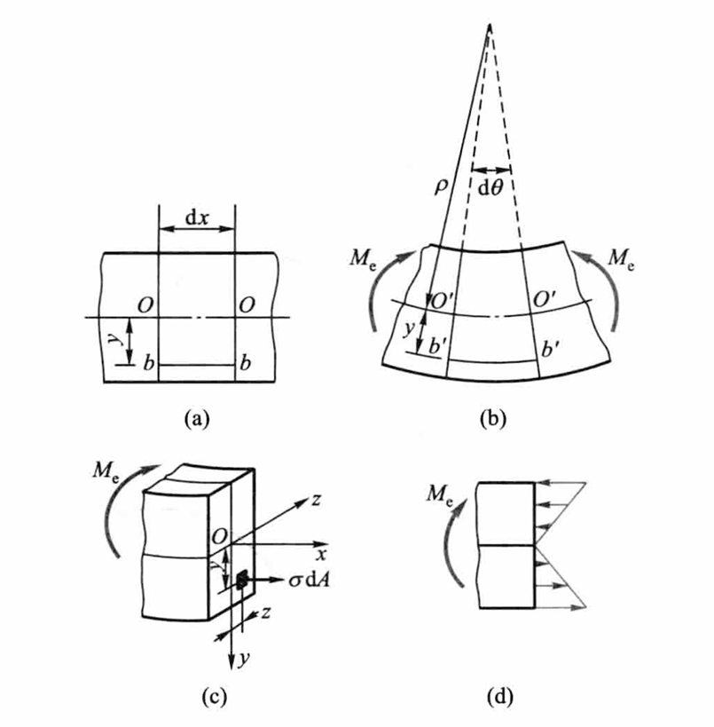
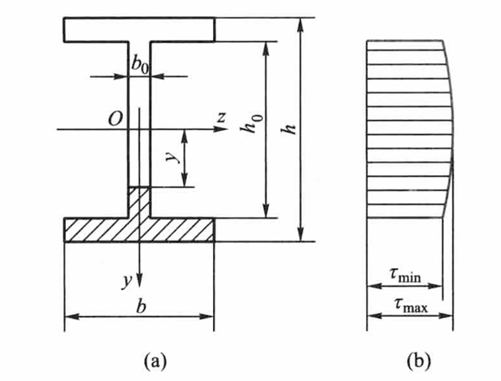

# Chap5 弯曲应力

## 概述

!!! definition "梁弯曲的概念"
    梁的横截面具有对称轴，所有相同的对称轴组成的平面，称为<b>对称面</b>（symmetric plane）；如果没有对称轴，但是都有通过横截面形心的形心主轴，所有相同的形心主轴组成的平面，称为<b>主轴平面</b>（plane including principal axed）

    梁横截面上既有弯矩又有剪力，称为<b>横力弯曲</b>（transverse bending）；梁横截面上剪力等于零，而弯矩为常量，称为<b>纯弯曲</b>（pure bending）

!!! note "平面假设"
    变形前原为平面的梁的横截面变形后仍保持为平面，且仍然垂直于变形后的梁轴线，这就是弯曲变形的<b>平面假设</b>（plane assumption）

!!! definition "中性层与中性轴"
    梁发生弯曲时，中间必定存在一长度不变的纤维层，称为<b>中性层</b>或<b>中性面</b>（neutral axis）

    中性层与横截面的交线称为<b>中性轴</b>（neutral axis）

纯弯曲变形假设：平面假设、纵向纤维间无正应力

## 纯弯曲时的正应力

### 几何关系

根据平面假设可知，距中性层为$y$的纤维$bb$的长度变为

$$
\widehat{b'b'} = (\rho + y) \, \mathrm{d}\theta
$$

$\rho$为中性层的曲率半径

纤维 $bb$ 的原长度为 $\mathrm{d}x$，且 $\overline{bb} = \mathrm{d}x = \overline{OO}$。因为变形前和变形后中性层内纤维 $OO$ 的长度不变，故有

$$
\overline{bb} = \mathrm{d}x = \overline{OO} = \widehat{O'O'} = \rho \, \mathrm{d}\theta
$$

纤维$bb$的应变为

$$\varepsilon=\frac{(\rho+y)\mathrm{d}\theta-\rho\mathrm{d}\theta}{\rho \mathrm{d}\theta}=\frac{y}{\rho}$$

可见，纵向纤维的应变与它到中性层的距离成正比

### 物理关系

因为纵向纤维间无正应力，每一纤维都是单向拉伸或压缩。当应力小于比例极限时，由胡克定律知

$$\sigma=E\varepsilon$$

即有

$$\sigma=E\frac{y}{\rho}$$

可见，任意纵向纤维的正应力与它到中性层的距离成正比。在横截面上，任意点的正应力与该点到中性轴的距离成正比。亦即沿截面高度，正应力按直线规律变化，且在中性层处等于零

### 静力关系

横截面上的微内力组成垂直于横截面的空间平行力系。这一力系只可能简化为三个内力分量，即平行于$x$轴的轴力$F_N$，分别对$y$轴和$z$轴的力偶矩$M_{iy}$和$M_{iz}$

内、外力必须满足平衡方程$\sum F_x=0$和$\sum M_y=0$，即有

$$F_N=\int_A \sigma \mathrm{d}A=0$$

$$M_{iy}=\int_A z\sigma \mathrm{d}A=0$$

这样，横截面上的内力系最终只归结为一个力偶矩$M_{iz}$，即弯矩$M$

$$M_{iz}=M=\int_A y\sigma\mathrm{d}A$$

根据平衡方程，弯矩$M$和外力偶矩$M_e$大小相等，方向相反

$$\int_A \sigma\mathrm{d}A=\frac{E}{\rho}\int_A y\mathrm{d}A=0$$

式中$\frac{E}{\rho}$为非零常量，故必须有$\int_A y\mathrm{d}A=S_z=0$，即横截面对$z$轴的静矩必须等于零，亦即$z$轴（中性轴）应通过截面形心

进一步有

$$M=\int_A y\sigma\mathrm{d}A=\frac{E}{\rho}\int_A y^2\mathrm{d}A$$

式中积分

$$\int_A y^2\mathrm{d}A=I_z$$

是横截面对$z$轴（中性轴）的惯性矩，即有

$$\frac{1}{\rho}=\frac{M}{EI_z}$$

$\frac{1}{\rho}$为梁轴线变形后的曲率，$EI_z$称为抗弯刚度

即有纯弯曲时正应力的计算公式

$$\sigma=\frac{My}{I_z}$$

## 横力弯曲时的正应力

一般情况下，最大弯曲正应力$\sigma_{\max}$发生于弯矩最大的截面上，且离中性轴最远处，有

$$\sigma_{\max}=\frac{M_{\max} y_{\max}}{I_z}$$

引入记号

$$W=\frac{I_z}{y_{\max}}$$

$$\sigma_{\max}=\frac{M}{W}$$

$W$称为抗弯截面系数，与截面的几何形状有关

若截面是高为$h$、宽为$b$的矩形，$W=\frac{bh^2}{6}$

若截面是直径为$d$的圆形，$W=\frac{\pi d^3}{32}$

求出弯曲最大正应力后，弯曲正应力的强度条件为

$$\sigma_{\max}=\frac{M_{\max}}{W}\le[\sigma]$$

## 弯曲切应力

### 矩形截面梁

$$\tau=\frac{F_s}{2I_z}(\frac{h^2}{4}-y^2)$$

对于矩形截面，沿截面高度方向切应力按抛物线规律变化，截面上下边缘的各点处切应力为零，最大切应力发生在中性轴上

$$\tau_{\max}=\frac{3}{2}\frac{F_s}{A}=\frac{3}{2}\frac{F_s}{bh}$$

### 工字形截面梁

$$\tau_{\max}=\frac{F_S}{I_zb_0}[\frac{bh^2}{8}-(b-b_0)\frac{h_0^2}{8}]$$

$$\tau_{\min}=\frac{F_S}{I_zb_0}[\frac{bh^2}{8}-\frac{bh_0^2}{8}]$$

因为腹板的宽度$b_0$远小于翼缘的宽度$b$，因此$\tau_{\max}$与$\tau_{\min}$实际上相差不大；可以认为，在腹板上切应力大致是呈均匀分布的

$$\tau=\frac{F_S}{b_0h_0}$$

### 圆形截面梁

$$\tau_{\max}=\frac{4}{3}\frac{F_s}{A}=\frac{3}{2}\frac{F_s}{\pi R^2}$$

正弯矩上压下拉

## 提高弯曲强度的措施
