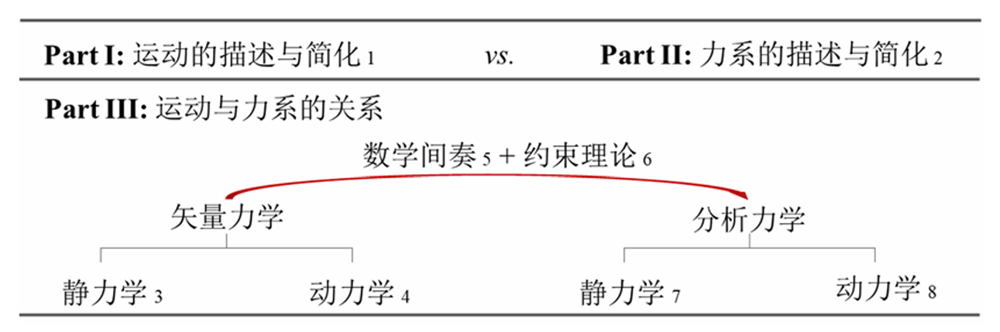

# Chap0 绪论

## 自然科学通论

自然科学是运用数学工具研究自然现象的各门学科的总称，是（作为主体的）人为满足己需，对（作为客体的）自然的主动认知。

自然科学门类繁多，但总体而言，均包含三个要素：输出（关注什么现象）、输入（什么因素影响）、系统（内在属性为何）。作为认知主体的研究者们的任务是：识别输出、输入及系统，形成各自的度量，并建立三者之间的定量关系。

## 经典力学

经典力学研究物体的机械运动与其所受力系的关系，限定于宏观物体的低速运动。在经典力系中，“输出”即位移（位移系）、“输入”即力（力系）、“系统”即宏观物体（物体系）。位移的度量为位移矢、力的度量为力矢、宏观物体的度量为质量（惯性属性的度量）。进一步地，建立位移矢、力矢和质量之间的定量关系。

经典力学将宏观物体抽象为质点和质点系。所谓质点，即具有物质（惯性）属性的无广延点，它“是”一个几何点（不占有空间），又“不是”一个几何点（具有物质属性）。所谓质点系，即多个质点的集合，可分为以某种方式相互关联的约束质点系和没有任何关联的自由质点系。

## 经典力学体系

经典力学理论针对质点建立起来。由牛顿第一定律确立参考系，牛顿第二定律确立在参考系中的动力学规律，牛顿第三定律确立质点间的相互作用，进而，将质点力学拓展到质点系力学。其中，牛顿第三定律是由质点力学迈向质点系力学的桥梁。这一体系称为牛顿力学，亦称<b>矢量力学</b>。

与之并列的另一体系是针对（约束）质点系建立起来的。以虚位移定理和达朗贝尔原理为基石，给出了从可能运动中区分出真实运动的判据。这一体系称为<b>分析力学</b>。

矢量力学和分析力学提供了同一场景的两种视点。矢量力学关注<b>时间演进</b>（询问系统状态随时间如何演进），使用<b>微分工具</b>；分析力学关注<b>空间试探</b>（询问系统构型的变更引发什么信息），使用<b>变分工具</b>。

## 经典力学学科

矢量力学和分析力学构成了描述宏观物体低速运动的完备理论。然而，处理由无穷多个质点组成的一般质点系仍旧困难。这就促使人们循序渐进，先识别出一些特定质点系，首先研究较简单的特殊质点系，之后进一步深化，研究更复杂的质点系。

第一个特殊质点系即是刚体。所谓<b>刚体</b>，是指点和点之间的距离保持不变的质点系。质点（系）力学和刚体（系）力学构成了<b>理论力学</b>的研究内容。

刚体模型具有局限性。刚体不能变形、不会破坏，这显然不符合实际。在刚体模型得到充分研究之后，人们转向对可变形体的研究。合实际。于是，在刚体模型得到充分研究之后，人们转向对可变形体的研究。可变形体研究仍然遵循由简入繁的思路。首先想到的是几何上最简单的可变形连续体——弦线（极端细长构件），它的两个几何维度远小于第三个几何维度，该问题在物理学和数学中得到研究。我们考虑稍显复杂的细长又非极端细长的构件。这种几何上的近一维构件依受力和变形形式不同，分别称为杆、梁、轴、柱。这类构件的受力、变形和破坏就构成了<b>材料力学</b>（亦可称为一维构件的力学）的研究内容。

进一步地，考虑一个几何维度远小于另外两个几何维度的连续体——薄膜，该问题同样在物理学和数学中得到研究。我们考虑略显复杂的很薄又非极薄的构件。这种几何上的近二维构件称为板壳。这类构件的受力、变形和破坏就构成了<b>板壳力学</b>（亦可称为二维构件的力学）的研究内容。再后，我们建立针对一般三维弹性体的力学理论，这就是<b>弹性力学</b>的研究内容。由于弹性力学和板壳力学的密切关系，在教学体系中，常将板壳力学置于弹性力学之后，称之为应用弹性力学。最后，将固体和流体一并视为连续介质，形成<b>连续介质力学</b>。

## 课程架构

理论力学论述（约束）质点系力学的基本原理，并以刚体（系）为落脚点。本课程围绕三个关键词展开：机械运动、力系和关系。三个关键词分别对应三大部分： 

- 第一部分——运动

- 第二部分——力系

- 第三部分——运动与力系的关系

从自然科学三要素的角度看，第一部分处理输出，给出输出的描述和最简刻画；第二部分处理输入，给出输入的描述和最简刻画；在第三部分中，引入系统属性，将输出、输入和系统属性联系起来。具体来说，第一部分包含一章，讲述点（系）、刚体（系）的运动描述和最简刻画；第二部分包含一章，讲述力（系）的描述以及单刚体上力系的最简刻画；第三部分并行讲述矢量力学和分析力学，各由静力学和动力学两章组成。在矢量力学和分析力学之间，插入了数学间奏和约束理论。

各章之间的逻辑关系如下图所示：

