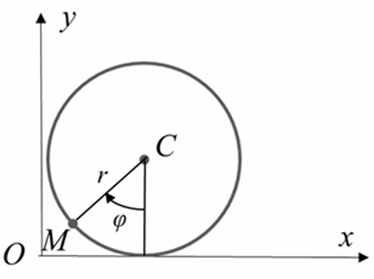
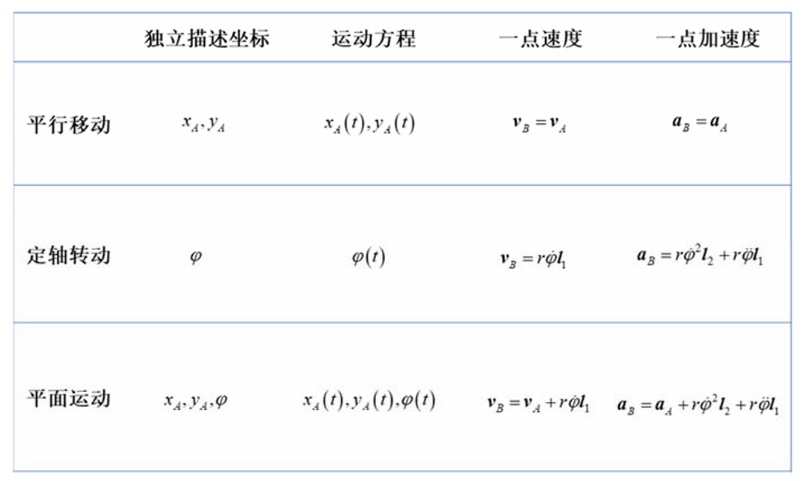
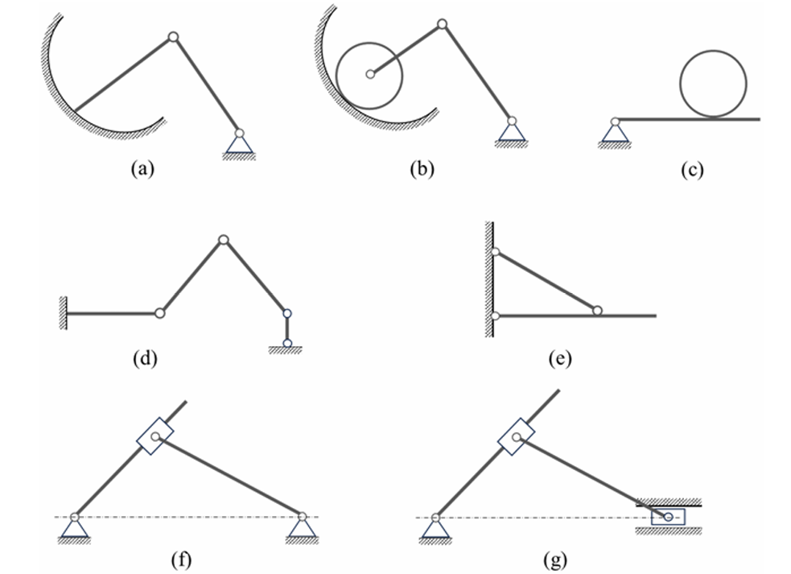

# Chap1 运动，其描述与简化

!!! summary "本章纲要"
    - <b>点（系）的运动描述与简化：</b>点的运动描述；点系的运动描述；约束与约束点系，独立描述坐标及其数目，由独立描述坐标表出系统的全部运动信息。 

    - <b>刚体（系）的运动描述与简化——过程标量分析方法：</b>典型运动单刚体的独立描述坐标数目及其选择，由独立描述坐标表出单刚体的全部运动信息；刚体和外界以及刚体与刚体之间的典型约束；刚体系独立描述坐标数目及其选择，由系统的独立描述坐标表出各单刚体的独立描述坐标，进而表出各单刚体的全部运动信息。 

    - <b>刚体（系）的运动描述与简化——瞬时矢量分析方法：</b>对典型运动的单刚体，由独立描述矢量表出全部运动信息；单刚体的运动分析方法；特殊刚体系的运动分析；点的合成运动定理；将单刚体运动分析方法与点的合成运动方法相结合，形成一般刚体系运动分析的瞬时矢量分析方法。

运动学的<b>基本问题</b>是：给定质点系（特别是刚体系），选出独立描述坐标，并由之表出全部运动信息。

## 点（系）的运动描述与简化

### 点（系）的运动描述

点的运动方程、运动轨迹、速度、加速度可由<b>矢径法</b>和<b>坐标法</b>描述。

#### 矢径法

一个点M在某一参考系中的位置可由如下方式描述。在参考系中选取一个固定点$O$，由之向$M$点连出一条有向线段，

$$\bm{r}=OM$$

称为点M关于O点的矢径。

点M的位置随时间连续改变，相应地，矢径$\bm{r}$就是一个时间$t$的连续矢量函数，即，

$$\bm{r}=\bm{r}(t)$$

这就是点的<b>矢径形式的运动方程</b>。

随着时间演进，矢端在参考系中划过的曲线就是点$M$的<b>运动轨迹</b>。

点$M$的<b>速度</b>定义为矢径$\bm{r}$对时间$t$的一阶导数，即，

$$\bm{v}=\frac{\mathrm{d}\bm{r}}{\mathrm{d}\bm{t}}$$

其方位沿轨迹的切线，指向点的运动方向。

点$M$的<b>加速度</b>定义为速度矢量$\bm{v}$对时间$t$的一阶导数，即，

$$\bm{a}=\frac{\mathrm{d}\bm{v}}{\mathrm{d}t}=\frac{\mathrm{d}^2 \bf{r}}{\mathrm{d}t^2}$$

其方向指向轨迹的凹侧。

易知，尽管对于同一参考系上的不同固定点，刻画点$M$位置的矢径不同，给出的速度和加速度却是相同的。

#### 坐标法

常用的坐标系包括笛卡尔直角坐标系、柱坐标系和球坐标系。

##### 直角坐标法

在笛卡尔直角坐标系中，点$M$的位置由坐标$(x,y,z)$确定。点$M$的位置随时间改变，三个坐标为时间的函数，即，

$$x=x(t),y=y(t),z=z(t)$$

这就是点的<b>直角坐标形式的运动方程</b>。从这组方程中消去时间$t$，即得到点$M$的轨迹方程。

取原点$O$为固定点，点$M$的矢径可表示为，

$$\bm{r}(t)=x(t)\bm{i}+y(t)\bm{j}+z(t)\bm{k}$$

!!! example "例题"
    圆轮沿平面纯滚。半径为$r$，其一半径（固定在轮上）与竖直方向夹角$\varphi=\omega t$。试写出轮缘上一点$M$的运动方程和轨迹方程，并给出点$M$恰与地面接触时的速度和加速度。

    

    取点$M$与地面接触时地面上的那个接触点为原点，建立直角坐标系。$M$点的运动方程可表示为，

    $$x=r(\omega t-\sin \omega t),y=r(1-\cos \omega t)$$

    从两式中消去时间$t$，即得轨迹方程，

    $$x=r[\text{arccos}(1-\frac{y}{r})-\sin(\text{arccos}(1-\frac{y}{r}))]$$

    运动方程对时间求一次导和二次导，

    $$\dot{x}=\omega r(1-\cos \omega t),\dot{y}=\omega r\sin \omega t$$

    $$\ddot{x}=\omega^2 r\sin \omega t,\ddot{y}=\omega^2 r\cos \omega t$$

    当时间$t$趋于零时，点$M$恰与地面接触，此时有，

    $$\dot{x}=0,\dot{y}=0$$

    $$\ddot{x}=0,\ddot{y}=\omega^2 r$$

可以得到以下结论：

两点无滑接触，接触两点的速度相同，接触两点的加速度在公切线方向上的投影相等。

点$M$所描绘出的轨线，在与地面接触处的切线沿竖直方向。

##### 柱坐标法

点的<b>柱坐标形式的运动方程</b>，即，

$$\rho=\rho(t),\varphi=\varphi (t),z=z(t)$$

取原点$O$为固定点，点$M$的矢径可表示为：

$$\bm{r}(t)=\rho(t)\bm{\rho}_0(t)+z(t)\bm{k}$$

##### 球坐标法

点的<b>球坐标形式的运动方程</b>，即，

$$\rho=\rho(t),\varphi=\varphi(t),\theta=\theta(t)$$

取原点$O$为固定点，点$M$的矢径可表示为：

$$\bm{r}(t)=\rho(t)\bm{\rho}_0 (t)$$

注意到，柱坐标系中当$z$恒等于零时，以及球坐标系中当$\theta$恒等于$\pi/2$时，均退化为极坐标系。

##### 弧坐标法

若给定点$M$的轨迹，我们可以在轨迹上取定一点$M_0$，并规定度量的正方向，这样，就能通过点$M$到取定点$M_0$的弧长值来确定其位置，即，

$$s=s(t)$$

这就是点$M$的<b>弧坐标形式的运动方程</b>。轨迹方程和弧坐标方程共同给出了点的运动的完全信息。

为了表出点的速度和加速度，我们取定自然轴系，于是有，

$$\bm{v}=\dot{s}\bm{\tau}$$

$$\bm{a}=\dot{\bm{v}}=\ddot{s}\bm{\tau}+\dot{s}\dot{\bm{\tau}}$$

考察单位矢量$\bm{\tau}$对时间的导数，易知，

$$\bm{a}=\dot{\bm{v}}=\ddot{s}\bm{\tau}+\frac{\dot{s}^2}{\rho}\bm{n}$$

上式右端第一项反映速度大小的变化率，称为<b>切向加速度</b>，记为$\bm{a}_\tau$；第二项反映速度方向的变化率，称为<b>法向加速度</b>，记为$\bm{a}_n$。于是有，

$$\bm{a}=\bm{a}_\tau+\bm{a}_n$$

#### 点系的运动描述

点系的速度和加速度描述可由各点的速度和加速度并置而得。

### 约束点系的初等理论

对于<b>自由点系</b>（即不受限制的点系），无法用更少数目的坐标来刻画。对于<b>非自由点系</b>（即受到某种限制的点系），上述描述是冗余的。

#### 约束概念

所谓<b>约束</b>，即限制、关联——预先设定的限制位置和运动的条件。所谓<b>约束方程</b>，即这些限制条件的数学表达式，预先设定的存在于位置、位置导数（速度）之间的关系式。

在此，我们局限于讨论<b>对位置的时不变等式</b>限制：所谓“位置”是指，仅限制位置关系，而无涉运动（即位置导数，速度）；所谓“时不变”是指，数学关系中不显含时间，换言之，约束的数学结构不随时间改变；所谓“等式”是指，数学关系为等式关系，不涉及不等式。在最一般意义上，应解除上述限制，解除这些限制所相应的物理意义及其一般理论，将在“约束的一般理论”章节详述。 

刚性杆（不变形的细长杆件）连接，是点和点之间的典型约束。它限制两点间的距离始终保持不变，约束方程为， 

$$||\bm{r}_i(t)-\bm{r}_j(t)||_2=L$$

根据当前定义，弹性线不是约束，因为其并未严格限制点和点之间的位置关系。

在力学中，<b>“约束”</b>专指预设的位置和运动限制。为明确区分，外加力称为（外在）<b>作用</b>，动力定律称为（动力学）<b>法则</b>。

#### 约束点系

<b>约束点系</b>是指受到约束的点系。$N$个点构成的点系有$3N$个描述坐标，每增加一个约束方程（要求各约束方程<b>相容</b>且<b>独立</b>），就减去一个独立描述坐标，对具有$k$个约束方程的点系，其独立描述坐标数目为，

$$n=3N-k$$

点系中任一点的位置可由独立描述坐标完全刻画；任一点的速度可由独立描述坐标及其一阶导数共同表出；任一点的加速度可由独立描述坐标、其一阶导数和二阶导数共同表出。这一结论在运动学中具有基本的重要性。

## 刚体（系）的运动描述与简化——过程标量分析方法

### 刚体的构成、独立描述坐标的数目和选择

<b>单刚体的独立描述坐标数目为6。</b>

刚体可视为由刚性杆联系在一起的不变点系，与之相应，<b>可变形连续体</b>可视为由弹性线（或非刚性线）联系在一起的可变点系。

### 单刚体的典型运动模式，其描述与简化

单刚体的典型运动模式包括：平行移动、定轴转动、平面运动、定点运动和一般运动。

#### 平行移动

所谓<b>平行移动</b>（简称<b>平移</b>）是指：刚体运动过程中，其上任一直线始终与其初始位置保持平行（对选定的参考系而言）。

平移刚体的转动受到限制，因此，用其上一点的三个坐标就能刻画刚体上任一点的位置。因此，独立描述坐标数目为3，可取为其上任一点的三个直角坐标。

若为<b>平面平移</b>，独立描述坐标数目为2。

给出定义：若某瞬时刚体上各点的速度相等，则称刚体作<b>瞬时平移</b>。

#### 定轴转动

所谓<b>定轴转动</b>是指：刚体运动过程中，其上或其延展体上有一条直线始终保持不动（对选定的参考系而言）。这条不动直线称为转轴，处于转轴上的各点始终不动，不在转轴上的各点在通过该点且垂直转轴的平面内作圆周运动。

定轴转动刚体的独立描述坐标数目为1。

#### 平面运动

所谓<b>平面运动</b>是指，刚体运动过程中，存在一个固定（对选定的参考系而言）平面，刚体上任一点到该平面的距离保持不变。值得指出，定轴转动是平面运动的特例；但平行移动和平面运动之间并无包含关系，平面平移是平面运动，但一般平移不是平面运动。 

平面运动刚体的独立描述坐标数目为3。 

### 刚体的典型约束

典型约束包括：接触式、铰联式、固定式、连杆式、滑移式。

#### 接触式约束

所谓<b>接触式约束</b>，即刚体与外界给定曲线（对平面问题）或给定曲面（对空间问题）或者刚体与刚体之间，发生且始终发生接触。

对于平面问题：如果能发生打滑，与给定曲线接触的刚体的独立描述坐标数目减1，两接触刚体的独立描述坐标数目同样减1；如果不能打滑而是纯滚，与给定曲线接触的刚体的独立描述坐标数目减 2，两接触刚体的独立描述坐标数目同样减2。 

对于空间问题：如果能发生打滑，与给定曲面接触的刚体的独立描述坐标数目减1，两接触刚体的独立描述坐标数目同样减1；如果不能打滑，与给定曲面接触的刚体的独立描述坐标数目减 2，两接触刚体的独立描述坐标数目同样减2。

#### 铰联式约束

所谓<b>铰联式约束</b>，即通过一个铰链将刚体与外界或者刚体与刚体联结起来的约束。

易知，固定铰链使单刚体的独立描述坐标数目减2，中间铰链使两个刚体的独立描述坐标数目减2，可动铰链使单刚体的独立描述坐标数目减1。 

#### 固定式约束

所谓<b>固定式约束</b>，即将刚体的一部分完全固定起来（与外界固结）。对于细长刚体，将一端插入外界不动构件中，此时称为<b>固定端约束</b>。

易知，对于平面问题，刚体的独立描述坐标数目减3（限制刚体两个位移和一个转角）；对于空间问题，刚体独立描述坐标数目减6（限制刚体三个位移和三个转角）。换言之，刚体的独立描述坐标数目变为0。

#### 连杆式约束

所谓<b>连杆式约束</b>，是指通过一根刚性杆实现的约束，刚性杆一端用铰链与外界不动构件相连，另一端用铰链与刚体相连。

对于平面问题，刚体的独立描述坐标数目减1；对于空间问题，刚体的独立描述坐标数目减1。刚体上受连杆约束的那个点，其坐标满足圆或球面方程，其速度沿所在位置的切线或切面方向。 

#### 滑移式约束

所谓滑移式约束是指，两个刚体通过一个套筒联系在一起，其中一个刚体与套筒铰联，另一个刚体从套筒中穿过，可与套筒相对滑动；其等效模式是，两个刚体通过滑块和滑道联系在一起，其中一个刚体与滑块铰联，另一个刚体上开有滑槽，滑块可沿滑槽运动。

对于平面问题，若能发生打滑，两刚体的独立描述坐标数目减1。此类约束多可发生打滑，如果不能发生打滑，则退化为铰联式约束。

#### 约束切换问题

某约束在一个阶段起作用，而在另一个阶段不起作用，
即在一个阶段存在此约束，而在另一个阶段不存在此约束，这就是<b>约束切换</b>问题。此处，我们常采用<b>“添加约束”</b>或者<b>“解除约束”</b>这样的术语描述这一现象。

### 刚体系独立描述坐标数目的计算和选择

独立描述坐标数目 = 2$\times$平移刚体数 + 1$\times$定轴转动刚体数 + 3$\times$平面运动刚体数 - N（由于约束减少的独立描述坐标数目）

!!! question "例题"
    

#### 结构和机构

如果系统中（独立）约束的数目足够多，就会导致该系统不具有运动的可能性；如果（独立）约束的数目不够多，该系统就可以运动。据此，我们定义机构和结构的概念：所谓<b>机构</b>，即在几何上可以发生运动的刚体系；所谓<b>结构</b>，即在几何上不能发生运动的刚体系。我们知道，当约束数目恰好使刚体系的独立描述坐标数目等于零时，该系统刚好不具有运动的可能性。以之为基准，若约束数目少了，该系统就是机构，所少的个数即为独立描述坐标数目，可称为<b>约束欠缺度</b>；若约束数目多了，该系统还是结构，所多的数目可称为<b>约束冗余度</b>。

系统的独立描述坐标，是指能<b>完全</b>刻画系统位置的<b>独立</b>坐标。所谓“完全”表明不缺少（充分），所谓“独立”表明不冗余（必要）。

## 刚体（系）的运动描述与简化——瞬时矢量分析方法

### 典型运动单刚体的矢量分析

#### 平行移动

#### 定轴转动

$$\bm{v}=\bm{\omega}\times \bm{r}$$

$$\bm{a}=\dot{\bm{v}}=\frac{\mathrm{d}}{\mathrm{d}t}(\bm{\omega}\times \bm{r})=\bm{\alpha}\times \bm{r}+\bm{\omega}\times \bm{v}$$

#### 平面运动

##### 速度基点法

##### 加速度基点法

##### 速度投影法

##### 加速度投影法

### 应用——平面机构的运动分析（之一）

## 点的合成运动分析

### 应用——简单问题、平面机构的运动分析（之二）