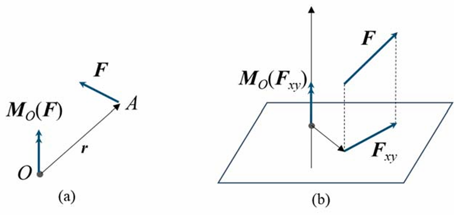
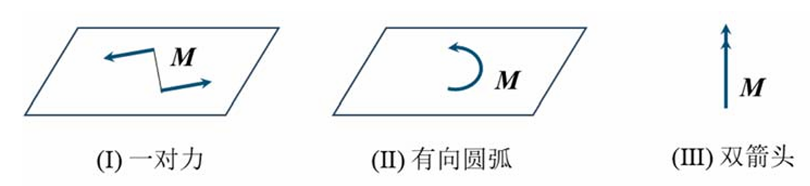

# Chap2 力系，其描述与简化

输入（作用）决定着系统（质点系）的输出（运动）。经验表明，无论作用形式如何，输入都可以统一地抽象成力系来处理。力系引起自由质点系的运动和质点间的相互作用（内力）；引起约束质点系的运动、质点间的相互作用（内
力）和外部约束力。所有这些统称为力系的作用效应。

对于受约束的刚体，力系引起运动（刚性运动）、内力和外部约束力；对于受约束的可变形体，力系引起运动（刚性运动+局部变形）、内力和外部约束力。我们称刚性运动和外部约束力为力系的<b>外效应</b>，称局部变形和内力为力系的<b>内效应</b>。

研究刚体时，只需关注力系的外效应：即<b>刚性运动</b>和<b>外部约束力</b>。

!!! summary "本章纲要"
    - <b>力、力矢和力矩矢，力偶和力偶矩矢：</b>力的概念、力的作用效应度量；力偶的概念、力偶的作用效应度量。强调力和力偶的独立性。
    - <b>刚体上力系的等效变换：</b>力系的等效变换公理。给出一般力系的等效变换方法，得出最简等效力系的类别。 
    - <b>约束的反力效应，物系的受力分析：</b>典型约束的反力效应（即，对几何和运动的严格限制表现在作用力上是怎样的）；物系受力分析的隔离体方法。

力系简化的<b>基本问题</b>是：给定作用于刚体上的力系，找出最简等效力系。

## 力，力矢，力矩矢

### 力矢

力可用矢量描述，称为<b>力矢</b>。力矢是定位矢量，其标记应包括“矢量符号”和“作用点（或作用点的矢径）”，即$(\boldsymbol{F},A)$或$(\boldsymbol{F},\boldsymbol{r})$。

平行四边形（多边形）法则是<b>最简力系的简化规则</b>，它由一个力等效一组共点力，或者说，一组共点力<b>合成</b>为一个力，这个力称为原力系的合力。

力系，即一组力。定义力系的主矢量（简称<b>主矢</b>）为力系中各力矢的矢量和，即，

$$\boldsymbol{F}_R^*=\sum_i \boldsymbol{F_i}$$

主矢为<b>自由矢量</b>。

### 力矩矢

<b>力对点之矩</b>定义为矢量叉积，

$$\boldsymbol{M}_O(\boldsymbol{F})=\boldsymbol{r}\times \boldsymbol{F}$$

力对点之矩为<b>定位矢量</b>。力矩矢用双箭头表示。

<b>力对轴之矩</b>定义为：力向垂直于该轴的某平面投影，之后对平面和轴的交点取矩，所得之矩与该轴同向取正，反向取负。力对轴之矩是代数量。

力对两个不同点之矩有如下关系，

$$\boldsymbol{M}_O(\boldsymbol{F})=\boldsymbol{M}_A\boldsymbol{F}+OA\times \boldsymbol{F}$$

若$OA$与$\boldsymbol{F}$平行，则有$\boldsymbol{M}_O(\boldsymbol{F})=\boldsymbol{M}_A (\boldsymbol{F})$。

!!! theorem "力矩关系定理"
    力对轴之矩等于力对轴上任一点之矩对该轴的投影值

!!! theorem "共点力系的合力矩定理"
    共点力系的合力对点之矩等于各分力对点之矩的矢量和

定义力系对一点之矩（称为主矩矢量，简称<b>主矩</b>）为力系中各力对该点之矩的矢量和，即，

$$\boldsymbol{M}_O^*=\sum_i \boldsymbol{M}_O (\boldsymbol{F}_i)=\sum_i \boldsymbol{r_i}\times \boldsymbol{F}_i$$

主矩为<b>定位矢量</b>。

定义力系对轴之矩为：力系中各力对轴之矩的代数和，即$\sum_i M_z(\boldsymbol{F}_i)$。

力系对两个不同点的主矩有如下关系，

$$\boldsymbol{M}_O^*=\boldsymbol{M}_A^*+OA\times \boldsymbol{F}_R^*$$

将力矩关系定理从单力推广到力系，可知：力系对轴之矩等于力系对轴上任一点之矩（对该点的主矩）在该轴上的投影。因此，力系对一点的主矩为零，当且仅当力系对过该点的三根不共面的轴之矩分别为零。

## 刚体上力系的等效变换公理

!!! theorem "公理"
    <b>二力平衡公理：</b>一个初始静止的单刚体，在该时刻受到两个力作用，刚体能继续保持静止的充要条件是二力等值、反向、共线。
    
    <b>平衡：</b>一个质点（系）在某时刻静止，如果在下一无限小邻近时刻继续保持静止，则称该质点（系）平衡。
    
    <b>平衡力系：</b>使质点系平衡的力系。

    <b>加减平衡力系公理：</b>在一个受力系作用的单刚体上，加上或者减去一个平衡力系，不会改变原力系的外效应。它是力系等效变换的基本公理。

!!! theorem "推论1：力对刚体的可传性"
    作用在单刚体上的力，可沿其作用线滑移至刚体上任一点，而不改变对刚体的外效应。据此可知，力对刚体是<b>滑移矢量</b>，刚体上力的三要素变为：大小、方向和作用线。

由此，可将平行四边形（多边形）法则从共点力系推广到汇交力系。所谓<b>汇交力系</b>，即各力的作用线汇交于一点的力系。将汇交力系中各力滑移至汇交点，之后合成为单个力（即汇交力系的合力）。又注意到，力的滑移不改变力对点之矩，可将合力矩定理从共点力系推广到汇交力系，即汇交力系的合力对一点之矩等于各力对该点之矩的矢量和。

!!! theorem "推论2：三力平衡汇交定理"
    若单刚体受三个力作用而平衡，且其中两力作用线相交，则这三个力共面且汇交于一点。

## 力偶、力偶矩矢

作用于单刚体上的一对等值、反向、不共线的力，称为<b>力偶</b>，记为$(\boldsymbol{F},\boldsymbol{F'})$。力偶由构成力偶的两个力对一点的主矩来度量，称为力偶矩矢；其值相等，则外效应相同。 

力偶的两个力对一点的主矩为，

$$\boldsymbol{M}_O(\boldsymbol{F},\boldsymbol{F'})=AB \times \boldsymbol{F}$$

力偶对任一点的主矩都相同，因此，力偶矩矢是<b>自由矢量</b>，记作$\boldsymbol{M}(\boldsymbol{F},\boldsymbol{F'})$。

力偶对轴之矩等于力偶矩矢在该轴上的投影。

我们可采用三种方式标示力偶（图2.3.3）：<b>一对力</b>——无需明确力值和力臂；<b>一个有向圆弧</b>——指明方位、转向和大小；<b>一个矢量</b>——力偶矩矢由力矩定义，用双箭头标示。

!!! theorem "合力偶矩定理"
    力偶系可以简化为一个单力偶，称为该力偶系的合力偶；合力偶的力偶矩矢等于各分力偶的力偶矩矢的矢量和。反之，一个力偶可以分解为一组力偶，这组力偶的力偶矩矢的矢量和等于原力偶的力偶矩矢。 

## 刚体上力系的简化

!!! theorem "力的平移定理"
    作用于刚体上的一个力，可以搬移至该刚体上的任一点，并附加一个力偶，其力偶矩矢等于原力对新作用点之矩。

考察刚体上一般力系的简化问题，任选刚体上一点$O$（称为<b>简化中心</b>），将各力向该点搬移，从而得到一个共点力系和一个力偶系。共点力系合成为一个单力，力偶系合成为一个单力偶。

该单力的力矢等于力系主矢，该单力偶的力偶矩矢等于力系对该简化中心的主矩。但要注意，力矢为滑移矢量而主矢为自由矢量，力偶矩矢为自由矢量而主矩为定位矢量。将力系向不同点简化，所得单力的力矢总是相等的，而所得单力偶的力偶矩矢一般不同。

!!! theorem "力系等效原理"
    力系等效等价于主矢相等，对任一点的主矩相等。

    进而有，若两力系主矢相等，对任一点（any）的主矩相等，则对任意点（arbitrary）的主矩均相等。

可以将适用于共点力系和汇交力系的合力矩定理推广到<b>存在合力的任意力系</b>。若一个力系存在合力，即该力系与一个单力（合力）等效，那么，该力系对任一点的主矩（即该力系对点之矩的矢量和）等于单力（合力）对该点之矩。

力系简化的最简形式有四种：无、合力、合力偶、力螺旋。

重力是最重要的同向平行力系。重心为

$$\boldsymbol{r}_C=\frac{\sum G_i \boldsymbol{r}_i}{G}$$

给出<b>质点系的质心</b>和<b>几何图形的形心</b>位置定义，

$$\frac{\sum M_i \boldsymbol{r}_i}{M},\frac{\sum V_i \boldsymbol{r}_i}{V}$$

<b>重心</b>是对刚体定义的，是刚体上的一个物质点，是最简等效力系（合力）的作用点；<b>质心</b>是对质点系定义的，是一个空间点，其意义将在动力学中表现出来；<b>形心</b>是对几何体定义的，是一个几何点，只具有几何意义。

如果刚体的体积不大，重力加速度$g$可视为常数，此时刚体的重心和质心位置重合。进一步地，如果刚体密度均匀，即$\rho$为常数，此时刚体的三心合一。

计算几何图形形心的方法有<b>组合法</b>和<b>负体积法</b>。

## 约束的反力效应

约束引起的力称为<b>约束力</b>或<b>约束反力</b>。

!!! theorem "作用与反作用定律"
    两物体之间的作用力和反作用力，总是等值、反向、共线且分别作用在两个物体上。

### 约束的反力效应

#### 接触式约束

#### 铰联式约束

#### 固定式约束

#### 滑移式约束

#### 连杆式约束

总结之，约束限制刚体的运动。在矢量力学框架下，约束通过约束力起作用。<b>约束限制一个运动就相应于一个约束力，约束减小的独立描述坐标数目恰等于约束力的个数。</b>

我们指出，上述讨论中均忽略了销钉、可动支座、连杆以及套筒的质量。换言之，在运动学中将之视为运动连接件，在受力分析中将之视为力传递件，均未视作一个目标对象来看待。

## 物系的受力分析

受力分析具体而言，选取研究对象，取之为隔离体（或自由体）；施加外加力，在解除约束处施加约束反力，从而得到受力图。受力分析构成了矢量力学的分析基础。 

对于一个不受约束的单刚体（即自由刚体），直接施加外加力即可。对于一个受约束的单刚体（即约束刚体），隔离之成为自由刚体，施加外加力并在解除约束处施加约束反力。对于一个受约束的刚体系（常称为物体系，简称物系），隔离每个单刚体使之成为自由刚体，施加外加力并在解除约束处施加约束反力。约束反力的方位及个数由约束类型确定。 

!!! theorem "刚化原理"
    可变形体在力系作用下平衡，刚化（想象将变形体替换为刚体）后仍平衡。

