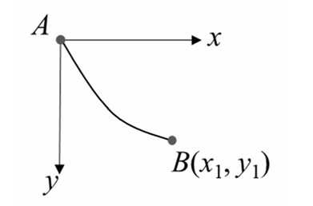
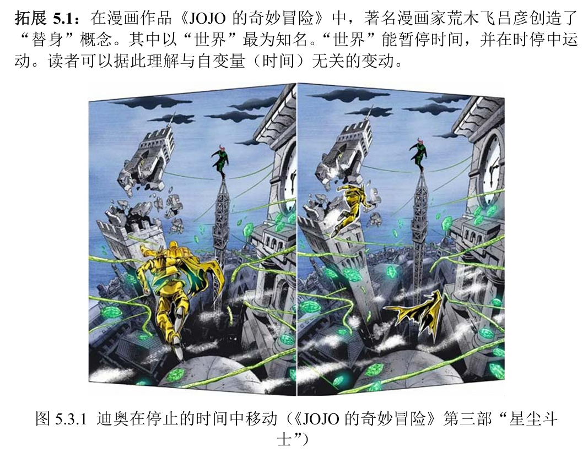

# Chap5 数学间奏——从函数到泛函，从微分到变分

## 函数概念与微分运算

### 驻值问题

函数是指变量与变量之间的依赖关系。自变量的任意无穷小变动称为<b>自变量的微分</b>，记为$\mathrm{d}x$

在某一点$x^*$处，如果自变量的任意微分引起的函数引起的函数微分恒等于零，即，

$$\mathrm{d}y|_{x^*}=0,\forall \mathrm{d}x$$

那么，该点称为函数的<b>驻值点</b>。求解函数驻值点的问题称为<b>函数驻值问题</b>。易知，驻值点满足方程，

$$f^(x^*)=0$$

多元函数记作，

$$y=f(x_1,...x_n)$$

多元函数的微分记为$\mathrm{d}y$或$\mathrm{d}f(x_1,..,x_n)$，我们有，

$$\mathrm{d}y=\mathrm{d}f(x_1,...,x)=\frac{\partial f}{\partial x_1}\mathrm{d}x_1+...+\frac{\partial f}{\partial x_n}\mathrm{d}x_n$$

多元函数的驻值点满足方程组，

$$\frac{\partial f(x_1^*,...,x_n^*)}{\partial x_1}=0,...,\frac{\partial f(x_1^*,...,x_n^*)}{\partial x_n}=0$$

设多个自变量$x_1,...,x_n$之间受到如下等式约束，

$$g(x_1,...,x_n)=0$$

从满足等式的一点出发，自变量发生微分后的点仍要满足该等式，也即，

$$g(x_1+\mathrm{d}x_1,...,x_n+\mathrm{d}x_n)=0$$

于是知，自变量微分受如下等式限制

$$\frac{\partial g}{\partial x_1}\mathrm{d}x_1+...+\frac{\partial g}{\partial x_n}\mathrm{d}x_n=0$$

这$n$个自变量中只有$n-1$个可以独立微分

我们可以解出其中1个微分如$\mathrm{d}x_1$，即有，

$$\mathrm{d}x_1=-\frac{\frac{\partial g}{\partial x_2}}{\frac{\partial g}{\partial x_1}}\mathrm{d}x_2...-\frac{\frac{\partial g}{\partial x_n}}{\frac{\partial g}{\partial x_1}}\mathrm{d}x_n$$

考虑<b>有约束的多元函数驻值问题</b>，有如下三种方法

## 泛函概念与变分运算

### 泛函概念

泛函是指<b>函数（或变数）</b>与<b>函数</b>之间的依赖关系。若函数（或变数）z依赖于函数y(x)，则称函数y(x)为自变函数；称函数（或变数）z是泛函，或称函数
（或变数）z是自变函数y(x)的泛函，记作，

$$z=J[y(x),x]$$

!!! question "最速降线问题"
    在重力场中，质点沿通过给定两点A、B的平面光滑刚性曲线下落，初速度为零。试求下落时间与曲线的关系

    

    曲线记为$y=y(x)$，由机械能守恒定律知，

    $$\frac{\mathrm{d}s}{\mathrm{d}t}=\sqrt{2gy}$$

    式中，弧长微元$\mathrm{d}s=\sqrt{1+y^{'2}}\mathrm{d}x$，于是有

    $$\mathrm{d}t=\frac{\sqrt{1+y^{'2'}}}{\sqrt{2gy}}\mathrm{d}x$$

    质点从A运动到B的时间为，

    $$T=J[y(x)]=\int_0^{x_1}\frac{\sqrt{1+y^{'2'}}}{\sqrt{2gy}}\mathrm{d}x$$

    由此知，下落时间$T$为函数$y(x)$的泛函

通过积分构造的泛函称为<b>积分泛函</b>。一般地，积分可写成，

$$z=J[y(x),x]=\int_{x_0}^{x_1} f(x,y,y')\mathrm{d}x$$

### 变分运算

自变函数的任意无穷小变动称为<b>自变函数的变分</b>，记为$\delta y(x)$

自变函数的变分导致泛函改变，改变的主部称为<b>泛函的变分</b>，记为$\delta z$或$\delta J[y(x),x]$

函数值泛函的变分是一个无穷小函数，依赖于自变函数和自变函数的变分；函数值泛函的变分在某处的值，依赖于自变函数在该处的值和自变函数的变分在该处的值。变数值泛函的变分是一个无穷小量，依赖于自变函数和自变函数的变分

### 泛函驻值问题

考察积分泛函$z=J[y(x),x]=\int_{x_0}^{x_1} f(x,y,y')\mathrm{d}x$。在某一函数$y^*(x)$处，如果自变函数的任意变分引起的积分泛函变分恒等于零，即，

$$\delta z|_{y^*(x)}=0$$

那么，该函数称为积分泛函的<b>驻值函数</b>，求解泛函驻值函数的问题称为<b>泛函驻值问题</b>

!!! theorem "变分引理"
    设$f(x)$是定义在$(x_0,x_1)$上的连续函数，若对于任意连续函数$\xi(x)$都有，

    $$\int_{x_0}^{x_1} f(x)\xi(x)\mathrm{d}x=0$$

    则有，

    $$f(x)=0,x \in(x_0,x_1)$$

!!! proof "证明"
    采用反证法。不妨假设存在$\tilde{d} \in (x_0,x_1)$，使得$f(\tilde{x})>0$。由连续性可知，存在一个小量$\varepsilon >0$，使得，

    $$f(x)>0,x\in (\tilde{x}-\varepsilon,\tilde{x}+\varepsilon) \subset(x_0,x_1) $$

    取如下连续函数$\xi(x)$，

    $$\xi(x)=\left\{\begin{aligned} \frac{x-(\tilde{x}-\varepsilon)}{\varepsilon} ,x \in (\tilde{x}-\varepsilon,\tilde{x}] \\ \frac{(\tilde{x}+\varepsilon)-x}{\varepsilon},x\in [\tilde{x},\tilde{x}+\varepsilon) \\ 0 , x\in (x_0 ,\tilde{x}-\varepsilon)\quad or \quad x \in (\tilde{x}+\varepsilon,x_1) \end{aligned}\right.$$

    则有$\int_{x_0}^{x_1}f(x)\xi(x)\mathrm{d}x>0$，矛盾

由于$\delta y|_{x_0}=0,\delta y|_{x_1}=0$，变分等式化为，

$$\delta z=\int_{x_0}^{x_1} [\frac{\partial f}{\partial y}-\frac{\mathrm{d}}{\mathrm{d}x}(\frac{\partial f}{\partial y'})]\delta y\mathrm{d}x=0$$

由变分引理知，

$$\frac{\partial f}{\partial y}-\frac{\mathrm{d}}{\mathrm{d}x}(\frac{\partial f}{\partial y'})=0,x \in(x_0,x_1)$$

上式是关于函数y(x)的二阶微分方程，结合两个边界条件$y(x_0)=y_0$和$y(x_1)=y_1$可以完全定解

!!! question "最速降线问题"
    给出最速降线满足的微分方程和边界条件

    最速降线问题化为积分泛函驻值问题，且边界条件给定。被积函数为，

    $$f(x,y,y')=\frac{\sqrt{1+y^{'2}}}{\sqrt{2gy}}$$

    相应的微分方程为，

    $$\frac{\sqrt{1+y^{'2}}}{2y\sqrt{y}}+\frac{\mathrm{d}}{\mathrm{d}x}[\frac{y'}{\sqrt{y(1+y^{'2})}}]=0$$

    结合边界条件可以定解

### 多个自变函数的泛函

<b>多个自变函数的泛函</b>记作，

$$z=J[y_1(x),...y_n(x),x]$$

### 数学约束

考虑<b>有约束的积分泛函驻值问题</b>

